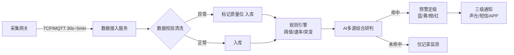
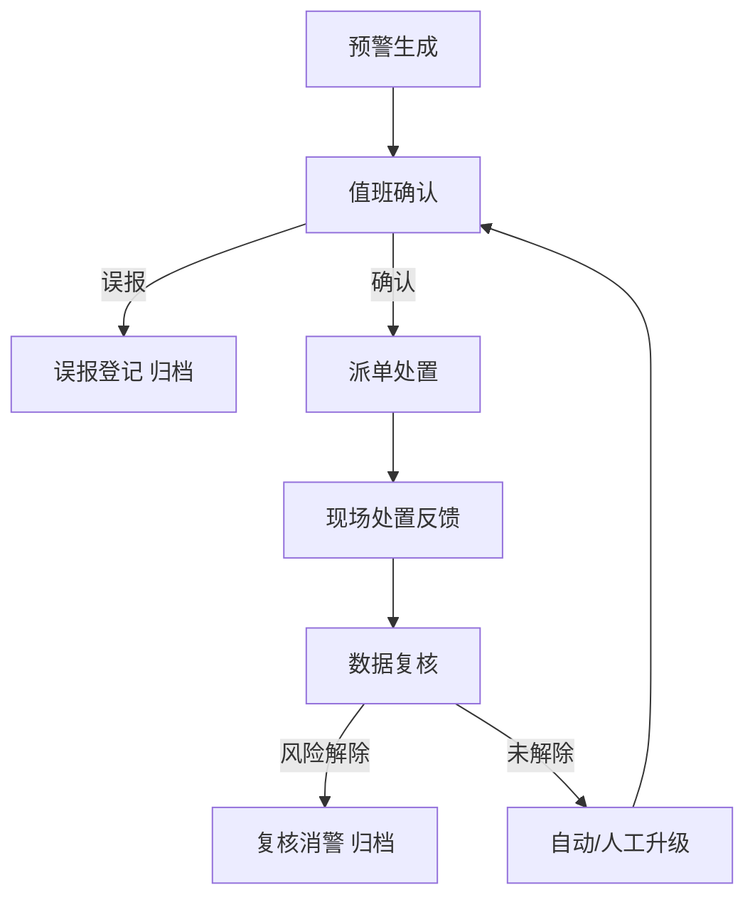

# 1. 需求规格说明书

| 项 | 内容 |
|---|---|
| 项目名称 | 隧道地质灾害AI预警系统（Tunnel Geohazard AI Warning System，简称 TGAWS） |
| 文档编号 | TSG-AIWS-DOC-01 |
| 文档版本 | V1.1 |
| 编制日期 | 2026-09-25 |
| 编制人 | 项目组（架构师） |
| 评审人 | 甲方项目组（2026-09-25 评审确认） |
| 需求基线 | 《0.待澄清问题清单.md》Q1~Q25 澄清结论（2026-09-25 用户确认：全部按建议默认，详见附录B） |
| 文档状态 | 已评审确认（2026-09-25） |

## 修订历史

| 版本 | 日期 | 修订人 | 修订说明 |
|---|---|---|---|
| V1.0 | 2026-09-25 | 项目组 | 初稿，基于澄清问题清单 Q1~Q25 确认结果编制 |
| V1.1 | 2026-09-25 | 项目组 | 评审修订：统一容量口径（490 万条/天）、新增 NFR-A1~A4 算法质量硬指标、新增 FR-407 灾害事件登记、FR-101 数据完整率口径消解 |

## 1.0 术语与约定

| 术语 | 定义 |
|---|---|
| 监测对象 | 被监测的地质灾害类型，本期共 6 类：坍塌、涌水/突水、瓦斯及有害气体、突泥、地表沉降/拱顶下沉、围岩收敛位移 |
| 测项 | 监测对象下的具体物理量指标（如瓦斯浓度、涌水量、收敛速率），是数据采集与预警判定的最小单元 |
| 监测点 | 部署于隧道某一位置、采集某一测项数据的物理点位，具有唯一编码 |
| 采集网关 | 现场工业网关，负责汇聚传感器数据并以 TCP/MQTT 协议统一上送本系统 |
| 预警事件 | 系统经规则引擎与综合研判生成的告警记录，具有蓝/黄/橙/红四级与全生命周期状态 |
| 处置闭环 | 预警生成→确认→派单→处置反馈→复核消警的完整业务闭环 |
| 消警 | 预警事件经复核确认风险解除后关闭，并归档为历史事件 |
| 质量位 | 数据校验后附加的质量标记（正常/超范围/跳变/缺失），异常数据不静默丢弃 |

## 1.1 项目背景与目标

### 1.1.1 项目背景

隧道（公路/铁路）在施工期与运营期长期面临地质灾害威胁，主要包括：**坍塌（围岩失稳/冒顶/塌方）、涌水/突水、瓦斯及有害气体（CH₄/CO/H₂S）、突泥、地表沉降/拱顶下沉、围岩收敛位移** 六类灾害。上述灾害具有突发性强、连锁反应多、夜间高发、后果严重等特点，是隧道工程安全管理的核心风险。

当前监测管理存在以下痛点：

1. **数据分散**：各类传感器、人工巡检记录分散在独立仪表与纸质台账中，无统一平台汇聚，管理人员无法形成全局态势认知；
2. **响应滞后**：依赖人工巡检与经验判断，巡检间隔期间（尤其夜间）发生的突变无法及时发现；
3. **研判手段单一**：现有预警多为单点阈值判断，缺乏趋势预测、突变检测与多指标联动研判，误报、漏报并存；
4. **处置无留痕**：预警后的响应、处置、恢复过程缺乏闭环管理与全程留痕，事后追溯与责任认定困难。

### 1.1.2 建设目标

| 编号 | 建设目标 | 可度量指标 |
|---|---|---|
| G1 | 统一接入 | 接入现场采集网关，覆盖 6 类监测对象、1000~5000 个监测点位 |
| G2 | 实时预警 | 数据入库→预警判定延迟 ≤30 秒（突发类事件 ≤10 秒） |
| G3 | 智能研判 | 规则引擎（阈值/速率/突变）+ 统计模型（趋势预测/突变检测）+ 多源综合研判上线运行 |
| G4 | 闭环处置 | 预警处置全流程在线闭环，全程留痕可追溯，闭环率 100% |
| G5 | 便捷交付 | Windows 一键安装包（exe 向导），完全离线可部署，现场试运行 ≥30 天验收 |

### 1.1.3 建设原则

1. **合规优先**：对标 JTG/T 3660—2020《公路隧道施工技术规范》、TB 10120—2019《铁路瓦斯隧道技术规范》及 GB/T 22239—2019《网络安全等级保护》二级要求设计；
2. **离线可用**：隧道现场网络条件差，系统须支持完全离线安装与运行，不依赖公网；
3. **参数化配置**：预警阈值、规则、巡检模板、通知模板全部参数化，适应不同工程阶段与地质分区，不写死代码；
4. **数据驱动演进**：一期以规则+统计模型先行，上线后持续积累带标签预警样本，迭代机器学习模型；
5. **分层解耦**：数据采集、预警计算、业务处置分层解耦，协议与规则插件化，便于扩展；
6. **可扩展预留**：预留第三方系统 REST 对接、上级平台数据上报、OAuth2 认证等扩展接口。

## 1.2 业务场景描述

### 1.2.1 场景总览

系统覆盖隧道**施工期+运营期全生命周期**（施工期功能先行）：

- **施工期（开挖扰动期）**：围岩应力重新分布，坍塌、突泥、涌水、瓦斯风险集中爆发，监测频率高（30s~5min），预警响应时限要求最严；
- **运营期（结构稳定期）**：长期监测结构变形、渗漏水、有害气体，关注缓慢趋势与季节性变化，预警以趋势预测为主。

### 1.2.2 监测对象与监测指标

| 监测对象 | 典型测项 | 物理量/单位 | 采集频率（可配） | 主要预警依据 |
|---|---|---|---|---|
| 坍塌（围岩失稳/冒顶/塌方） | 围岩位移、锚杆轴力、钢架应力 | mm、kN、MPa | 30s~5min | 位移速率超限、累计变形超限、应力突变 |
| 涌水/突水 | 涌水量、水压、地下水位 | L/s、MPa、m | 30s~5min | 流量突变、水压超限、水位骤升 |
| 瓦斯及有害气体 | CH₄、CO、H₂S 浓度、风速 | %VOL、ppm、m/s | 30s~5min | 浓度超限、浓度上升速率超限 |
| 突泥 | 泥水流量、孔隙水压 | L/s、kPa | 30s~5min | 流量/水压突变、浑水出现（人工确认） |
| 地表沉降/拱顶下沉 | 沉降量、下沉速率 | mm、mm/d | 5min~1h | 累计沉降超限、速率超限、趋势不收敛 |
| 围岩收敛位移 | 净空收敛、周边位移 | mm、mm/d | 5min~1h | 收敛速率超限、变形趋势恶化 |

**说明**：各级阈值、速率限值不写死，全部参数化，按"监测对象 × 工程阶段 × 断面/地质分区"三个维度配置，由技术专家评审定稿（见 1.6.3）。

### 1.2.3 典型业务场景举例

**场景一：施工期瓦斯超限（夜间突发）**

> 凌晨 2 点，瓦斯监测点 CH₄ 浓度 30s 采集一次。浓度 0.5% 时系统判为黄级，短信通知值班调度与监测员；浓度持续上升，速率模型检出突变，系统自动升级为橙级，现场声光报警启动；值班调度 3 分钟内确认，下达危险区撤人指令，通知技术专家会商；处置后浓度回落至安全区间，现场反馈处置结果，复核人确认消警。事件全过程时间线归档，供复盘与模型训练。

**场景二：运营期涌水突变**

> 运营隧道某涌水监测点流量数据经滑动窗口突变检测，检出 2 小时内流量均值漂移 300%。系统生成黄级预警，值班调度派单现场核查；核查发现衬砌局部渗漏加剧，人工升级为橙级，启动处置方案；修复后数据恢复，复核消警。

**场景三：日常巡检**

> 监测员每班按计划执行巡检任务，移动 H5 逐项填报（可离线暂存、补传），发现隐患即时登记并拍照上传；隐患自动进入跟踪列表，由值班调度督办至闭环。

## 1.3 系统用户角色分析

### 1.3.1 角色定义

| 角色 | 职责 | 典型终端 | 使用频率 |
|---|---|---|---|
| 现场监测员 | 巡检填报、设备状态确认、处置反馈、隐患登记 | 移动H5 / PC | 每班 |
| 值班调度员 | 7×24 实时监控、预警确认、处置派单、闭环跟踪 | PC 为主 | 7×24 轮班 |
| 技术专家（研判） | 预警复核、规则与模型参数定稿、处置方案建议 | PC | 按需 |
| 管理领导 | 驾驶舱总览、统计报表、重大预警督办 | PC / 移动H5 | 每日/每周 |
| 系统管理员 | 用户与权限、字典与工程配置、通知通道、备份与审计 | PC | 按需 |

### 1.3.2 功能权限矩阵（概览）

| 功能域 | 监测员 | 值班调度 | 技术专家 | 管理领导 | 系统管理员 |
|---|---|---|---|---|---|
| 实时监控查看 | √ | √ | √ | √ | √ |
| 预警确认/派单 | — | √ | √（复核） | 督办 | — |
| 处置反馈 | √ | √ | √ | — | — |
| 规则/模型参数 | — | — | √ | — | — |
| 巡检填报 | √ | — | — | — | — |
| 用户/权限/字典配置 | — | — | — | — | √ |
| 报表/驾驶舱 | — | √ | √ | √ | √ |

（√=可用，—=不可用；详细权限点随阶段6详细设计细化）

### 1.3.3 认证与权限机制

- 采用 RBAC（用户—角色—权限）模型，角色权限可配置；
- 本地账号密码认证：密码复杂度策略、有效期策略、连续失败锁定策略；
- 全操作审计留痕（登录、配置变更、预警操作、数据导出）；
- 预留 OAuth2 协议扩展点，支持后续对接 AD/LDAP 或企业微信/钉钉。

## 1.4 功能性需求（模块拆解）

优先级定义：**P0=一期必须上线；P1=一期重要（含预留）；P2=二期规划**。

### 1.4.1 模块总览

| 模块 | 编号 | 名称 | 优先级 |
|---|---|---|---|
| M1 | 数据采集与接入 | 网关接入、数据清洗、点位管理、人工录入、文件导入 | P0 |
| M2 | 实时监控中心 | 实时看板、断面可视化、历史查询、异常标记 | P0 |
| M3 | 预警中心（核心） | 规则管理、定级、综合研判、通知、升级降级、消警归档 | P0 |
| M4 | 处置闭环管理 | 确认、派单、反馈、复核消警、超时提醒、全程留痕 | P0 |
| M5 | 巡检管理 | 巡检计划、模板、移动填报、隐患跟踪 | P0 |
| M6 | AI 分析引擎 | 趋势预测、突变检测、综合研判模型、模型管理、分析报告 | P0 |
| M7 | 基础支撑 | 用户权限、字典、通知通道、审计日志、备份恢复 | P0 |
| M8 | 报表与驾驶舱 | 统计报表、领导驾驶舱、数据导出、上报接口（预留） | P1 |
| M9 | 二期规划 | 视频AI、电话语音通知、移动原生APP、集团级监管 | P2 |

### 1.4.2 M1 数据采集与接入

| 编号 | 需求名称 | 需求描述 | 优先级 | 验收要点 |
|---|---|---|---|---|
| FR-101 | 传感器数据接入 | 通过 TCP 自定义协议与 MQTT 两种方式接收采集网关上送数据；协议可插拔适配；支持心跳保活、断点续传、重连补传；数据报文含点位编码、时间戳、数值、质量位 | P0 | 模拟网关推送 1000 点、30s 周期连续 24h，设计负载内数据零丢失；**超设计峰值（持续 >300 条/s 超 5min）允许背压降级丢弃（计数+告警），日数据完整率 ≥99.99%** |
| FR-102 | 数据校验与清洗 | 范围校验（物理量合理区间）、跳变检测、重复数据剔除、缺失标记；异常原始值保留并标记质量位，不静默丢弃 | P0 | 注入超范围/跳变/重复/缺失四类异常样本，全部正确标记 |
| FR-103 | 监测点位管理 | 点位台账（隧道/断面/测项/量纲/单位/安装位置/启用状态）、阈值参数、采集频率配置、启停维护 | P0 | 点位全生命周期管理，参数变更留痕 |
| FR-104 | 人工巡检录入 | PC/移动H5 按巡检模板填报，支持图片附件、定位、离线暂存（联网后补传） | P0 | 断网填报 10 条记录，恢复网络后全部补传成功 |
| FR-105 | 第三方系统 REST 对接（预留） | 定义标准鉴权 REST 接口规范，供瓦斯监控系统等第三方系统推送/查询数据；本期实现接口框架并完成模拟联调 | P1 | 按接口规范完成一次模拟系统联调 |
| FR-106 | 历史数据文件导入 | 按 Excel/CSV 模板导入历史监测数据与灾害事件台账，含校验、去重、入库 | P1 | 导入 10 万条样例数据，校验错误报告准确 |

### 1.4.3 M2 实时监控中心

| 编号 | 需求名称 | 需求描述 | 优先级 | 验收要点 |
|---|---|---|---|---|
| FR-201 | 实时数据看板 | 按隧道/断面/测项分组实时展示最新值、状态（正常/超限/离线）、实时曲线；数据刷新 ≤5s | P0 | 数据端到端刷新延迟 ≤5s |
| FR-202 | 隧道断面可视化 | 以断面图展示测点空间分布与实时数值，超限点位变色闪烁告警 | P0 | 测点与断面位置一一对应，超限状态即时联动 |
| FR-203 | 历史数据查询 | 按点位/时段组合查询、多测项曲线对比、统计值（max/min/avg/速率）计算、Excel 导出 | P0 | 100 万条数据量级查询 P95 ≤3s |
| FR-204 | 数据异常标记 | 人工标记可疑数据（如传感器漂移），被标记数据在综合研判中降权处理 | P1 | 标记后研判结果按预期调整 |

### 1.4.4 M3 预警中心（核心）

| 编号 | 需求名称 | 需求描述 | 优先级 | 验收要点 |
|---|---|---|---|---|
| FR-301 | 预警规则管理 | 规则类型 ≥3 类：阈值（超上限/超下限）、速率（变化速率超限）、突变（统计突变检测）；支持多指标组合规则；按"监测对象×工程阶段×断面分区"配置；规则版本化、启停、生效时间，变更全留痕 | P0 | 规则增删改查+版本回滚，变更审计完整 |
| FR-302 | 预警定级 | 按蓝/黄/橙/红四级定级，级别由规则命中+综合研判评估得出；支持人工升级/降级（留痕） | P0 | 四级预警判定与响应动作映射正确（见 1.6.3） |
| FR-303 | 多源综合研判 | 同一断面多测项/多指标联合研判（如位移+应力+水压联动），输出综合风险分与建议级别；算法详见阶段5 | P0 | 组合规则场景判定结果与预期一致 |
| FR-304 | 预警通知 | 三级通道：现场声光报警联动（开关量/协议对接现场报警器）、短信、站内消息/APP推送；通知模板含级别、位置、测项、数值、时间；发送失败重试，通知记录留痕 | P0 | 三级通道全部触达，失败重试生效 |
| FR-305 | 预警升级/降级 | 条件满足自动升级；处置后人工降级；升级/降级全程留痕 | P0 | 自动升级阈值触发准确，人工操作留痕 |
| FR-306 | 消警与归档 | 消警需复核人确认+原因说明；事件全量归档（数据快照、通知记录、处置记录），供追溯与模型训练 | P0 | 事件归档资料完整可追溯 |

### 1.4.5 M4 处置闭环管理

| 编号 | 需求名称 | 需求描述 | 优先级 | 验收要点 |
|---|---|---|---|---|
| FR-401 | 预警确认 | 值班调度在时限内确认（确认/误报登记）；超时自动升级并逐级提醒 | P0 | 超时升级机制按 1.6.3 时限表生效 |
| FR-402 | 处置派单 | 创建处置任务：指定责任人、处置措施、完成时限；移动端接收 | P0 | 派单→移动端接收全链路 ≤1min |
| FR-403 | 处置反馈 | 现场填报处置措施、现场照片、处置结果，支持分次反馈 | P0 | 移动端反馈含照片上传成功 |
| FR-404 | 复核消警 | 技术专家/值班调度复核数据恢复后消警，填写复核结论 | P0 | 消警必须携带复核人+结论，否则不可关闭 |
| FR-405 | 超时提醒 | 确认/处置环节超时，站内+短信逐级提醒 | P1 | 超时提醒按配置时限触发 |
| FR-406 | 全程留痕 | 时间线视图展示预警全生命周期（生成-通知-确认-派单-处置-消警），记录不可篡改 | P0 | 任意事件可完整回溯全流程 |
| FR-407 | 灾害事件登记 | 人工登记灾害/险情事件（类型/位置/发生时间/后果/级别，可关联预警事件），为模型评估提供"灾变时刻"真值锚点 | P1 | 登记记录与预警事件关联可追溯 |

### 1.4.6 M5 巡检管理

| 编号 | 需求名称 | 需求描述 | 优先级 | 验收要点 |
|---|---|---|---|---|
| FR-501 | 巡检计划与任务 | 按班次/日/周自动生成巡检任务，自动派发至监测员 | P0 | 计划生成与派发准确率 100% |
| FR-502 | 巡检模板管理 | 巡检项、检查内容、判定标准可配置，模板版本化 | P0 | 模板配置即改即用 |
| FR-503 | 移动端填报 | H5 逐项填报、拍照、定位、离线暂存补传 | P0 | 同 FR-104 离线场景验收 |
| FR-504 | 隐患登记与跟踪 | 巡检发现隐患登记（可关联照片/位置），转入处置跟踪流程直至闭环 | P1 | 隐患全生命周期跟踪 |

### 1.4.7 M6 AI 分析引擎

| 编号 | 需求名称 | 需求描述 | 优先级 | 验收要点 |
|---|---|---|---|---|
| FR-601 | 时序趋势预测 | 基于历史数据的趋势外推（滑动平均/线性回归/指数平滑等统计模型），输出未来时段预测值与置信区间 | P0 | 对样本数据预测方向正确率 ≥80%（试运行期评估） |
| FR-602 | 突变检测 | 滑动窗口+统计检验（均值漂移/方差突变）自动检出异常跃变，触发规则引擎 | P0 | 注入已知突变样本全部检出（见阶段8测试计划） |
| FR-603 | 多源综合研判模型 | 多指标加权/规则组合模型输出综合风险等级；模型可评估（准确率/漏报率/误报率） | P0 | 评估报告输出三项指标 |
| FR-604 | 模型与参数管理 | 模型注册、版本管理、运行参数（窗口大小/阈值系数）配置，评估结果留痕 | P1 | 模型版本可切换可回滚 |
| FR-605 | 分析报告生成 | 定期（日/周/月）自动生成监测分析报告，含趋势图、预警统计、结论建议 | P1 | 报告自动生成并可按模板导出 |

### 1.4.8 M7 基础支撑

| 编号 | 需求名称 | 需求描述 | 优先级 | 验收要点 |
|---|---|---|---|---|
| FR-701 | 用户与权限管理 | 用户/角色/权限管理、密码策略、登录审计（对应 1.3.3） | P0 | 权限矩阵逐项验证 |
| FR-702 | 字典与工程配置 | 隧道、断面、测项、单位、监测对象、预警级别等字典管理 | P0 | 字典统一维护、全局生效 |
| FR-703 | 通知通道配置 | 短信网关参数（供应商、AK/SK、签名，占位符见附录A）、声光联动点位、站内推送配置；通道健康检测 | P0 | 通道切换仅改配置不改代码 |
| FR-704 | 操作审计日志 | 登录、配置变更、预警操作、数据导出全量审计，可查询、不可删改、保留 ≥6 个月 | P0 | 审计日志防篡改验证 |
| FR-705 | 备份与恢复 | 数据库每日自动备份、保留策略、恢复演练脚本 | P0 | 备份恢复演练一次成功 |

### 1.4.9 M8 报表与驾驶舱

| 编号 | 需求名称 | 需求描述 | 优先级 | 验收要点 |
|---|---|---|---|---|
| FR-801 | 统计报表 | 日/周/月报：预警统计、处置闭环率、数据完整率、巡检完成率 | P1 | 报表数据与台账核对一致 |
| FR-802 | 领导驾驶舱 | 关键指标总览：今日预警、闭环率、高风险点位、设备在线率 | P1 | 指标实时刷新 ≤1min |
| FR-803 | 数据导出 | 按条件导出监测数据/预警记录（Excel/CSV），导出操作留痕 | P1 | 10 万条导出 ≤30s |
| FR-804 | 上级平台上报接口（预留） | 定义上报数据结构与 REST 接口，供集团/业主平台订阅 | P1 | 接口规范评审通过 |

### 1.4.10 M9 二期规划（本期不实现）

| 编号 | 需求名称 | 说明 |
|---|---|---|
| FR-901 | 视频图像 AI 识别 | 越界/落石/涌水等图像识别，依赖摄像头接入与 GPU 算力 |
| FR-902 | 电话语音通知 | 红级预警自动电话语音外呼 |
| FR-903 | 移动原生 APP | 独立 Android/iOS 应用（本期为移动 H5） |
| FR-904 | 集团级多项目监管 | 多项目数据汇聚与跨项目对比分析 |

## 1.5 非功能性需求

### 1.5.1 性能

| 编号 | 指标 | 要求 |
|---|---|---|
| NFR-P1 | 预警判定延迟 | 数据入库→预警判定 ≤30s；突发类事件 ≤10s |
| NFR-P2 | 数据吞吐 | 设计基线（统一口径）：日入库 ≥490 万条（约 57 条/s 均值、峰值 ≥300 条/s 不积压）；验收下限 ≥100 万条/天 |
| NFR-P3 | 页面响应 | 查询页面 P95 ≤3s；实时看板数据刷新 ≤5s |
| NFR-P4 | 并发能力 | ≥50 并发用户；7×24 连续运行 |
| NFR-P5 | 资源占用 | 8C16G 单机：CPU 常态 ≤60%，内存 ≤70% |

### 1.5.2 安全（按等保二级设计）

| 编号 | 指标 | 要求 |
|---|---|---|
| NFR-S1 | 合规基线 | 满足 GB/T 22239—2019 等保二级：身份鉴别、访问控制、安全审计、入侵防范、数据完整性/保密性 |
| NFR-S2 | 身份鉴别 | 密码复杂度+有效期+失败锁定；会话超时自动退出 |
| NFR-S3 | 访问控制 | RBAC 最小权限；敏感操作（消警、参数变更）二次确认 |
| NFR-S4 | 安全审计 | 全操作审计，日志保留 ≥6 个月，防篡改 |
| NFR-S5 | 传输与存储 | 对外接口 HTTPS（2026-09-29 决策：本期必做，自签证书/内网 CA，禁止 HTTP 降级——Service Worker 离线能力依赖安全上下文）；密码 BCrypt 加密存储；密钥/凭据以环境变量注入，源码零硬编码（占位符见附录A） |
| NFR-S6 | 数据安全 | 备份文件加密；数据导出留痕 |

### 1.5.3 可靠性

| 编号 | 指标 | 要求 |
|---|---|---|
| NFR-R1 | 可用性 | ≥99.5%（按试运行期统计非计划停机时间） |
| NFR-R2 | 数据不丢 | 采集链路断点续传+本地缓存，网络恢复后自动补传 |
| NFR-R3 | 服务自愈 | 后端以 Windows 服务方式守护运行，异常退出自动拉起并告警 |

### 1.5.4 兼容性

| 编号 | 指标 | 要求 |
|---|---|---|
| NFR-C1 | 服务端 | Windows Server 2022（含完全离线部署，无公网依赖） |
| NFR-C2 | 客户端 | Chrome/Edge 90+；移动端 H5 适配主流机型 |
| NFR-C3 | 数据兼容 | 历史数据导入模板化（Excel/CSV）；二期模型兼容一期存量数据 |

### 1.5.5 可部署性

| 编号 | 指标 | 要求 |
|---|---|---|
| NFR-D1 | 安装包形态 | exe 向导式安装包，内置 JDK 25 + MySQL 绿色版 + 一键初始化脚本 |
| NFR-D2 | 安装效率 | 全新环境安装耗时 ≤30min；初始化脚本幂等可重复执行 |
| NFR-D3 | 运维能力 | 支持数据库备份恢复、版本升级与回滚 |

### 1.5.6 可维护性与可扩展性

| 编号 | 指标 | 要求 |
|---|---|---|
| NFR-M1 | 架构分层 | 数据采集、预警计算、业务处置分层解耦；接入协议与预警规则插件化 |
| NFR-M2 | 接口预留 | 第三方 REST 对接、上级平台上报、OAuth2 认证接口预留 |
| NFR-M3 | 代码规范 | 命名、分层、异常、日志、注释遵循《阿里巴巴Java开发手册》 |

### 1.5.7 数据保留

| 编号 | 数据类别 | 保留周期 |
|---|---|---|
| NFR-DATA1 | 原始采样数据 | 1 年（到期可归档导出） |
| NFR-DATA2 | 分钟级聚合数据 | 3 年 |
| NFR-DATA3 | 预警事件与处置记录 | 永久 |

### 1.5.8 算法质量（硬指标，模型上线门禁）

| 编号 | 指标 | 要求 |
|---|---|---|
| NFR-A1 | 漏报率 | 生效期 ≤5%（FN/(TP+FN)，安全系统第一指标） |
| NFR-A2 | 误报率 | 生效期 ≤10%；试运行期放宽至 ≤20% |
| NFR-A3 | 平均提前预警时间 | ≥15 min（触发时刻−灾变时刻，灾变时刻取灾害登记真值） |
| NFR-A4 | 模型上线门禁 | 影子期 ≥30 天（只计算不通知）→ 灰度期 ≥14 天（蓝黄通知、橙红人工确认）→ 生效期；回滚条件触发即回退（详见算法文档 5.8） |

## 1.6 业务流程梳理

### 1.6.1 总体业务链路

1. 现场传感器 → 采集网关汇聚 → 系统接入层（TCP/MQTT）；
2. 数据校验清洗 → 入库（带质量位）；
3. 规则引擎（阈值/速率/突变）+ AI 综合研判 → 预警定级（蓝/黄/橙/红）；
4. 预警通知（声光/短信/APP）→ 值班确认 → 派单处置 → 现场反馈 → 复核消警 → 归档；
5. 全过程留痕，数据沉淀为模型训练样本。

### 1.6.2 数据采集与预警判定流程

| 步骤 | 说明 | 性能锚点 |
|---|---|---|
| 1 | 网关按测项配置频率（30s~5min）上送数据 | — |
| 2 | 接入层协议解析、校验、清洗 | — |
| 3 | 入库（原始+质量位） | 入库即触发判定 |
| 4 | 规则引擎+综合研判 | 判定延迟 ≤30s（突发 ≤10s） |
| 5 | 命中 → 定级 → 通知 | 通知发送 ≤1min |

### 1.6.3 预警处置闭环流程

**蓝黄橙红响应动作映射表（建议基线，Q13 默认，评审时定稿）**：

| 级别 | 定义 | 系统动作 | 响应动作 | 响应时限 | 上报层级 |
|---|---|---|---|---|---|
| 蓝（关注） | 接近阈值或轻微异常 | 站内提示+看板标色 | 值班查看跟踪，通知监测员关注 | 30min 内确认 | 值班调度 |
| 黄（警戒） | 超阈值或速率超限 | 站内+短信+声光提示 | 加密监测（采集频率加倍）、现场核查、技术专家关注 | 15min 内确认，2h 内现场核查 | 值班调度→技术专家 |
| 橙（处置） | 显著超限或多指标联动异常 | 声光+短信+APP 推送（全员） | 危险区停工撤人、专家会商、启动处置方案 | 5min 内确认，30min 内撤人 | 项目负责人 |
| 红（紧急） | 灾变临界或灾变发生 | 声光+短信+人工电话 | 全线撤离、启动应急预案、报上级主管部门 | 立即响应，3min 内确认 | 项目负责人→上级单位 |

**说明**：上表为建议基线版本，各级阈值、动作、时限、上报层级全部参数化可配置，正式值以甲方评审定稿为准。

### 1.6.4 人工巡检流程

1. 系统按计划自动生成巡检任务 → 派发至监测员移动端；
2. 监测员按模板逐项填报（支持离线暂存、拍照、定位）；
3. 填报数据自动入库；发现隐患 → 登记并拍照上传；
4. 隐患进入跟踪列表 → 值班调度督办 → 处置完成 → 闭环销号。

### 1.6.5 消警与归档流程

1. 处置后监测数据恢复至正常区间（持续观察窗确认，窗口时长可配）；
2. 复核人（技术专家/值班调度）确认风险解除，填写复核结论；
3. 系统执行消警：关闭预警事件、归档全量数据（数据快照+通知记录+处置记录+时间线）；
4. 归档事件进入历史库，供统计分析、复盘与模型训练。

## 1.7 需求范围与边界

### 1.7.1 本期系统做什么

- 六大类监测对象的统一数据接入、存储、展示（M1/M2）；
- 蓝黄橙红四级预警全流程：规则判定、AI 研判、定级、三级通知（M3）；
- 预警处置闭环管理、全程留痕（M4）；
- 电子巡检台账（M5）；
- 统计模型引擎（趋势预测、突变检测、综合研判）（M6）；
- 用户权限、字典、审计、备份等基础支撑（M7）；
- 报表、驾驶舱、数据导出、上报接口预留（M8）；
- Windows 一键安装包交付（后端 Jar + 前端静态资源 + Nginx + 数据库初始化脚本 + 部署文档）。

### 1.7.2 本期系统不做什么

1. **不研发传感器硬件与采集网关**（按既有网关协议接入）；
2. **不控制施工/运营设备**（仅监测预警，不联动设备控制，声光报警联动除外）；
3. **不做视频图像 AI 识别**（二期，依赖摄像头与 GPU）；
4. **不做电话语音自动外呼**（二期）；
5. **不替代应急指挥系统**（系统提供预警与闭环记录，不承担应急指挥调度职能）；
6. **不做集团级多租户平台**（单项目独立部署，仅预留上报接口）；
7. **不做移动原生 APP**（本期交付移动 H5）。

### 1.7.3 外部依赖

| 依赖项 | 说明 |
|---|---|
| 采集网关/传感器 | 由现场既有设备提供，本系统按 TCP/MQTT 协议接入 |
| 短信网关 | 供应商待定（阿里云/腾讯云/运营商），系统以占位配置开发，供应商确定后仅改配置 |
| 现场声光报警器 | 需现场具备可对接的报警器（开关量或协议接口） |
| 服务器 | Windows Server 2022、8C16G 及以上 |

### 1.7.4 二期展望

视频图像 AI 识别、电话语音通知、移动原生 APP、集团级多项目监管平台。

## 1.8 业务风险与假设

### 1.8.1 风险清单

| 编号 | 风险 | 影响 | 可能性 | 应对措施 |
|---|---|---|---|---|
| R1 | 预警阈值/响应动作未评审定稿，参数不准 | 误报/漏报，现场信任度下降 | 高 | 全部参数化配置；设置试运行调参期（≥30天）；评审定稿前以保守值运行 |
| R2 | 现场网络不稳定（内网/离线/断网） | 数据中断、通知延迟 | 高 | 断点续传+本地缓存；离线安装包；声光报警走本地链路 |
| R3 | 短信网关供应商未确定 | 短信通知通道无法开通 | 中 | 通知通道抽象化，占位配置开发；供应商确定后仅改配置；过渡期以站内消息+声光为主 |
| R4 | 无带标签历史数据，模型冷启动 | AI 预测效果初期有限 | 高 | 一期规则+统计模型先行；上线后积累样本迭代；FR-604 支持模型版本切换 |
| R5 | 传感器协议多样、厂商各异 | 接入开发返工 | 中 | 接入协议插件化适配层；接入前与厂商联调确认报文格式 |
| R6 | 单机部署可用性风险 | 单点故障导致服务中断 | 中 | Windows 服务守护自动拉起；每日自动备份；异常告警 |
| R7 | 等保测评口径差异 | 安全整改返工 | 低 | 按等保二级自查设计并输出对照表，评审阶段确认 |
| R8 | MySQL 8.0.x 官方支持已结束（2026-04） | 长期运维安全补丁风险 | 低 | 一期锁定 8.0.46 开发；评估 8.4 LTS 升级路径（兼容性预研列入阶段2） |

### 1.8.2 假设与依赖

- 现场采集网关与传感器已部署或随项目同步部署，具备 TCP/MQTT 上送能力；
- 现场具备可对接的声光报警器；
- 部署服务器满足 8C16G 规格要求；
- 甲方在试运行期内组织预警阈值与响应动作评审定稿；
- 用户总数 ≤200、并发 ≤50、点位 1000~5000（超出规模时按水平扩展方案扩容）；
- **容量设计基线（统一口径）**：3000 点×60s + 2000 点×300s ≈ 490 万条/天（约 57 条/s 均值、峰值 ≥300 条/s），需求/架构/数据库/算法文档的容量估算均引用该口径；验收下限 ≥100 万条/天。

### 1.8.3 需求确认记录

2026-09-25，用户对《0.待澄清问题清单.md》Q1~Q25 全部按建议默认确认，形成本需求基线（摘要见附录B）。

---

## 附录A 敏感信息占位符清单

以下占位符集中管理，源码与文档中一律不出现真实值，部署时以环境变量/配置文件注入：

| 占位符 | 用途 | 替换说明 |
|---|---|---|
| `${DB_HOST}` `${DB_PORT}` `${DB_NAME}` | 数据库连接 | 部署机实际地址/端口/库名 |
| `${DB_USERNAME}` `${DB_PASSWORD}` | 数据库账号 | 部署初始化时生成强密码 |
| `${SMS_ACCESS_KEY}` `${SMS_SECRET_KEY}` | 短信网关 AK/SK | 供应商确定后申请 |
| `${SMS_SIGN_NAME}` `${SMS_TEMPLATE_CODE}` | 短信签名/模板编号 | 供应商审核通过后填写 |
| `${MQTT_USERNAME}` `${MQTT_PASSWORD}` | 采集网关接入账号 | 现场部署时分配 |
| `${JWT_SECRET}` | 接口令牌签名密钥 | ≥256 位随机生成 |
| `${SERVER_IP}` | 部署服务器 IP | 现场实际 IP |
| `${NGINX_LISTEN_PORT}` | 对外服务端口 | 默认 80/443，按现场调整 |
| `${ADMIN_INIT_PASSWORD}` | 初始管理员密码 | 安装时生成，强制首次登录修改 |

## 附录B 需求确认记录（Q1~Q25 基线摘要）

确认方式：2026-09-25 用户文字确认"Q1~Q25 全部默认"。基线摘要：

| 组 | 确认结论 |
|---|---|
| A 业务范围 | 监测对象 6 类全覆盖（坍塌/涌水突水/瓦斯及有害气体/突泥/沉降/位移）；施工+运营全周期；1~3 条隧道、1000~5000 点、≤50 并发；对标 JTG/T 3660—2020、TB 10120—2019、等保二级 |
| B 数据来源 | 网关汇聚 TCP/MQTT 上送（30s~5min 可配）；内置电子巡检台账（PC+移动H5）；第三方 REST 预留+文件导入兜底；无训练样本→规则+统计模型先行 |
| C 角色组织 | 5 类角色（监测员/值班调度/技术专家/管理领导/系统管理员）；单项目独立部署+预留上报接口；本地账号+RBAC+预留 OAuth2；≤200 账号 |
| D 预警分级 | 蓝黄橙红四级，响应动作映射表按行业惯例给出（1.6.3 建议基线，评审定稿）；声光+短信+APP 推送本期必做（电话/邮件二期）；处置闭环+全程留痕必须 |
| E AI 能力 | 阈值规则+时序预测/突变检测+多源综合研判本期；视频 AI 二期；无 GPU，CPU 推理 |
| F 部署安全 | Windows Server 2022、8C16G、单机一体化、完全离线安装；判定 ≤30s（突发 ≤10s）、日入库 ≥100 万条、P95 ≤3s；原始 1 年/分钟聚合 3 年/事件永久；等保二级+全审计+每日备份 |
| G 交付验收 | Vue3+PC Web+移动 H5 一并交付；exe 向导安装包内置 JDK25+MySQL 绿色版+一键初始化；现场试运行 ≥30 天，按阶段8测试计划出报告，功能演示+文档评审 |
