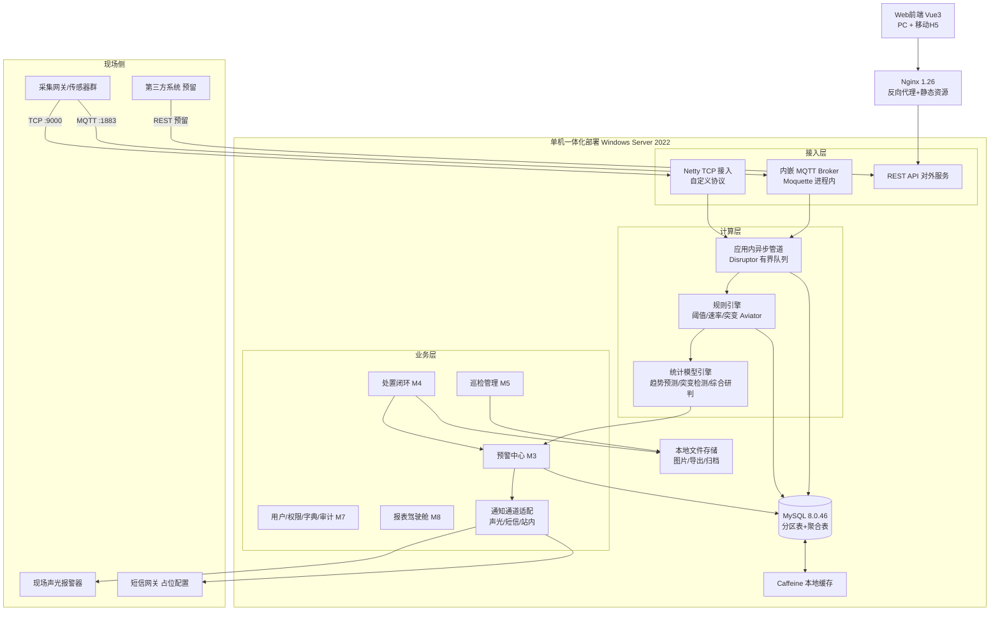
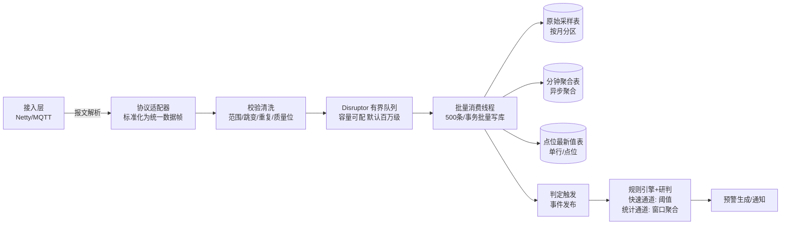
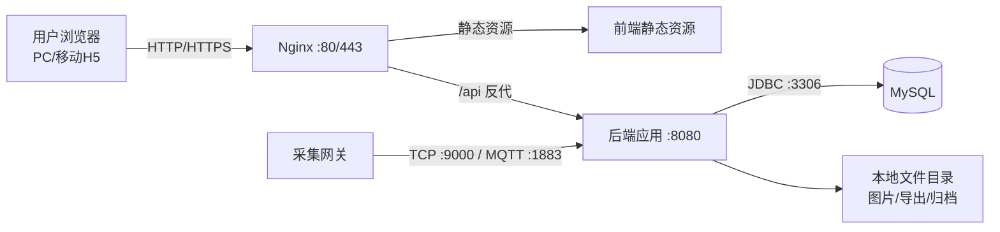

# 2. 系统架构设计说明书

| 项 | 内容 |
|---|---|
| 项目名称 | 隧道地质灾害AI预警系统（TGAWS） |
| 文档编号 | TSG-AIWS-DOC-02 |
| 文档版本 | V1.1 |
| 编制日期 | 2026-09-25 |
| 编制人 | 项目组（架构师） |
| 评审人 | 甲方项目组（2026-09-25 评审确认） |
| 上游文档 | 《1.需求规格说明书》V1.1（已评审确认） |
| 文档状态 | 已评审确认（2026-09-25） |

## 修订历史

| 版本 | 日期 | 修订人 | 修订说明 |
|---|---|---|---|
| V1.0 | 2026-09-25 | 项目组 | 初稿；中间件选型经用户确认（见附录A决策记录） |
| V1.1 | 2026-09-25 | 项目组 | 评审修订：MyBatis 4.0.1 锁定、双触发批量写、SSE 定稿、磁盘 ≥2TB、统一容量口径、乱序数据规则、Controller 上移 web（模块划分澄清） |

## 2.1 架构设计目标与原则

### 2.1.1 设计目标

1. 满足需求文档 G1~G5 全部建设目标及 19 条 NFR 指标；
2. 单机 Windows 一体化交付：一键安装、完全离线、≤30min 部署完成；
3. 预警核心链路低延迟：入库→判定 ≤30s（突发 ≤10s）；
4. 代码分层解耦：接入协议、预警规则、通知通道、存储介质全部可替换，不因二期升级重构业务代码。

### 2.1.2 设计原则

| 原则 | 说明 |
|---|---|
| 模块化单体（Modular Monolith） | 单进程部署、模块内高内聚、模块间低耦合；代码层面按微服务边界切分，二期可平滑拆分 |
| 零独立中间件 | 本期不引入任何独立部署的中间件（决策记录见附录A），全部能力进程内实现 |
| 分层解耦 | 接入层/计算层/业务层/支撑层严格分层，单向依赖 |
| 参数化配置 | 阈值、规则、模板、通道全部配置驱动，代码零硬编码 |
| 离线优先 | 所有运行依赖随安装包交付，不依赖公网 |
| 规范先行 | 命名、分层、异常、日志遵循《阿里巴巴Java开发手册》 |

## 2.2 总体架构设计

### 2.2.1 架构风格选择

选择**模块化单体架构**，理由：

1. **部署约束**：单机 Windows 离线交付、exe 一键安装，微服务化将使部署组件数量倍增，违反 NFR-D1/D2；
2. **规模匹配**：≤50 并发、日入库约 490 万条（约 57 条/秒均值、峰值 ≥300 条/秒，统一容量口径见 2.10），单体+异步管道完全可支撑；
3. **事务一致性**：预警处置闭环（生成→确认→派单→消警）是强事务链路，单体免分布式事务；
4. **运维成本**：单机现场运维人员能力有限，进程越少越可靠；
5. **演进路径**：模块间通过接口交互、禁止跨模块直接调用 DAO，二期若拆分微服务，仅需将接口改为 RPC。

### 2.2.2 逻辑架构图



### 2.2.3 技术选型总览

| 层次 | 技术/组件 | 版本 | 用途与选型理由 |
|---|---|---|---|
| 语言运行时 | JDK | 25 LTS | Spring Boot 4 官方支持（Java 17~25），LTS 至 2031 |
| 后端框架 | Spring Boot | 4.0.8 | 需求指定；Spring Framework 7 + Jakarta EE 11；注意 Boot4 相对 3.x 的 starter 模块化重组，依赖清单于阶段7锁定 |
| TCP 接入 | Netty | 4.1.x | 高性能非阻塞网络框架，业界标准，支持自定义协议编解码 |
| MQTT 接入 | Moquette（内嵌） | 0.17.x | 纯 Java 轻量 MQTT Broker，进程内运行随应用启停（决策见附录A） |
| 异步管道 | Disruptor | 3.4.x | 有界队列+批量消费，接入与计算解耦，削峰填谷 |
| 本地缓存 | Caffeine | 3.x | 最新值/热点配置缓存，进程内零运维（决策见附录A） |
| 规则引擎 | Aviator | 5.4.x | 轻量表达式引擎，规则条件求值，规则配置化落地 |
| 统计模型 | Apache Commons Math | 3.6.1 | 回归拟合、统计检验，支撑趋势预测/突变检测 |
| ORM | MyBatis（mybatis-spring-boot-starter 4.0.x） | 4.0.1 | 国内主流、SQL 可控性强、分区分表友好；4.0.x 为 MyBatis 官方 Spring Boot 4 适配线（已查证）；脚手架 pom 已从 JPA 迁移至 MyBatis 并通过依赖解析+编译验证，T1 收尾启动级验证 |
| 连接池 | HikariCP | 随 Boot 管理 | Spring Boot 默认连接池，性能业界标杆 |
| 参数校验 | spring-boot-starter-validation | 随 Boot 管理 | Bean Validation 3.0（Jakarta） |
| 令牌 | jjwt | 0.12.x | JWT 签发与校验，轻量无外部依赖 |
| 日志 | Logback（Boot 默认） | 随 Boot 管理 | 统一日志格式、分模块分文件、敏感信息脱敏 |
| 简化开发 | Lombok | 最新稳定版 | 仅用于 @Getter/@Setter/@Slf4j/@Builder，实体禁用 @Data（防集合字段隐患） |
| 前端框架 | Vue 3 + Vite + TypeScript | Vue3.x/Vite6.x | 需求确认（Q23）；Vite 构建产物为静态资源交付 |
| 前端组件 | Element Plus + ECharts + Pinia + Vue Router + Axios | 最新稳定版 | 中后台组件标准、监测曲线/断面图可视化、状态管理 |
| Web 服务器 | Nginx | 1.26.x（Windows） | 反向代理+静态资源托管+HTTPS 终结 |
| 数据库 | MySQL | 8.0.46 | 需求指定；绿色版随包交付（决策见附录A） |
| 服务守护 | WinSW | 2.12.x | 将后端/Nginx 注册为 Windows 服务，异常自动拉起 |
| 安装打包 | Inno Setup | 6.x | 向导式安装包编排（理由见 2.12.1） |

### 2.2.4 中间件选型与理由（决策记录）

| 决策项 | 结论 | 核心理由 | 二期升级路径 |
|---|---|---|---|
| 数据存储 | **MySQL 单库**，不引入时序库 | 日 490 万条、峰值 300 条/秒经分区表+聚合表+批量写入（双触发）轻松支撑；单机离线部署最简、备份可靠 | 预留存储适配层（DAO 隔离），量级达千万条/天时迁移 TDengine |
| 缓存 | **Caffeine 本地缓存**，不引入 Redis | 官方 Redis 不支持 Windows（移植版有许可/兼容风险）；单机场景本地缓存零运维 | 预留 Spring Cache 抽象，二期多机部署切换 Redis 仅改配置 |
| 消息队列 | **应用内异步队列**（Disruptor），不引入独立 MQ | 当前量级独立 MQ 属过度设计；Windows 部署 RabbitMQ/RocketMQ 复杂度高 | 预留消息管道接口，二期切换 MQ 不重构业务代码 |
| MQTT Broker | **Moquette 内嵌**，不独立部署 | 纯 Java、进程内运行、随安装包交付，零独立守护 | 上量后可按需外置 EMQX，仅改 Broker 地址配置 |

**结论：本期部署组件 = 后端应用 + MySQL + Nginx 共 3 个进程**，全部随安装包交付。

## 2.3 应用架构设计

### 2.3.1 Maven 聚合工程结构

```
tgaws-parent                    # 父 POM：依赖版本管理（dependencyManagement）
├── tgaws-common                # 通用层：常量/枚举/统一异常/统一返回/工具类
├── tgaws-access                # 接入层：Netty TCP、Moquette MQTT、协议适配、第三方 REST
├── tgaws-compute               # 计算层：规则引擎、统计模型、研判编排、异步管道
├── tgaws-business              # 业务层：预警/处置/巡检/用户权限/字典/审计/报表/通知
└── tgaws-web                   # 接口与装配层：Controller/启动类/全局配置/拦截器/定时任务装配（1 父 POM + 5 子模块）
```

依赖方向：`web → business → compute → common`，`web → access → common`；**business 不依赖 access**（依赖倒置，保持接入层可替换承诺）。**禁止反向依赖与跨层直调 DAO**。

### 2.3.2 后端分层（阿里规约分层）

```
com.tgaws.web（controller 归属）
├── controller/     # 接口层：参数校验、协议转换，不写业务逻辑

com.tgaws.business / com.tgaws.compute（业务与计算模块）
├── service/        # 业务逻辑层：接口+实现分离
├── manager/        # 通用业务处理层：跨 DAO 组合、缓存/队列交互、第三方封装
├── mapper/         # 数据访问层：MyBatis Mapper，只做 CRUD
├── entity/         # 数据库实体 PO（与表一一对应）
├── dto/            # 传输对象：入参校验
├── vo/             # 视图对象：出参组装
└── enums/constant/ # 枚举与常量（常量按功能域分类，禁止魔法值）
```

### 2.3.3 模块与需求追溯矩阵

| 代码模块 | 承载功能（FR） |
|---|---|
| tgaws-access | FR-101 传感器接入、FR-102 数据校验清洗、FR-105 第三方 REST 预留 |
| tgaws-compute | FR-301 规则管理、FR-302 定级、FR-303 综合研判、FR-601 趋势预测、FR-602 突变检测、FR-604 模型管理 |
| tgaws-business | FR-103 点位管理、FR-104/501~504 巡检、FR-201~204 监控中心、FR-304~306/401~406 预警与处置闭环、FR-605 分析报告、FR-701~705 基础支撑、FR-801~804 报表驾驶舱、FR-106 文件导入 |
| tgaws-web | 装配整合、全局配置、启动入口、**全部 Controller（API-A01~F05 接口层）**、鉴权/限流/审计拦截器 |

### 2.3.4 异常与日志规范（摘要，详细规则见阶段6）

- **统一返回**：`Result<T>{ code, message, data, timestamp }`；成功 code=00000；
- **错误码规范**：5 位数字——第 1 位级别（1=参数、2=业务、5=系统），第 2~3 位模块（01=接入、02=预警、03=处置、04=巡检、05=用户、06=系统），第 4~5 位序号；错误码集中定义于 `ErrorCode` 枚举；
- **异常体系**：`BizException`（业务异常，可预期）、`SysException`（系统异常）；全局异常处理器统一捕获，Controller 不 try-catch；
- **日志规范**：`@Slf4j`，INFO 记关键业务节点，WARN 记可恢复异常，ERROR 记不可恢复异常+入参脱敏；禁止输出密码/密钥；日志按模块分文件、按天滚动、保留 30 天。

## 2.4 数据流转架构

### 2.4.1 数据管道



**关键设计**：

| 设计点 | 说明 |
|---|---|
| 背压控制 | 队列有界；接近容量阈值时降级（丢弃旧数据并记数告警），杜绝内存溢出 |
| 双通道判定 | **快速通道**：入库后即时阈值判定（突发类 ≤10s）；**统计通道**：分钟聚合后做速率/突变/趋势判定（≤30s） |
| 批量写入 | **双触发**：满 500 条或满 1 秒先到者提交（峰值 300 条/秒时约 1 笔/秒，数据在队列驻留 ≤1s），保障入库→判定延迟承诺 |
| 数据质量 | 校验异常数据带质量位入库，研判时按质量位降权，不静默丢弃 |
| 乱序/迟到数据 | 补传数据时间戳晚于当前 10min 判定为"迟到"：正常入库并参与聚合/模型基线，**不触发实时预警**（防补传引发历史性误报） |

### 2.4.2 预警计算链路时序

数据入库（T0）→ 最新值表更新（T0+100ms）→ 快速通道阈值判定（T0+1s）→ 命中则定级+通知（T0+3s 内，突发类 ≤10s 达标）→ 分钟聚合（T0+60s）→ 统计通道速率/突变/趋势判定（T0+90s，整体 ≤30s 达标，统计类按分钟窗口径）。

## 2.5 前端架构设计

| 项 | 设计 |
|---|---|
| 技术栈 | Vue 3 + Vite + TypeScript + Pinia + Vue Router + Element Plus + ECharts + Axios |
| 形态 | PC Web + 移动 H5 自适应（响应式布局 + 移动端巡检/处置专属路由与组件） |
| 页面结构 | 登录 / 驾驶舱 / 实时监控（列表+曲线）/ 隧道断面图 / 预警中心（事件列表+详情+时间线）/ 处置任务 / 巡检任务 / 报表中心 / 系统管理（用户/角色/字典/点位/规则/通知通道） |
| 实时刷新 | 看板轮询（5s，走最新值接口，命中 Caffeine 缓存）；预警到达用 **SSE 推送**（已定稿：GET /api/v1/warn/stream，PC EventSource 断线重连；移动 H5 走轮询） |
| 权限 | 路由守卫+按钮级指令，按 RBAC 权限点渲染 |
| 构建交付 | `vite build` 产物（静态资源）随安装包置于 Nginx html 目录；Nginx 统一托管静态资源并反代 `/api` |

## 2.6 接口与集成架构

### 2.6.1 REST API 规范（内部+对外统一）

| 规范项 | 约定 |
|---|---|
| 版本与风格 | `/api/v1/{业务域}/{资源}`；RESTful 命名（资源复数、动词用 HTTP 方法） |
| 统一响应 | `{ code, message, data, timestamp }`；HTTP 状态码语义化（200/400/401/403/404/409/500） |
| 鉴权 | JWT Bearer Token，access token 有效期 2h + refresh 续签；预留 OAuth2 扩展点 |
| 幂等与防重 | 写操作携带幂等键（Idempotency-Key）；防重复提交（前端拦截+后端令牌校验） |
| 防重放 | 请求携带时间戳+nonce，超时窗口（5min）内拒绝重复请求 |
| 分页 | 统一分页参数 `pageNum/pageSize`，返回 `{ total, list }` |
| 文档 | OpenAPI 3.1（springdoc），接口文档随构建生成 |

### 2.6.2 集成通道设计

| 通道 | 方向 | 设计 |
|---|---|---|
| 采集网关 | 入 | TCP 自定义协议（Netty，帧头+长度+CRC 校验）/ MQTT（内嵌 Moquette）；协议适配器 SPI 可插拔 |
| 第三方系统（瓦斯监控等） | 入 | 标准 REST 推送接口（鉴权+签名校验），本期实现框架+模拟联调（FR-105） |
| 上级平台 | 出（预留） | 上报 REST 接口规范（FR-804），数据结构见阶段4 |
| 声光报警联动 | 出 | 通知通道适配器：HTTP 回调 / Modbus-TCP 开关量两种适配实现，点位与映射配置驱动 |
| 短信 | 出 | `SmsSender` 接口抽象 + 供应商实现（占位配置，附录B）；失败重试+通道健康检测 |
| 文件导入 | 入 | Excel/CSV 模板导入（EasyExcel 类库，阶段7锁定版本） |

## 2.7 部署架构设计

### 2.7.1 部署拓扑（单机一体化）



### 2.7.2 端口规划

| 端口 | 服务 | 说明 |
|---|---|---|
| 80 / 443 | Nginx | 对外入口；**HTTPS 本期必做（2026-09-29 决策：自签证书/内网 CA）**——Service Worker/IndexedDB 仅在安全上下文可用，http://内网IP 下 FR-104/FR-503（断网填报/联网补传）静默失效；80 端口仅做 301 跳转 443 |
| 8080 | 后端应用 | 仅本机访问（Nginx 反代），不直接对外 |
| 3306 | MySQL | 仅本机监听（bind 127.0.0.1） |
| 9000 | Netty TCP 接入 | 采集网关专用，白名单校验 |
| 1883 | 内嵌 MQTT Broker | 采集网关专用 |
| 全部端口 | — | 安装向导中可配置，冲突自动检测 |

### 2.7.3 目录规划（默认安装根目录 `D:\TGAWS`，向导可改）

```
D:\TGAWS\
├── app\            # 后端 Jar + 配置文件 + jre（jlink 精简运行时）
├── nginx\          # Nginx 绿色版 + 前端静态资源（html\）
├── mysql\          # MySQL 绿色版（含数据目录 data\）
├── data\files\     # 业务文件：巡检照片/导出文件/归档
├── backup\         # 数据库备份（每日，保留 3 代滚动）
├── logs\           # 应用/接入/告警日志
└── scripts\        # 初始化/启停/备份/卸载脚本
```

### 2.7.4 服务与守护

| Windows 服务名 | 进程 | 守护方式 |
|---|---|---|
| TGAWS-App | 后端应用 | WinSW 注册，异常退出自动拉起，启动失败重试 3 次 |
| TGAWS-Nginx | Nginx | WinSW 注册 |
| TGAWS-MySQL | MySQL 绿色版 | mysqld --install 注册服务 |

### 2.7.5 资源规格

| 项 | 规格 | 依据 |
|---|---|---|
| CPU/内存 | 8C16G | 需求确认（Q19）；JVM 堆 4G + MySQL 缓冲池 8G 分配见 2.10 |
| 磁盘 | ≥2TB（基线） | 统一容量口径（490 万条/天）：原始 1 年 ≈250GB + 分钟聚合 3 年 ≈375GB + 业务/备份滚动/文件 ≈250GB，约 5 成余量；预算受限可缩短聚合保留期（见 2.10.1） |

## 2.8 安全架构设计（等保二级对照）

| 等保二级要求域 | 系统实现 |
|---|---|
| 身份鉴别 | 本地账号+密码复杂度（≥8位含三类字符）+90 天有效期+连续 5 次失败锁定 30min+会话 30min 超时；预留 OAuth2 |
| 访问控制 | RBAC 最小权限；菜单/按钮/数据三级权限（监测员仅见本隧道数据）；敏感操作（消警/参数变更）二次确认 |
| 安全审计 | 全操作审计日志（登录/配置/预警操作/导出），保留 ≥6 个月，独立审计表防篡改（仅追加） |
| 入侵防范 | 登录防爆破（IP 维度限流）、参数化 SQL 防注入、输入白名单校验、上传文件类型/大小校验、防重放（2.6.1） |
| 数据完整性 | 采集报文 CRC 校验、数据质量位机制、数据库每日校验备份 |
| 数据保密性 | HTTPS 可配（内网降级 HTTP 需明示）；密码 BCrypt 存储；密钥/凭据环境变量注入、源码零硬编码（附录B）；备份文件加密 |
| 剩余信息保护 | 登出/超时清理会话；导出文件临时区定期清理 |

## 2.9 高可用与容灾设计

| 项 | 设计 |
|---|---|
| 进程自愈 | 三服务均注册 Windows 服务，异常退出自动拉起并记录告警 |
| 数据不丢 | 网关侧断链缓存+应用侧断点续传（FR-101）；应用内队列数据落盘策略（阶段6定稿：队列满/关机时快照落盘） |
| 备份策略 | mysqldump 每日 02:00 全量备份（Windows 任务计划），保留 3 代滚动+每周异地介质建议；恢复演练脚本随包交付 |
| 磁盘水位 | 备份目录与数据目录水位监控，≤85% 告警 |
| 单点声明 | 本期单机部署，NFR-R1（99.5%）通过守护+备份达成；二期双机热备方案预留（主备切换接口与数据同步设计在阶段6补充说明） |

## 2.10 性能设计

### 2.10.1 容量估算

| 估算项 | 计算 | 结果 |
|---|---|---|
| 写入均值 | 490 万条/天 ÷ 86400s（统一口径：3000 点×60s + 2000 点×300s） | ≈57 条/s |
| 写入峰值 | NFR-P2 峰值指标 | ≥300 条/s 不积压 |
| 事务峰值 | 双触发（满 500 条或满 1s 先到提交） | ≤1 笔/s，队列驻留 ≤1s |
| 原始数据存储 | 490 万条/天 × 100B/条 × 1.4（索引/页开销） | ≈690MB/天，1 年 ≈250GB |
| 聚合数据存储 | 非空分钟 ≈490 万行/天 × 50B × 1.4 | 3 年 ≈375GB |
| 业务表+文件+备份 | 业务表 ~10GB + 文件 + 备份 3 代滚动（压缩） | ≈250GB |
| 内存分配 | 16G：JVM 4G（含算法增量统计 <5MB，见算法文档 5.9）+ MySQL 缓冲池 8G + 系统 4G | — |
| 看板读压力 | 50 用户×5s 轮询，命中最新值表+Caffeine | 数据库读压力可忽略 |

### 2.10.2 性能保障措施

1. 按月分区原始采样表（自动建分区任务），分区裁剪加速查询与归档；
2. 分钟聚合表+点位最新值表，避免大表实时扫描；
3. 批量写入（双触发）+异步聚合，写入链路与统计链路分离；
4. 组合索引设计（point_id+ts 等），阶段3数据库设计中给出完整索引方案；
5. Caffeine 缓存最新值（TTL 5s）与热点配置（TTL 10min）；
6. 查询接口分页强制（pageSize 上限 200），大导出走异步任务；
7. MySQL 参数调优（innodb_buffer_pool 8G、批量提交、日志落盘策略），初始化脚本内置。

## 2.11 可扩展性设计

| 扩展点 | 抽象方式 | 二期切换动作 |
|---|---|---|
| 接入协议 | 协议适配器 SPI（报文→统一数据帧） | 新增适配器实现类+注册配置 |
| 预警规则 | 规则 DSL（JSON 配置）+Aviator 表达式 | 新增规则配置，无需发版 |
| 通知通道 | 通道适配器接口（声光/短信/站内/电话） | 新增适配器实现 |
| 缓存介质 | Spring Cache 抽象 | Caffeine→Redis 仅改配置 |
| 消息管道 | 消息管道接口 | 应用内队列→独立 MQ 仅改实现 |
| 数据存储 | DAO 层隔离+存储适配器 | MySQL→时序库按适配器替换 |
| 模型算法 | 模型接口（规则/统计/ML） | 新增模型实现+注册，版本可切换（FR-604） |

## 2.12 打包与安装设计

### 2.12.1 打包工具选型：Inno Setup 6.x

| 对比项 | Inno Setup | jpackage |
|---|---|---|
| 向导式安装 | 完整支持（界面/步骤/输入校验/静默安装参数） | 仅简单安装器，无自定义向导页 |
| 编排能力 | 支持释放文件后执行初始化脚本（MySQL 初始化、建库、服务注册、配置生成） | 不支持自定义安装逻辑 |
| 体积与生态 | 脚本化、中文生态成熟、案例丰富 | 产物为 MSI/EXE，扩展受限 |
| 结论 | **选用 Inno Setup** | 不满足 NFR-D1 要求 |

### 2.12.2 安装包内容清单

| 组件 | 内容 |
|---|---|
| 运行时 | JDK 25 精简运行时（jlink 定制，仅含所需模块，体积约 60~80MB） |
| 后端 | tgaws-web 可执行 Jar + 配置文件模板（占位符） |
| 前端 | Vite 构建产物（静态资源） |
| Web | Nginx 1.26 Windows 绿色版 + 配置模板 |
| 数据库 | MySQL 8.0.46 Windows 绿色版 + 初始化 SQL 脚本（建库/建表/字典数据/初始管理员） |
| 守护 | WinSW 可执行文件 |
| 脚本 | 初始化、启停、备份、恢复演练、卸载脚本 |
| 文档 | 《部署说明文档》《环境变量说明》（阶段7交付物） |

### 2.12.3 安装流程（向导步骤）

1. 选择安装目录（默认 `D:\TGAWS`）→ 2. 端口冲突检测（80/8080/3306/9000/1883）→ 3. 输入初始配置（数据库密码、管理员初始密码，强制复杂度校验）→ 4. 释放文件 → 5. 占位符替换生成实际配置（附录B）→ 6. MySQL 初始化（mysqld --initialize + 建库 + 执行初始化脚本，幂等可重跑）→ 7. 注册三个 Windows 服务并启动 → 8. 安装验证（服务状态+健康检查接口）→ 完成。全程 ≤30min，支持静默安装（命令行参数）与卸载（含数据保留选项）。

### 2.12.4 升级与回滚

升级包 = 新 Jar+前端资源覆盖+数据库增量脚本（版本化：V1.0→V1.1 顺序执行，记录 schema_version）；升级前自动备份，失败自动回滚文件并恢复备份。

## 2.13 技术风险与前置验证任务

| 编号 | 风险 | 影响 | 应对 |
|---|---|---|---|
| R-A1 | Spring Boot 4 生态适配（starter 模块化重组） | 构建阻塞 | MyBatis 4.0.x 官方适配线已查证并迁移；其余依赖验证列入 T1~T5 |
| R-A2 | JDK 25 下第三方库兼容（Netty/Moquette/Commons Math/jjwt） | 运行异常 | 前置验证 T2~T5；均属活跃维护项目，风险低 |
| R-A3 | MySQL 8.0.x 官方支持已结束 | 长期补丁风险 | **决策（2026-09-25）**：甲方确认维持 8.0.46 并书面接受 EOL 风险（决策记录见《3》附录C）；升级路径保留（8.4 LTS 兼容性预研、DAO 层隔离） |
| R-A4 | 单机单点故障 | 服务中断 | 2.9 高可用措施；二期双机方案预留 |
| R-A5 | 网关协议细节与假设不符 | 接入返工 | 接入联调前置（编码阶段安排与厂商协议确认会） |
| R-A6 | jlink 精简运行时裁剪过度 | 启动失败 | T7 验证含反射/动态代理模块完整性，失败则回退完整 JRE |

**前置验证任务清单（阶段7编码前必须完成，输出验证报告）**：

| 编号 | 验证任务 | 验收标准 |
|---|---|---|
| T1 | MyBatis（mybatis-spring-boot-starter 4.0.x，Boot4 官方适配线）启动与 CRUD 验证 | 示例 CRUD 跑通；脚手架 pom 已从 JPA 迁移至 MyBatis 并通过依赖解析+主代码编译验证（2026-09-25），T1 收尾启动级验证；失败则启用兜底（mybatis-spring 原生整合 / Spring JDBC） |
| T2 | Netty 4.1.x + JDK 25 运行 | 千点并发接入压测无异常 |
| T3 | Moquette 内嵌启动与 MQTT 客户端互通 | 发布/订阅消息收发正确 |
| T4 | Aviator + Commons Math 在 JDK 25 运行 | 表达式求值/回归计算正确 |
| T5 | jjwt 0.12 签发校验 | Token 签发/过期/篡改拒绝正确 |
| T6 | WinSW 注册/守护/拉起 | 服务 kill 后 30s 内自动拉起 |
| T7 | jlink 定制运行时启动 Spring Boot 应用 | 应用启动成功且功能正常 |
| T8 | Inno Setup 打包+静默安装+卸载 | 全新机器安装 ≤30min，卸载干净 |
| T9 | MySQL 8.0.46 绿色版免安装初始化 | 初始化+建库+脚本执行幂等 |
| T10 | 阿里云镜像拉取 Spring Boot 4 全套依赖 | 全量依赖一次构建成功 |

---

## 附录A 中间件选型决策记录（2026-09-25 用户确认）

| 决策项 | 用户选择 | 理由摘要 |
|---|---|---|
| 数据存储 | MySQL 单库（推荐方案） | 当前量级单库完全可支撑，部署最简、备份可靠；预留时序库迁移适配层 |
| 缓存 | 应用内缓存 Caffeine（推荐方案） | 官方 Redis 不支持 Windows；本地缓存零运维；预留 Spring Cache 抽象 |
| 消息队列 | 应用内异步队列 Disruptor（推荐方案） | 独立 MQ 过度设计且 Windows 部署复杂；预留管道接口 |
| MQTT Broker | 内嵌 Moquette（推荐方案） | 纯 Java 进程内运行，随安装包交付，零独立守护 |

**本期部署组件：后端应用 + MySQL + Nginx，共 3 个进程。**

## 附录B 敏感信息占位符清单（架构部分，继承需求文档附录A）

| 占位符 | 用途 | 替换说明 |
|---|---|---|
| `${INSTALL_DIR}` | 安装根目录 | 安装向导选择，默认 D:\TGAWS |
| `${MYSQL_ROOT_PASSWORD}` | MySQL root 密码 | 安装向导输入，强密码校验 |
| `${TCP_GATEWAY_PORT}` | TCP 接入端口 | 默认 9000，冲突时可改 |
| `${MQTT_PORT}` | MQTT 端口 | 默认 1883 |
| `${MQTT_USERNAME}` `${MQTT_PASSWORD}` | 网关 MQTT 账号 | 初始化脚本生成随机强密码 |
| `${LIGHT_ALARM_URL}` | 声光报警器回调地址 | 现场报警器实际地址 |
| `${NGINX_HTTPS_CERT}` `${NGINX_HTTPS_KEY}` | HTTPS 证书路径 | 现场证书优先；**未提供时部署向导自动生成自签证书（内网 CA 可选）——禁止 HTTP 降级** |
| `${BACKUP_KEY}` | 备份加密密钥 | 初始化脚本生成 |

其余 `${DB_*}`、`${SMS_*}`、`${JWT_SECRET}`、`${SERVER_IP}`、`${ADMIN_INIT_PASSWORD}` 见《1.需求规格说明书》附录A。
