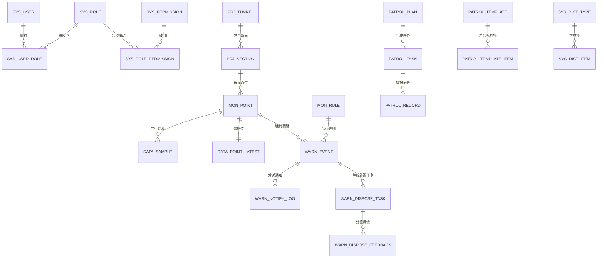

# 3. 数据库设计说明书

| 项 | 内容 |
|---|---|
| 项目名称 | 隧道地质灾害AI预警系统（TGAWS） |
| 文档编号 | TSG-AIWS-DOC-03 |
| 文档版本 | V1.1 |
| 编制日期 | 2026-09-25 |
| 编制人 | 项目组（架构师） |
| 评审人 | 甲方项目组（2026-09-25 评审确认） |
| 上游文档 | 《1.需求规格说明书》V1.1、《2.系统架构设计说明书》V1.1（均已评审确认） |
| 数据库 | MySQL 8.0.46，单库 `tgaws`，InnoDB，utf8mb4 |
| 文档状态 | 已评审确认（2026-09-25） |

## 修订历史

| 版本 | 日期 | 修订人 | 修订说明 |
|---|---|---|---|
| V1.0 | 2026-09-25 | 项目组 | 初稿：35 张表全字段规格、分区策略、字典、生命周期、备份、容量模型 |
| V1.1 | 2026-09-25 | 项目组 | 评审修订：40 张表（新增 sys_role_tunnel/mon_gateway/warn_hazard_event/ai_forecast/data_archive_log）、item_type→smallint、datetime(3) 毫秒、data_sample 主键改 (point_id, ts) 天然去重、warn_notify_log Outbox 三字段、MAXVALUE 兜底分区、附录 DDL 与正文同步 |

## 3.1 设计目标与范围

1. 支撑《1.需求规格说明书》全部 FR 的数据需求，落实 NFR-DATA 保留策略（原始 1 年/分钟聚合 3 年/预警事件永久）；
2. 满足 NFR-P 性能指标：日入库 ≥490 万条（设计基线，约 57 条/秒均值）、峰值 ≥300 条/秒写入、查询 P95 ≤3s；
3. 严格遵循《阿里巴巴Java开发手册-数据库篇》；
4. 单库无分库分表，高频采样表按月分区，存储与查询成本可控；
5. 交付可直接执行的初始化脚本规划（DDL+DML 分离、幂等、版本化）。

## 3.2 设计规范（阿里规约数据库篇落地）

| 类别 | 规范条目 |
|---|---|
| 命名 | 表名/字段名一律小写字母+数字+下划线，禁拼音、禁数字开头；表名单数；规避 MySQL 保留字（如 `level`→`warn_level`、`rank`、`interval` 禁用）；模块前缀：sys_/prj_/mon_/data_/warn_/patrol_/ai_/rpt_ |
| 必备字段 | 业务表统一 `id`(bigint unsigned 自增)、`create_time`、`update_time`、`is_deleted`(tinyint unsigned)；**特例**：高频采样表 data_sample/data_sample_minute 以雪花 id+分区时间为主键，不设自增与逻辑删除（见 3.5 说明） |
| 字段类型 | 状态/布尔 `tinyint unsigned`；数值 `decimal`（禁 float/double 存监测值）；时间 `datetime`；计数 `int`；主键 `bigint unsigned`；varchar 长度按需取 32/64/128/255/500 档，超 500 用 text 或分表 |
| 索引 | 唯一约束 `uk_字段名`，普通索引 `idx_字段名`；组合索引遵循最左前缀；禁止重复索引与冗余索引；单表索引 ≤5 个；组合索引字段数 ≤5；字符串索引注明前缀长度时需评估区分度 |
| 禁止项 | 禁止外键与级联（完整性由应用层保证）；禁止存储过程/触发器/函数；禁止 SELECT *；禁止大 offset 深分页（超 10000 行改 id 范围查询）；OR 条件改 UNION（或用覆盖索引） |
| 存储 | 引擎统一 InnoDB；字符集 utf8mb4、排序 utf8mb4_general_ci；所有表与列必须有 COMMENT |
| 分区 | 采样/聚合表按月 RANGE COLUMNS 分区，分区键必须包含在主键中（MySQL 约束）；单表分区数 ≤100（按 3 年 36 个设计） |

## 3.3 ER 模型设计

### 3.3.1 核心实体关系图



### 3.3.2 关系约定

- 实体间一律**不建物理外键**，关联字段语义化命名（如 `tunnel_id`、`point_id`），完整性由应用层保证；
- 逻辑删除字段 `is_deleted` 仅用于可删除业务数据；审计类表（sys_oper_log/sys_login_log）与预警事件表（warn_event，永久保留）不使用逻辑删除；
- 预警事件与处置反馈中的图片以 JSON 路径数组存本地文件路径，不存二进制。

## 3.4 表结构总览

共 **41 张表**，按 7 个域划分：

| 域 | 表名 | 中文名 | 预估量级 | 说明 |
|---|---|---|---|---|
| 系统 | sys_user | 用户表 | 200 行 | RBAC 主体 |
| 系统 | sys_role | 角色表 | 10 行 | 5 类业务角色 |
| 系统 | sys_user_role | 用户角色关联 | 400 行 | 多对多 |
| 系统 | sys_permission | 权限点表 | 100 行 | 菜单/按钮级 |
| 系统 | sys_role_permission | 角色权限关联 | 500 行 | 多对多 |
| 系统 | sys_role_tunnel | 角色隧道授权表 | 100 行 | 数据权限（多隧道） |
| 系统 | sys_dict_type | 字典类型表 | 30 行 | 字典元 |
| 系统 | sys_dict_item | 字典项表 | 300 行 | 字典值 |
| 系统 | sys_config | 系统配置表 | 50 行 | 参数/占位密钥 |
| 系统 | sys_oper_log | 操作审计日志 | 10 万行/年 | 仅追加 |
| 系统 | sys_login_log | 登录日志 | 5 万行/年 | 仅追加 |
| 系统 | sys_notify_channel | 通知通道配置 | 10 行 | 声光/短信/站内 |
| 系统 | sys_third_app | 第三方应用注册 | 10 行 | REST 对接鉴权 |
| 系统 | sys_backup_log | 备份记录 | 365 行/年 | 每日备份留痕 |
| 系统 | sys_schema_version | 库结构版本 | 50 行 | 增量脚本管理 |
| 工程 | prj_tunnel | 隧道工程表 | 10 行 | 1~3 条隧道 |
| 工程 | prj_section | 断面分区表 | 500 行 | 按桩号/地质分区 |
| 监测 | mon_point | 监测点位表 | 5000 行 | 核心台账 |
| 监测 | mon_gateway | 采集网关表 | 50 行 | 注册凭据/标定/在线状态 |
| 监测 | mon_rule | 预警规则表 | 200 行 | 版本化规则 |
| 数据 | data_sample | 原始采样数据表 | 490 万行/天（基线） | **月分区** |
| 数据 | data_sample_minute | 分钟聚合数据表 | ≤原始量 | **月分区**，仅存非空分钟 |
| 数据 | data_archive_log | 分区归档留痕表 | 100 行/年 | ADD/DROP PARTITION 审计 |
| 数据 | data_point_latest | 点位最新值表 | 5000 行 | 单行/点位 |
| 数据 | data_import_batch | 文件导入批次表 | 100 行/年 | 导入留痕 |
| 预警 | warn_event | 预警事件表 | 1 万行/年 | 永久保留 |
| 预警 | warn_hazard_event | 灾害险情登记表 | 100 行/年 | 模型评估真值锚点 |
| 预警 | warn_event_timeline | 预警事件时间线 | 5 万行/年 | 仅追加不可篡改（FR-406） |
| 预警 | warn_notify_log | 预警通知记录 | 5 万行/年 | 通道/重试留痕 |
| 预警 | warn_dispose_task | 处置任务表 | 1 万行/年 | 闭环派单 |
| 预警 | warn_dispose_feedback | 处置反馈表 | 2 万行/年 | 分次反馈 |
| 巡检 | patrol_template | 巡检模板表 | 50 行 | 版本化 |
| 巡检 | patrol_template_item | 巡检模板项表 | 1000 行 | 模板明细 |
| 巡检 | patrol_plan | 巡检计划表 | 50 行 | 自动派发 |
| 巡检 | patrol_task | 巡检任务表 | 3000 行/年 | 按班次生成 |
| 巡检 | patrol_record | 巡检记录表 | 10 万行/年 | 逐项填报 |
| 巡检 | patrol_hazard | 隐患登记表 | 1000 行/年 | 跟踪至闭环 |
| 分析 | ai_model | 算法模型注册表 | 50 行 | 规则/统计模型版本 |
| 分析 | ai_forecast | 预测结果表 | 490 万行/天（批算） | 保留 90 天，回测/查询 |
| 分析 | rpt_export_task | 数据导出任务表 | 1000 行/年 | 异步导出 |
| 分析 | rpt_report | 分析报告记录表 | 365 行/年 | 日/周/月报 |
| 分析 | rpt_stat_daily | 报表日聚合表 | 365×隧道数 行/年 | FR-801/802 预聚合（≤1min 刷新的物理前提） |

## 3.5 分表与分区策略

### 3.5.1 data_sample / data_sample_minute 按月分区

- 分区键 `ts`（采样时间）必须包含在全部唯一键中（MySQL 分区约束），故两表**主键为 (point_id, ts)**：天然去重（同点同毫秒重复行由数据库拒绝，批次写入 ON DUPLICATE KEY UPDATE 幂等覆盖补传重放）、主键即覆盖高频查询（免去 idx_point_ts 冗余索引）、去掉雪花 id 省约 26B/行；
- 每月 1 日 00:10 由定时任务自动创建下月分区（**`REORGANIZE PARTITION pmax INTO (新月份分区, pmax)`——pmax 存在时 MySQL 禁止其后 ADD PARTITION，见 02_partition.sql 模板**），初始化脚本预建当年+次年共 24 个分区；**所有分区表固定保留 `pmax VALUES LESS THAN (MAXVALUE)` 兜底分区**——建分区任务失败（D0007 告警）时数据仍可写入 pmax，杜绝 ERROR 1526 写入失败；pmax 有数据时额外告警提醒人工介入；
- 过期数据归档后 `DROP PARTITION`（配合 3.9 生命周期任务），分区删除为 O(1) 操作、不产生大事务；
- 分区键查询自动裁剪，未带 ts 的查询由索引兜底（idx_point_ts 前缀 point_id）。

### 3.5.2 聚合策略

- 分钟聚合任务（应用内定时）将原始数据聚合为 `data_sample_minute`：avg/min/max/count/异常占比；
- **仅写入有数据的分钟**（sample_count>0），低频测项不产生空行，控制 3 年保留期体积；
- 3 年以上统计查询统一走聚合表，原始表仅保留 1 年。

### 3.5.3 其余表

均不分区（量级 ≤百万行，索引可控）。

## 3.6 表结构详细设计

> 规格说明：必备字段 `id/create_time/update_time/is_deleted` 统一省略不逐表重复（特例注明）；"可空"列 Y=可空，N=非空；所有数值字段均为 decimal 或整数类型，监测值统一 decimal(16,4)。

### 3.6.1 系统域

**sys_user 用户表**

| 字段 | 类型 | 可空 | 默认 | 说明 |
|---|---|---|---|---|
| username | varchar(32) | N | — | 登录名，唯一 |
| password | varchar(100) | N | — | BCrypt 密文 |
| real_name | varchar(32) | Y | NULL | 姓名 |
| phone | varchar(20) | Y | NULL | 手机号（短信接收） |
| status | tinyint unsigned | N | 1 | 1启用 0停用 |
| last_login_time | datetime | Y | NULL | 最近登录 |
| last_login_ip | varchar(45) | Y | NULL | 最近登录 IP |
| pwd_update_time | datetime | N | 当前时间 | 密码更新时间（90 天策略） |
| create_by / update_by | bigint unsigned | Y | NULL | 操作人 |

索引：`uk_username(username)`；`idx_status(status)`。

**sys_role 角色表**

| 字段 | 类型 | 可空 | 默认 | 说明 |
|---|---|---|---|---|
| role_code | varchar(32) | N | — | 角色编码，唯一 |
| role_name | varchar(32) | N | — | 角色名称 |
| remark | varchar(200) | Y | NULL | 备注 |
| status | tinyint unsigned | N | 1 | 1启用 0停用 |
| data_scope | tinyint unsigned | N | 3 | 数据范围：1全部 2本隧道 3本断面 4仅本人 |

索引：`uk_role_code(role_code)`。

**sys_user_role 用户角色关联**

| 字段 | 类型 | 可空 | 默认 | 说明 |
|---|---|---|---|---|
| user_id | bigint unsigned | N | — | 用户 id |
| role_id | bigint unsigned | N | — | 角色 id |

索引：`uk_user_role(user_id, role_id)`。

**sys_role_tunnel 角色隧道授权表**

| 字段 | 类型 | 可空 | 默认 | 说明 |
|---|---|---|---|---|
| role_id | bigint unsigned | N | — | 角色 id |
| tunnel_id | bigint unsigned | N | — | 隧道 id |

索引：`uk_role_tunnel(role_id, tunnel_id)`。

**sys_permission 权限点表**

| 字段 | 类型 | 可空 | 默认 | 说明 |
|---|---|---|---|---|
| perm_code | varchar(64) | N | — | 权限编码，唯一（如 warn:event:close） |
| perm_name | varchar(32) | N | — | 权限名称 |
| perm_type | tinyint unsigned | N | 1 | 1菜单 2按钮 |
| parent_id | bigint unsigned | N | 0 | 父级 id，0=根 |
| route | varchar(128) | Y | NULL | 前端路由 |
| sort | int | N | 0 | 排序 |

索引：`uk_perm_code(perm_code)`。

**sys_role_permission 角色权限关联**

| 字段 | 类型 | 可空 | 默认 | 说明 |
|---|---|---|---|---|
| role_id | bigint unsigned | N | — | 角色 id |
| permission_id | bigint unsigned | N | — | 权限点 id |

索引：`uk_role_perm(role_id, permission_id)`。

**sys_dict_type 字典类型表**

| 字段 | 类型 | 可空 | 默认 | 说明 |
|---|---|---|---|---|
| dict_code | varchar(64) | N | — | 字典编码，唯一（如 hazard_type） |
| dict_name | varchar(64) | N | — | 字典名称 |
| status | tinyint unsigned | N | 1 | 1启用 0停用 |
| remark | varchar(200) | Y | NULL | 备注 |

索引：`uk_dict_code(dict_code)`。

**sys_dict_item 字典项表**

| 字段 | 类型 | 可空 | 默认 | 说明 |
|---|---|---|---|---|
| dict_type_id | bigint unsigned | N | — | 字典类型 id |
| item_label | varchar(64) | N | — | 显示名 |
| item_value | varchar(64) | N | — | 存储值 |
| sort | int | N | 0 | 排序 |
| status | tinyint unsigned | N | 1 | 1启用 0停用 |

索引：`uk_type_value(dict_type_id, item_value)`；`idx_type(dict_type_id)`。

**sys_config 系统配置表**

| 字段 | 类型 | 可空 | 默认 | 说明 |
|---|---|---|---|---|
| config_key | varchar(64) | N | — | 配置键，唯一 |
| config_value | varchar(500) | N | — | 配置值（密钥类存占位/密文） |
| config_type | tinyint unsigned | N | 1 | 1普通文本 2密钥 |
| remark | varchar(200) | Y | NULL | 说明 |

索引：`uk_config_key(config_key)`。

**sys_oper_log 操作审计日志（仅追加，无 is_deleted）**

| 字段 | 类型 | 可空 | 默认 | 说明 |
|---|---|---|---|---|
| user_id | bigint unsigned | Y | NULL | 操作人 id |
| username | varchar(32) | Y | NULL | 操作人登录名（快照） |
| module | varchar(32) | N | — | 业务模块 |
| operation | varchar(64) | N | — | 操作内容 |
| method | varchar(128) | Y | NULL | 类.方法 |
| request_params | varchar(2000) | Y | NULL | 入参（脱敏后） |
| response_code | varchar(8) | Y | NULL | 业务响应码 |
| cost_ms | int | Y | NULL | 耗时毫秒 |
| ip | varchar(45) | Y | NULL | 来源 IP |
| oper_time | datetime | N | 当前时间 | 操作时间 |
| audit_hash | char(64) | Y | NULL | 防篡改哈希链（SHA-256 上一行哈希+本行规范化内容；T-703） |

索引：`idx_oper_time(oper_time)`；`idx_user_time(user_id, oper_time)`。
防篡改（8.8 S-08）：哈希链 + 应用账号 REVOKE UPDATE/DELETE（补丁 t703 模板）双保险；Mapper 仅追加无 update/delete 语句。

**sys_login_log 登录日志（仅追加）**

| 字段 | 类型 | 可空 | 默认 | 说明 |
|---|---|---|---|---|
| user_id | bigint unsigned | Y | NULL | 用户 id |
| username | varchar(32) | N | — | 登录名 |
| login_type | tinyint unsigned | N | 1 | 1登录 2登出 |
| result | tinyint unsigned | N | 1 | 1成功 0失败 |
| fail_reason | varchar(100) | Y | NULL | 失败原因（密码错误/锁定等） |
| ip | varchar(45) | Y | NULL | 来源 IP |
| login_time | datetime | N | 当前时间 | 时间 |

索引：`idx_login_time(login_time)`；`idx_user_time(user_id, login_time)`。

**sys_notify_channel 通知通道配置**

| 字段 | 类型 | 可空 | 默认 | 说明 |
|---|---|---|---|---|
| channel_code | varchar(32) | N | — | 通道编码，唯一（light_alarm/sms/inner） |
| channel_name | varchar(64) | N | — | 通道名称 |
| channel_type | tinyint unsigned | N | — | 1声光 2短信 3站内 |
| config_json | varchar(2000) | N | — | 通道参数 JSON（占位符，见附录B） |
| enabled | tinyint unsigned | N | 1 | 1启用 0停用 |
| health_status | tinyint unsigned | N | 0 | 0未知 1正常 2异常 |
| last_check_time | datetime | Y | NULL | 最近健康检测 |

索引：`uk_channel_code(channel_code)`。

**sys_third_app 第三方应用注册**

| 字段 | 类型 | 可空 | 默认 | 说明 |
|---|---|---|---|---|
| app_key | varchar(64) | N | — | 应用标识，唯一 |
| app_secret | varchar(128) | N | — | 签名密钥（密文存储） |
| secret_old | varchar(128) | Y | NULL | 轮换过渡旧密钥（密文） |
| secret_rotate_time | datetime | Y | NULL | 轮换时间（新旧密钥并行 24h 过渡窗口） |
| app_name | varchar(64) | N | — | 应用名称 |
| callback_url | varchar(255) | Y | NULL | 回调地址 |
| ip_whitelist | varchar(255) | Y | NULL | 来源 IP 白名单（逗号分隔；空=不限） |
| enabled | tinyint unsigned | N | 1 | 1启用 0停用 |
| expire_time | datetime | Y | NULL | 授权到期 |

索引：`uk_app_key(app_key)`。

**sys_backup_log 备份记录**

| 字段 | 类型 | 可空 | 默认 | 说明 |
|---|---|---|---|---|
| backup_type | tinyint unsigned | N | 1 | 1自动 2手动 |
| file_path | varchar(255) | N | — | 备份文件路径 |
| file_size | bigint unsigned | Y | NULL | 字节数 |
| result | tinyint unsigned | N | 1 | 1成功 0失败 |
| fail_reason | varchar(200) | Y | NULL | 失败原因 |
| backup_time | datetime | N | 当前时间 | 备份时间 |

索引：`idx_backup_time(backup_time)`。

**sys_schema_version 库结构版本**

| 字段 | 类型 | 可空 | 默认 | 说明 |
|---|---|---|---|---|
| version | varchar(32) | N | — | 版本号（如 1.0.0） |
| script_name | varchar(128) | N | — | 脚本文件名 |
| applied_time | datetime | N | 当前时间 | 执行时间 |
| remark | varchar(200) | Y | NULL | 说明 |

索引：`uk_version(version)`。

### 3.6.2 工程域

**prj_tunnel 隧道工程表**

| 字段 | 类型 | 可空 | 默认 | 说明 |
|---|---|---|---|---|
| tunnel_code | varchar(32) | N | — | 隧道编码，唯一 |
| tunnel_name | varchar(64) | N | — | 隧道名称 |
| tunnel_type | tinyint unsigned | N | 1 | 1公路 2铁路 |
| stage | tinyint unsigned | N | 1 | 1施工 2运营 |
| length_m | decimal(8,2) | Y | NULL | 隧道长度（米） |
| geo_desc | varchar(255) | Y | NULL | 地质概况 |
| status | tinyint unsigned | N | 1 | 1在建 2正常 3停用 |
| start_date | date | Y | NULL | 开工日期 |
| remark | varchar(255) | Y | NULL | 备注 |

索引：`uk_tunnel_code(tunnel_code)`。

**prj_section 断面分区表**

| 字段 | 类型 | 可空 | 默认 | 说明 |
|---|---|---|---|---|
| tunnel_id | bigint unsigned | N | — | 所属隧道 |
| section_code | varchar(32) | N | — | 断面编码 |
| section_name | varchar(64) | N | — | 断面名称 |
| mileage_from | varchar(32) | Y | NULL | 起始桩号 |
| mileage_to | varchar(32) | Y | NULL | 结束桩号 |
| geo_zone | varchar(64) | Y | NULL | 地质分区 |
| stage | tinyint unsigned | N | 1 | 工程阶段 |
| status | tinyint unsigned | N | 1 | 1启用 0停用 |
| sort | int | N | 0 | 排序 |

索引：`uk_tunnel_section(tunnel_id, section_code)`；`idx_tunnel(tunnel_id)`。

### 3.6.3 监测域

**mon_gateway 采集网关表**

| 字段 | 类型 | 可空 | 默认 | 说明 |
|---|---|---|---|---|
| gateway_code | varchar(32) | N | — | 网关编号，唯一（协议 GW_ID 字段） |
| gateway_name | varchar(64) | N | — | 网关名称 |
| secret | varchar(128) | N | — | 注册凭据 PSK（密文存储） |
| protocol | tinyint unsigned | N | 1 | 1TCP 2MQTT |
| scale | tinyint unsigned | N | 4 | 协议值缩放系数（实际值=整数×10^-scale，与 mon_point.scale 一致） |
| status | tinyint unsigned | N | 1 | 1启用 0停用 |
| online_status | tinyint unsigned | N | 0 | 0离线 1在线（心跳维护） |
| last_online_time | datetime | Y | NULL | 最近在线时间 |
| remark | varchar(255) | Y | NULL | 备注 |

索引：`uk_gateway_code(gateway_code)`。

**mon_point 监测点位表**

| 字段 | 类型 | 可空 | 默认 | 说明 |
|---|---|---|---|---|
| point_code | varchar(32) | N | — | 点位编码，唯一（报文匹配键） |
| point_name | varchar(64) | N | — | 点位名称 |
| tunnel_id | bigint unsigned | N | — | 所属隧道 |
| section_id | bigint unsigned | Y | NULL | 所属断面 |
| hazard_type | tinyint unsigned | N | — | 监测对象（字典：1坍塌 2涌水突水 3瓦斯及有害气体 4突泥 5沉降 6收敛位移） |
| item_type | smallint unsigned | N | — | 测项（字典编码 101~602 分组编码，见 3.7；tinyint 上限 255 会溢出） |
| unit | varchar(16) | Y | NULL | 量纲（mm/kN/MPa/L/s/%VOL/ppm） |
| range_min | decimal(16,4) | Y | NULL | 量程下限（标定） |
| range_max | decimal(16,4) | Y | NULL | 量程上限（标定） |
| scale | tinyint unsigned | N | 4 | 协议值缩放系数：实际值=整数×10^-scale（默认 4） |
| install_position | varchar(128) | Y | NULL | 安装位置描述 |
| gateway_code | varchar(32) | Y | NULL | 所属采集网关 |
| protocol | tinyint unsigned | N | 1 | 1TCP 2MQTT 3人工录入 |
| collect_freq_sec | int | N | 1800 | 采集周期（秒，30~1800 可配） |
| collect_enabled | tinyint unsigned | N | 1 | 1自动采集 0仅人工 |
| enabled | tinyint unsigned | N | 1 | 1启用 0停用 |
| online_status | tinyint unsigned | N | 0 | 0离线 1在线（应用维护） |
| last_data_time | datetime | Y | NULL | 最近数据时间 |
| remark | varchar(255) | Y | NULL | 备注 |

索引：`uk_point_code(point_code)`；`idx_tunnel_section(tunnel_id, section_id)`；`idx_hazard(hazard_type)`；`idx_gateway(gateway_code)`。

**mon_rule 预警规则表（版本化）**

| 字段 | 类型 | 可空 | 默认 | 说明 |
|---|---|---|---|---|
| rule_code | varchar(32) | N | — | 规则编码，唯一 |
| rule_name | varchar(64) | N | — | 规则名称 |
| hazard_type | tinyint unsigned | N | — | 适用监测对象（0=全部） |
| item_type | smallint unsigned | N | 0 | 适用测项（0=全部） |
| stage | tinyint unsigned | N | 0 | 适用工程阶段（0=全阶段） |
| section_id | bigint unsigned | N | 0 | 适用断面（0=全部） |
| rule_type | tinyint unsigned | N | — | 1阈值上限 2阈值下限 3速率 4突变 5组合 |
| warn_level | tinyint unsigned | N | — | 命中定级 1蓝 2黄 3橙 4红 |
| expression_json | varchar(2000) | N | — | 条件表达式/参数 JSON（Aviator，如 `{value > 0.5}`、窗口/系数） |
| priority | int | N | 100 | 优先级（同点命中多规则取最高级别，同级取优先级高者） |
| version | int | N | 1 | 版本号 |
| status | tinyint unsigned | N | 1 | 1启用 0停用 |
| effective_time | datetime | N | 当前时间 | 生效时间 |
| expire_time | datetime | Y | NULL | 失效时间 |
| remark | varchar(255) | Y | NULL | 备注 |

索引：`uk_rule_version(rule_code, version)`（版本化：修改=同 rule_code 新版本行，历史留痕 P1-14）；`idx_hazard_item_stage(hazard_type, item_type, stage)`。

### 3.6.4 数据域

**data_sample 原始采样数据表（月分区，特例表：无自增/无逻辑删除）**

| 字段 | 类型 | 可空 | 默认 | 说明 |
|---|---|---|---|---|
| point_id | bigint unsigned | N | — | 点位 id（主键组成） |
| ts | datetime(3) | N | — | 采样时间毫秒精度（主键组成+**分区键**，同点同毫秒天然去重） |
| value | decimal(16,4) | N | — | 监测值 |
| quality | tinyint unsigned | N | 0 | 质量位 0正常 1超范围 2跳变 3缺失 |
| source | tinyint unsigned | N | — | 来源 1TCP 2MQTT 3人工 4导入 5第三方 |
| receive_time | datetime(3) | N | — | 入库时间（毫秒） |

主键：`PRIMARY KEY(point_id, ts)`（即主查询索引，无需 idx_point_ts）；分区：`PARTITION BY RANGE COLUMNS(ts)` 按月 + pmax 兜底（DDL 见附录A）。

**data_sample_minute 分钟聚合数据表（月分区，特例表同上）**

| 字段 | 类型 | 可空 | 默认 | 说明 |
|---|---|---|---|---|
| point_id | bigint unsigned | N | — | 点位 id（主键组成） |
| ts_minute | datetime(3) | N | — | 分钟桶时间=桶起始（主键组成+**分区键**，毫秒精度与采样表一致） |
| avg_value | decimal(16,4) | N | — | 均值 |
| min_value | decimal(16,4) | N | — | 最小值 |
| max_value | decimal(16,4) | N | — | 最大值 |
| sample_count | int | N | — | 样本数（>0） |
| quality_ratio | decimal(5,4) | N | 0 | 异常样本占比 |

主键：`PRIMARY KEY(point_id, ts_minute)`（聚合重跑幂等：INSERT ... ON DUPLICATE KEY UPDATE）；按月分区 + pmax 兜底。

**data_archive_log 分区归档留痕表（审计性，无 is_deleted）**

| 字段 | 类型 | 可空 | 默认 | 说明 |
|---|---|---|---|---|
| table_name | varchar(64) | N | — | 表名（data_sample/data_sample_minute） |
| partition_name | varchar(32) | N | — | 分区名（p202601/pmax） |
| action | tinyint unsigned | N | — | 1新增分区 2删除分区 |
| boundary_time | datetime | N | — | 分区上界时间 |
| row_count | bigint unsigned | Y | NULL | 删除前行数（DROP 时记录） |
| result | tinyint unsigned | N | 1 | 1成功 0失败 |
| remark | varchar(255) | Y | NULL | 说明 |
| create_time | datetime | N | 当前时间 | 执行时间 |

索引：`idx_table_action(table_name, action)`；`idx_create_time(create_time)`。

**data_point_latest 点位最新值表**

| 字段 | 类型 | 可空 | 默认 | 说明 |
|---|---|---|---|---|
| point_id | bigint unsigned | N | — | 点位 id（主键，单行/点位） |
| value | decimal(16,4) | N | — | 最新值 |
| ts | datetime(3) | N | — | 采样时间（毫秒） |
| quality | tinyint unsigned | N | 0 | 质量位 |
| source | tinyint unsigned | N | — | 来源 |
| update_time | datetime | N | 当前时间 | 更新时间 |

主键：`PRIMARY KEY(point_id)`（upsert 维护）。

**data_import_batch 文件导入批次表**

| 字段 | 类型 | 可空 | 默认 | 说明 |
|---|---|---|---|---|
| batch_no | varchar(32) | N | — | 批次号，唯一 |
| file_name | varchar(128) | N | — | 源文件名 |
| import_type | tinyint unsigned | N | — | 1监测数据 2灾害台账 |
| total_count | int | N | 0 | 总行数 |
| success_count | int | N | 0 | 成功数 |
| fail_count | int | N | 0 | 失败数 |
| status | tinyint unsigned | N | 0 | 0待处理 1处理中 2完成 3失败 |
| error_file_path | varchar(255) | Y | NULL | 错误明细文件 |
| finish_time | datetime | Y | NULL | 完成时间 |
| create_by | bigint unsigned | N | — | 操作人 |

索引：`uk_batch_no(batch_no)`。

### 3.6.5 预警域

**warn_event 预警事件表（永久保留，无 is_deleted）**

| 字段 | 类型 | 可空 | 默认 | 说明 |
|---|---|---|---|---|
| event_no | varchar(32) | N | — | 事件编号（yyMMdd+6 位序号），唯一 |
| tunnel_id | bigint unsigned | N | — | 隧道 |
| section_id | bigint unsigned | Y | NULL | 断面 |
| point_id | bigint unsigned | Y | NULL | 点位（组合规则事件为空） |
| hazard_type | tinyint unsigned | N | — | 监测对象 |
| item_type | smallint unsigned | N | — | 测项 |
| warn_level | tinyint unsigned | N | — | 级别 1蓝 2黄 3橙 4红 |
| warn_title | varchar(128) | N | — | 标题（模板生成） |
| warn_content | varchar(500) | N | — | 内容（含数值/位置/时间） |
| rule_id | bigint unsigned | Y | NULL | 命中规则 id |
| trigger_value | varchar(128) | Y | NULL | 触发值快照 |
| trigger_time | datetime | N | — | 触发时间 |
| warn_status | tinyint unsigned | N | 1 | 1待确认 2已确认 3处置中 4待复核 5已消警 6误报关闭 |
| gate_stage | tinyint unsigned | N | 0 | 门禁阶段标记（独立于状态机）：0正常 1影子期（只标记不通知） 2灰度期 |
| hazard_event_id | bigint unsigned | Y | NULL | 关联灾害登记id（反向关联一对多：一次灾变可关联多条预警事件，FN 计算口径） |
| confirm_user_id | bigint unsigned | Y | NULL | 确认人 |
| confirm_time | datetime | Y | NULL | 确认时间 |
| confirm_result | varchar(255) | Y | NULL | 确认结论/误报说明 |
| upgrade_from_id | bigint unsigned | Y | NULL | 升级来源事件 id |
| close_user_id | bigint unsigned | Y | NULL | 消警复核人 |
| close_time | datetime | Y | NULL | 消警时间 |
| close_reason | varchar(255) | Y | NULL | 消警原因 |
| snapshot_json | varchar(4000) | Y | NULL | 数据快照（判定依据留痕） |
| create_time / update_time | datetime | — | — | 标准字段 |

索引：`uk_event_no(event_no)`；`idx_tunnel_status(tunnel_id, warn_status)`；`idx_level_time(warn_level, trigger_time)`；`idx_status(warn_status)`。

**warn_hazard_event 灾害险情登记表（审计性，无 is_deleted）**

| 字段 | 类型 | 可空 | 默认 | 说明 |
|---|---|---|---|---|
| hazard_no | varchar(32) | N | — | 登记编号，唯一 |
| tunnel_id | bigint unsigned | N | — | 隧道 |
| section_id | bigint unsigned | Y | NULL | 断面 |
| hazard_type | tinyint unsigned | N | — | 灾害类型（字典 hazard_type） |
| event_time | datetime(3) | N | — | 灾害/险情发生时间（模型评估"灾变时刻"真值） |
| position | varchar(128) | Y | NULL | 发生位置 |
| consequence | varchar(500) | Y | NULL | 后果描述 |
| level | tinyint unsigned | N | 1 | 1蓝 2黄 3橙 4红 |
| relate_event_id | bigint unsigned | Y | NULL | 关联预警事件 id（主关联；一对多反向关联见 warn_event.hazard_event_id） |
| patrol_hazard_id | bigint unsigned | Y | NULL | 巡检隐患来源 id（评审 3.5 转灾害留痕） |
| register_user_id | bigint unsigned | N | — | 登记人 |
| remark | varchar(255) | Y | NULL | 备注 |

索引：`uk_hazard_no(hazard_no)`；`idx_tunnel_time(tunnel_id, event_time)`。

**warn_event_timeline 预警事件时间线（仅追加，不可篡改——FR-406 落地点）**

| 字段 | 类型 | 可空 | 默认 | 说明 |
|---|---|---|---|---|
| event_id | bigint unsigned | N | — | 预警事件id |
| node_type | tinyint unsigned | N | — | 节点类型：1生成 2通知 3确认 4误报 5派单 6反馈 7升级 8降级 9待复核 10消警 11灾变确认 |
| actor_type | tinyint unsigned | N | 1 | 1系统 2人工 |
| actor_id | bigint unsigned | Y | NULL | 操作人id（系统为NULL） |
| actor_name | varchar(32) | Y | NULL | 操作人快照（防用户改名后失真） |
| action | varchar(64) | N | — | 动作摘要 |
| detail | varchar(1000) | Y | NULL | 详情（含触发值快照，不可被后续覆盖） |
| occur_time | datetime(3) | N | — | 发生时间 |

索引：`idx_event_time(event_id, occur_time)`。无 update_time/is_deleted——仅追加。

**warn_notify_log 预警通知记录**

| 字段 | 类型 | 可空 | 默认 | 说明 |
|---|---|---|---|---|
| event_id | bigint unsigned | N | — | 事件 id |
| channel_type | tinyint unsigned | N | — | 1声光 2短信 3站内 |
| target | varchar(128) | N | — | 接收对象（人/报警器编号） |
| content | varchar(1000) | N | — | 通知内容 |
| status | tinyint unsigned | N | 1 | 1成功 2失败 3重试中 |
| retry_count | int | N | 0 | 重试次数 |
| send_time | datetime | N | — | 发送时间 |
| fail_reason | varchar(255) | Y | NULL | 失败原因 |
| deliver_state | tinyint unsigned | N | 0 | **投递状态：0待投递 1已投递 2失败待补偿 3已放弃**（Outbox，业务事务内落库） |
| next_retry_time | datetime(3) | Y | NULL | 下次重试时间（补偿任务扫描） |
| attempt_count | int unsigned | N | 0 | 尝试次数（退避 10s/30s/2min/10min，上限 6 次） |

索引：`idx_event(event_id)`；`idx_send_time(send_time)`；`idx_deliver(deliver_state, next_retry_time)`（补偿任务驱动）。

**warn_dispose_task 处置任务表**

| 字段 | 类型 | 可空 | 默认 | 说明 |
|---|---|---|---|---|
| task_no | varchar(32) | N | — | 任务编号，唯一 |
| event_id | bigint unsigned | N | — | 关联事件 |
| assignee_id | bigint unsigned | N | — | 责任人 |
| assigner_id | bigint unsigned | N | — | 派单人 |
| measure | varchar(500) | N | — | 处置措施 |
| deadline | datetime | N | — | 完成时限 |
| status | tinyint unsigned | N | 1 | 1待处置 2处置中 3已完成 4超时未完成 |
| finish_time | datetime | Y | NULL | 完成时间 |
| create_time / update_time | datetime | — | — | 标准字段 |

索引：`uk_task_no(task_no)`；`idx_event(event_id)`；`idx_assignee_status(assignee_id, status)`。

**warn_dispose_feedback 处置反馈表**

| 字段 | 类型 | 可空 | 默认 | 说明 |
|---|---|---|---|---|
| task_id | bigint unsigned | N | — | 任务 id |
| feedback_user_id | bigint unsigned | N | — | 反馈人 |
| content | varchar(1000) | N | — | 反馈内容 |
| images | varchar(2000) | Y | NULL | 图片路径 JSON 数组 |
| feedback_time | datetime | N | 当前时间 | 反馈时间 |

索引：`idx_task(task_id)`。

### 3.6.6 巡检域

**patrol_template 巡检模板表**

| 字段 | 类型 | 可空 | 默认 | 说明 |
|---|---|---|---|---|
| template_no | varchar(32) | N | — | 模板编号，唯一 |
| template_name | varchar(64) | N | — | 模板名称 |
| version | int | N | 1 | 版本号 |
| status | tinyint unsigned | N | 1 | 1启用 0停用 |
| remark | varchar(255) | Y | NULL | 备注 |

索引：`uk_template_version(template_no, version)`（版本化：修改=同 template_no 新版本行，历史任务按生成时版本解释；审计 §FR-502 落实）。

**patrol_template_item 巡检模板项表**

| 字段 | 类型 | 可空 | 默认 | 说明 |
|---|---|---|---|---|
| template_id | bigint unsigned | N | — | 模板 id |
| item_name | varchar(64) | N | — | 巡检项 |
| check_content | varchar(255) | N | — | 检查内容 |
| judge_standard | varchar(255) | Y | NULL | 判定标准 |
| sort | int | N | 0 | 排序 |

索引：`idx_template(template_id)`。

**patrol_plan 巡检计划表**

| 字段 | 类型 | 可空 | 默认 | 说明 |
|---|---|---|---|---|
| plan_no | varchar(32) | N | — | 计划编号，唯一 |
| plan_name | varchar(64) | N | — | 计划名称 |
| tunnel_id | bigint unsigned | N | — | 隧道 |
| frequency_type | tinyint unsigned | N | — | 1每班 2每日 3每周 |
| time_slot | varchar(32) | N | — | 班次/时间点（每日/每周为 HH:mm；每班为班次名，按 00:00/08:00/16:00 三班生成） |
| template_id | bigint unsigned | N | — | 关联模板（版本行 id） |
| inspector_id | bigint unsigned | N | — | 巡检人（自动派发对象） |
| enabled | tinyint unsigned | N | 1 | 1启用 0停用 |

索引：`uk_plan_no(plan_no)`；`idx_tunnel(tunnel_id)`。

**patrol_task 巡检任务表**

| 字段 | 类型 | 可空 | 默认 | 说明 |
|---|---|---|---|---|
| task_no | varchar(32) | N | — | 任务编号，唯一 |
| plan_id | bigint unsigned | N | — | 来源计划 |
| tunnel_id | bigint unsigned | N | — | 隧道 |
| section_id | bigint unsigned | Y | NULL | 断面 |
| inspector_id | bigint unsigned | N | — | 巡检人 |
| template_id | bigint unsigned | N | — | 模板版本行 id（完成校验与历史快照口径） |
| plan_time | datetime | N | — | 计划巡检时间 |
| status | tinyint unsigned | N | 1 | 1待巡检 2进行中 3已完成 4逾期 |
| finish_time | datetime | Y | NULL | 完成时间 |

索引：`uk_task_no(task_no)`；`uk_plan_time(plan_id, plan_time)`（生成幂等：重复生成零副作用，派发准确率 100% 可复核）；`idx_inspector_status(inspector_id, status)`；`idx_plan_time(plan_time)`。

**patrol_record 巡检记录表**

| 字段 | 类型 | 可空 | 默认 | 说明 |
|---|---|---|---|---|
| task_id | bigint unsigned | N | — | 任务 id |
| client_key | varchar(64) | Y | NULL | 离线补传幂等键（前端暂存 UUID） |
| item_id | bigint unsigned | Y | NULL | 模板项 id |
| item_name | varchar(64) | N | — | 巡检项快照 |
| judge_standard_snapshot | varchar(255) | Y | NULL | 判定标准快照（模板改版后历史按旧标准解释） |
| result | tinyint unsigned | N | — | 1正常 2异常 3不适用 |
| description | varchar(500) | Y | NULL | 情况描述 |
| images | varchar(2000) | Y | NULL | 图片路径 JSON 数组 |
| longitude | decimal(10,6) | Y | NULL | 经度 |
| latitude | decimal(10,6) | Y | NULL | 纬度 |
| record_time | datetime | N | 当前时间 | 填报时间 |
| recorder_id | bigint unsigned | N | — | 填报人 |

索引：`uk_client_key(client_key)`；`uk_task_item(task_id, item_id)`（补传幂等/同项防重，审计 P2-18 落实）；`idx_task(task_id)`。

**patrol_hazard 隐患登记表**

| 字段 | 类型 | 可空 | 默认 | 说明 |
|---|---|---|---|---|
| hazard_no | varchar(32) | N | — | 隐患编号，唯一 |
| tunnel_id | bigint unsigned | N | — | 隧道 |
| section_id | bigint unsigned | Y | NULL | 断面 |
| source | tinyint unsigned | N | — | 1巡检发现 2人工上报 |
| title | varchar(128) | N | — | 隐患标题 |
| description | varchar(1000) | Y | NULL | 隐患描述 |
| hazard_level | tinyint unsigned | N | 1 | 1蓝 2黄 3橙 4红 |
| images | varchar(2000) | Y | NULL | 图片路径 JSON 数组 |
| longitude | decimal(10,6) | Y | NULL | 经度 |
| latitude | decimal(10,6) | Y | NULL | 纬度 |
| status | tinyint unsigned | N | 1 | 1待处置 2处置中 3已闭环 |
| handler_id | bigint unsigned | Y | NULL | 处置人 |
| task_id | bigint unsigned | Y | NULL | 来源巡检任务 id |
| record_id | bigint unsigned | Y | NULL | 来源巡检记录 id |
| hazard_type | tinyint unsigned | Y | NULL | 灾害类型（字典 hazard_type，转灾害登记用） |
| discover_user_id | bigint unsigned | N | — | 发现人 |
| discover_time | datetime | N | 当前时间 | 发现时间 |
| close_time | datetime | Y | NULL | 闭环时间 |
| close_remark | varchar(255) | Y | NULL | 闭环说明 |

索引：`uk_hazard_no(hazard_no)`；`idx_tunnel_status(tunnel_id, status)`。

### 3.6.7 分析域

**ai_forecast 预测结果表（回测与接口查询，保留 90 天）**

| 字段 | 类型 | 可空 | 默认 | 说明 |
|---|---|---|---|---|
| point_id | bigint unsigned | N | — | 点位 id |
| model_id | bigint unsigned | N | — | 模型 id |
| forecast_at | datetime | N | — | 批算时刻 |
| target_time | datetime | N | — | 预测目标时刻 |
| forecast_value | decimal(16,4) | N | — | 预测值 |
| lower_bound | decimal(16,4) | Y | NULL | 置信区间下界 |
| upper_bound | decimal(16,4) | Y | NULL | 置信区间上界 |
| create_time | datetime | N | 当前时间 | 创建时间 |

索引：`uk_point_target(point_id, target_time, forecast_at)`；`idx_forecast_at(forecast_at)`（90 天清理按此）。

**ai_model 算法模型注册表**

| 字段 | 类型 | 可空 | 默认 | 说明 |
|---|---|---|---|---|
| model_code | varchar(32) | N | — | 模型编码 |
| model_name | varchar(64) | N | — | 模型名称 |
| model_type | tinyint unsigned | N | — | 1规则 2统计 3ML（二期预留） |
| version | int | N | 1 | 版本号 |
| params_json | varchar(2000) | N | — | 运行参数（窗口/系数等） |
| metrics_json | varchar(1000) | Y | NULL | 评估指标（准确率/漏报率/误报率） |
| is_current | tinyint unsigned | N | 0 | 1当前生效 0历史版本 |
| status | tinyint unsigned | N | 1 | 1启用 0停用 |
| effective_time | datetime | Y | NULL | 生效时间 |

索引：`uk_model_version(model_code, version)`；`idx_model_code(model_code)`。

**rpt_stat_daily 报表日聚合表（FR-801/802 预聚合口径）**

| 字段 | 类型 | 可空 | 默认 | 说明 |
|---|---|---|---|---|
| tunnel_id | bigint unsigned | N | — | 隧道 |
| stat_date | date | N | — | 统计日 |
| warn_total | int unsigned | N | 0 | 当日生成预警数 |
| warn_red | int unsigned | N | 0 | 红级预警数 |
| warn_confirmed | int unsigned | N | 0 | 已确认数（warn_status≥2 且≠6） |
| warn_closed | int unsigned | N | 0 | 已消警数（warn_status=5） |
| dispose_total | int unsigned | N | 0 | 当日派单数 |
| dispose_closed | int unsigned | N | 0 | 当日派单中已闭环数（滚动口径，闭环率=closed/total） |
| patrol_total | int unsigned | N | 0 | 当日巡检任务数 |
| patrol_done | int unsigned | N | 0 | 已完成巡检数 |
| hazard_new | int unsigned | N | 0 | 新增隐患数 |
| hazard_closed | int unsigned | N | 0 | 闭环隐患数 |
| sample_count | bigint unsigned | N | 0 | 实收样本数 |
| sample_expect | bigint unsigned | N | 0 | 应收样本数（按点位采集频率在聚合时固化，审计 P2-14 落实） |

索引：`uk_tunnel_date(tunnel_id, stat_date)`（upsert 重跑安全）；`idx_stat_date(stat_date)`。
设计依据：FR-802 驾驶舱要求指标刷新 ≤1min，实时 GROUP BY 扫千万行需 30~180s 不可能达标（审计第 7 轮结论）——完整日全量聚合入本表，驾驶舱"今日"仅查当日有界窗口（warn_event 增补 `idx_create_time(create_time)` 支撑）。

**rpt_export_task 数据导出任务表**

| 字段 | 类型 | 可空 | 默认 | 说明 |
|---|---|---|---|---|
| task_no | varchar(32) | N | — | 任务编号，唯一 |
| export_type | tinyint unsigned | N | — | 1监测数据 2预警记录 3巡检记录 |
| params_json | varchar(2000) | N | — | 查询条件 JSON |
| file_path | varchar(255) | Y | NULL | 导出文件路径 |
| status | tinyint unsigned | N | 0 | 0排队 1处理中 2完成 3失败 |
| fail_reason | varchar(255) | Y | NULL | 失败原因 |
| finish_time | datetime | Y | NULL | 完成时间 |
| create_by | bigint unsigned | N | — | 操作人 |

索引：`uk_task_no(task_no)`；`idx_create_by(create_by)`。

**rpt_report 分析报告记录表**

| 字段 | 类型 | 可空 | 默认 | 说明 |
|---|---|---|---|---|
| report_no | varchar(32) | N | — | 报告编号，唯一 |
| report_type | tinyint unsigned | N | — | 1日报 2周报 3月报 |
| period | varchar(16) | N | — | 统计周期（YYYYMMDD/YYYYWW/YYYYMM） |
| file_path | varchar(255) | N | — | 报告文件路径 |
| status | tinyint unsigned | N | 1 | 1生成成功 0生成失败 |
| generate_time | datetime | N | 当前时间 | 生成时间 |

索引：`uk_report_no(report_no)`；`idx_type_period(report_type, period)`。

## 3.7 数据字典设计

### 3.7.1 内置字典清单（初始化脚本 data/01_dict.sql）

| 字典编码 | 名称 | 字典值（value=label） |
|---|---|---|
| hazard_type | 监测对象 | 1=坍塌，2=涌水/突水，3=瓦斯及有害气体，4=突泥，5=地表沉降/拱顶下沉，6=围岩收敛位移 |
| item_type | 测项 | 101=围岩位移，102=锚杆轴力，103=钢架应力，201=涌水量，202=水压，203=地下水位，301=CH4浓度，302=CO浓度，303=H2S浓度，304=风速，401=泥水流量，402=孔隙水压，501=沉降量，502=下沉速率，601=净空收敛，602=周边位移 |
| warn_level | 预警级别 | 1=蓝色（关注），2=黄色（警戒），3=橙色（处置），4=红色（紧急） |
| warn_status | 预警状态 | 1=待确认，2=已确认，3=处置中，4=待复核，5=已消警，6=误报关闭 |
| quality | 数据质量位 | 0=正常，1=超范围，2=跳变，3=缺失 |
| data_source | 数据来源 | 1=TCP，2=MQTT，3=人工录入，4=文件导入，5=第三方REST |
| notify_channel | 通知渠道 | 1=声光报警，2=短信，3=站内消息（4=电话语音，二期） |
| rule_type | 规则类型 | 1=阈值上限，2=阈值下限，3=速率，4=突变，5=组合 |
| patrol_result | 巡检结果 | 1=正常，2=异常，3=不适用 |
| patrol_status | 巡检任务状态 | 1=待巡检，2=进行中，3=已完成，4=逾期 |
| dispose_status | 处置任务状态 | 1=待处置，2=处置中，3=已完成，4=超时未完成 |
| hazard_status | 隐患状态 | 1=待处置，2=处置中，3=已闭环 |
| tunnel_type | 隧道类型 | 1=公路，2=铁路 |
| tunnel_stage | 工程阶段 | 1=施工，2=运营 |
| import_status | 导入状态 | 0=待处理，1=处理中，2=完成，3=失败 |
| export_status | 导出状态 | 0=排队，1=处理中，2=完成，3=失败 |
| model_type | 模型类型 | 1=规则，2=统计，3=ML（二期） |
| report_type | 报告类型 | 1=日报，2=周报，3=月报 |
| point_status | 通用启停 | 1=启用，0=停用 |
| login_result | 登录结果 | 1=成功，0=失败 |

**说明**：item_type 采用 3 位分组编码（百位=监测对象，十位/个位=测项序号），最大 602，相关表字段类型为 **smallint unsigned**（tinyint 上限 255 会溢出）。

### 3.7.2 状态机约定

| 状态机 | 流转 | 约束 |
|---|---|---|
| 预警事件 warn_status | 1→2→3→4→5；1→6；3→4（处置完成待复核）；4→3（复核不通过退回） | 消警(5)必须携带 close_user_id+close_reason；升级走 upgrade_from_id 链 |
| 处置任务 dispose_status | 1→2→3；1/2→4（超时自动） | 超时由定时任务判定（deadline 过期且非完成） |
| 巡检任务 patrol_status | 1→2→3；1→4（超时自动） | 完成需全部巡检项已填报 |

## 3.8 索引设计汇总（关键查询对照）

| 高频查询 | 索引 |
|---|---|
| 按点位+时段查原始采样 | data_sample: PK(id,ts) + idx_point_ts(point_id, ts)（分区裁剪+回表） |
| 按点位+时段查分钟曲线 | data_sample_minute: uk_point_minute(point_id, ts_minute) |
| 看板最新值 | data_point_latest: PK(point_id)（+Caffeine 缓存） |
| 待办预警列表（值班） | warn_event: idx_status(warn_status) |
| 某隧道预警跟踪 | warn_event: idx_tunnel_status(tunnel_id, warn_status) |
| 预警统计（级别×时间） | warn_event: idx_level_time(warn_level, trigger_time) |
| 处置任务（我的待办） | warn_dispose_task: idx_assignee_status(assignee_id, status) |
| 巡检任务（我的待办/逾期） | patrol_task: idx_inspector_status(inspector_id, status) |
| 登录/操作审计查询 | sys_login_log: idx_user_time / sys_oper_log: idx_oper_time |
| 点位台账检索 | mon_point: uk_point_code + idx_tunnel_section(tunnel_id, section_id) |

## 3.9 数据生命周期管理

| 数据 | 保留期 | 到期处理 |
|---|---|---|
| data_sample 原始采样 | 1 年 | 每日 03:00 任务：超期月份 `DROP PARTITION`（可选归档导出至 data/files/archive，配置开关） |
| data_sample_minute 分钟聚合 | 3 年 | 同上，超 3 年月份删分区 |
| 业务表（预警/处置/巡检/审计） | 永久/≥6 个月 | 审计日志 ≥6 个月后可归档，预警事件永久保留 |
| ai_forecast 预测结果 | 90 天 | 每日清理超期记录（与回测窗口一致） |
| 业务文件（照片/导出） | 2 年 | 定时清理超期导出临时文件；照片随业务记录永久 |

## 3.10 备份与恢复设计

| 项 | 设计 |
|---|---|
| 备份方式 | mysqldump `--single-transaction --default-character-set=utf8mb4` 全量逻辑备份，压缩后 AES 加密（密钥 `${BACKUP_KEY}`） |
| 备份计划 | Windows 任务计划每日 02:00（避开 01:00 聚合高峰）；成功后写 sys_backup_log |
| 保留策略 | backup\ 目录滚动保留最近 3 代 + 每周 1 代（共 4 代），磁盘水位告警（≤85%） |
| 恢复演练 | 交付 restore.bat（解密→建库→导入→校验行数），**每季度演练一次**并记录；RPO ≤24h、RTO ≤2h |
| 一致性 | 单库单机、事务性备份，无需跨库协调 |

## 3.11 初始化脚本规划

```
scripts/db/
├── schema/00_create_db.sql        # 建库（utf8mb4）+ 建用户（最小权限：仅 tgaws 库）
├── schema/01_tables.sql           # 35 张表 DDL（阶段7按本设计生成）
├── schema/02_partition.sql        # 分区初始化（当年+次年 24 个分区）
├── data/01_dict.sql               # 字典初始化（3.7.1 全部字典）
├── data/02_init_admin.sql         # 初始管理员（BCrypt 占位 ${ADMIN_INIT_PASSWORD}）
├── data/03_default_rule.sql       # 默认规则集（6 类对象基础阈值规则，参数占位待评审定稿）
├── data/04_init_roles.sql         # 5 类角色+权限点初始化
└── upgrade/V1.1__xxx.sql          # 增量脚本（命名：版本__描述），执行记录写 sys_schema_version
```

执行要求：全部脚本**幂等**（IF NOT EXISTS / 按 sys_schema_version 判断跳过）；安装向导按序执行；升级按版本链顺序执行未应用脚本。

## 3.12 容量模型

**存储估算公式**：年存储量 ≈ 日均条数 D × 单行字节 B × 365 × 1.4（索引/页开销）

**统一容量口径**（需求文档 1.8.2）：3000 点×60s + 2000 点×300s ≈ **490 万条/天**（约 57 条/s 均值、峰值 ≥300 条/s）。

| 场景 | 日均条数 D | 原始表 1 年 | 聚合表 3 年（仅非空分钟） | 业务+备份 | 建议磁盘 |
|---|---|---|---|---|---|
| 基线（统一口径） | 490 万（B≈100B） | ≈250GB | ≈375GB（B≈50B） | ≈250GB | **≥2TB**（约 5 成余量；预算受限可将聚合保留降为 1 年 → ≥1TB） |
| 上限（5000 点×30s 全开） | 1440 万 | ≈736GB | ≈1100GB | ≈250GB | ≥3TB，或缩短原始保留期 / 二期迁移时序库 |

**内存口径**：MySQL `innodb_buffer_pool_size=8G`（占 16G 内存 50%，热数据为近 3 天采样+全部业务表，命中率高）；连接池 max 50（2.10 已论证）。

---

## 附录A 关键表完整 DDL 示例（其余表 DDL 以阶段7 W2 生成的 scripts/db/schema/01_tables.sql 为唯一权威源）

> **机制约定（防正文与 DDL 漂移）**：40 张表的完整 DDL 由阶段7 W2 生成脚本产出并**在真实 MySQL 实跑验证**（出口标准：全绿无 ERROR/WARNING + DDL 静态校验 SQL 通过 + pmax 兜底），本文档附录仅保留 2 张代表性 DDL；任何字段类型变更必须同步修订 3.6 规格表，由 W2 静态校验捕获漂移。

**data_sample（分区表，主键即去重）**：

```sql
CREATE TABLE `data_sample` (
  `point_id`      bigint unsigned NOT NULL COMMENT '点位id（主键组成）',
  `ts`            datetime(3)   NOT NULL COMMENT '采样时间毫秒（主键组成+分区键，同点同毫秒天然去重）',
  `value`         decimal(16,4) NOT NULL COMMENT '监测值',
  `quality`       tinyint unsigned NOT NULL DEFAULT 0 COMMENT '质量位：0正常 1超范围 2跳变 3缺失',
  `source`        tinyint unsigned NOT NULL COMMENT '来源：1TCP 2MQTT 3人工 4导入 5第三方',
  `receive_time`  datetime(3)   NOT NULL COMMENT '入库时间（毫秒）',
  PRIMARY KEY (`point_id`, `ts`)
) ENGINE=InnoDB DEFAULT CHARSET=utf8mb4 COLLATE=utf8mb4_general_ci
  COMMENT='原始采样数据表（按月分区+pmax兜底）'
PARTITION BY RANGE COLUMNS(`ts`) (
  PARTITION p202601 VALUES LESS THAN ('2026-02-01'),
  PARTITION p202602 VALUES LESS THAN ('2026-03-01'),
  PARTITION pmax VALUES LESS THAN (MAXVALUE)
);
```

**warn_event（业务核心表）**：

```sql
CREATE TABLE `warn_event` (
  `id`               bigint unsigned NOT NULL AUTO_INCREMENT COMMENT '主键',
  `event_no`         varchar(32)  NOT NULL COMMENT '事件编号（yyMMdd+6位序号）',
  `tunnel_id`        bigint unsigned NOT NULL COMMENT '隧道id',
  `section_id`       bigint unsigned DEFAULT NULL COMMENT '断面id',
  `point_id`         bigint unsigned DEFAULT NULL COMMENT '点位id（组合规则事件为空）',
  `hazard_type`      tinyint unsigned NOT NULL COMMENT '监测对象字典',
  `item_type`        smallint unsigned NOT NULL COMMENT '测项字典（编码101~602，tinyint会溢出）',
  `warn_level`       tinyint unsigned NOT NULL COMMENT '级别：1蓝 2黄 3橙 4红',
  `warn_title`       varchar(128) NOT NULL COMMENT '标题',
  `warn_content`     varchar(500) NOT NULL COMMENT '内容（数值/位置/时间）',
  `rule_id`          bigint unsigned DEFAULT NULL COMMENT '命中规则id',
  `trigger_value`    varchar(128) DEFAULT NULL COMMENT '触发值快照',
  `trigger_time`     datetime NOT NULL COMMENT '触发时间',
  `warn_status`      tinyint unsigned NOT NULL DEFAULT 1 COMMENT '1待确认 2已确认 3处置中 4待复核 5已消警 6误报关闭',
  `confirm_user_id`  bigint unsigned DEFAULT NULL COMMENT '确认人id',
  `confirm_time`     datetime DEFAULT NULL COMMENT '确认时间',
  `confirm_result`   varchar(255) DEFAULT NULL COMMENT '确认结论/误报说明',
  `upgrade_from_id`  bigint unsigned DEFAULT NULL COMMENT '升级来源事件id',
  `close_user_id`    bigint unsigned DEFAULT NULL COMMENT '消警复核人id',
  `close_time`       datetime DEFAULT NULL COMMENT '消警时间',
  `close_reason`     varchar(255) DEFAULT NULL COMMENT '消警原因',
  `snapshot_json`    varchar(4000) DEFAULT NULL COMMENT '数据快照（判定依据留痕）',
  `create_time`      datetime NOT NULL DEFAULT CURRENT_TIMESTAMP COMMENT '创建时间',
  `update_time`      datetime NOT NULL DEFAULT CURRENT_TIMESTAMP ON UPDATE CURRENT_TIMESTAMP COMMENT '更新时间',
  PRIMARY KEY (`id`),
  UNIQUE KEY `uk_event_no` (`event_no`),
  KEY `idx_tunnel_status` (`tunnel_id`, `warn_status`),
  KEY `idx_level_time` (`warn_level`, `trigger_time`),
  KEY `idx_status` (`warn_status`)
) ENGINE=InnoDB DEFAULT CHARSET=utf8mb4 COLLATE=utf8mb4_general_ci COMMENT='预警事件表（永久保留）';
```

**mon_point（核心台账表，字段定义见 3.6.3，DDL 由 W2 脚本生成）**——索引 4 个（uk_point_code、idx_tunnel_section、idx_hazard、idx_gateway），符合单表 ≤5 索引规范。

## 附录B 敏感信息占位符（数据库部分）

| 占位符 | 用途 | 替换说明 |
|---|---|---|
| `${DB_NAME}` | 库名 | 固定 `tgaws` |
| `${DB_USERNAME}` `${DB_PASSWORD}` | 应用连接账号 | 安装向导生成强密码；仅授予 tgaws 库最小权限 |
| `${MYSQL_ROOT_PASSWORD}` | root 密码 | 安装向导输入（继承架构文档附录B） |
| `${ADMIN_INIT_PASSWORD}` | 初始管理员密码 | data/02_init_admin.sql 占位，安装时 BCrypt 生成 |
| `${BACKUP_KEY}` | 备份加密密钥 | 初始化脚本生成 |

其余占位符见《1.需求规格说明书》附录A、《2.系统架构设计说明书》附录B。

## 附录C MySQL 版本决策记录（2026-09-25 甲方确认）

| 项 | 内容 |
|---|---|
| 决策 | **维持 MySQL 8.0.46**（需求指定技术栈；本机实例已确证为 8.0.46，注册表 `HKLM\SOFTWARE\MySQL AB\MySQL Server 8.0` → Version=8.0.46，端口 3306） |
| 已知风险 | 8.0.x 官方支持已于 2026-04 结束（无安全补丁）；等保测评/甲方审计如需说明，由甲方出具书面接受记录（本表即记录） |
| 风险缓解 | ①数据库仅本机监听（bind 127.0.0.1），不暴露内网；②应用侧参数化防注入+最小权限账号；③每日加密备份；④升级路径保留：8.4 LTS 兼容性预研（分区/datetime(3)/ON DUPLICATE 语法 8.4 全兼容）、DAO 层隔离，需升级时仅换部署组件 |
| 影响范围 | W2/T9a/T9b 验收基准均为 8.0.46；绿色版随安装包交付同样为 8.0.46 |
| 季度动作 | **每季度人工核查 MySQL 8.0 相关 CVE**；出现高危且影响本系统用法（本机监听+参数化场景）时启动 8.4 LTS 升级（升级路径见上）——EOL 风险从"被动接受"转为"带监控的接受" |
