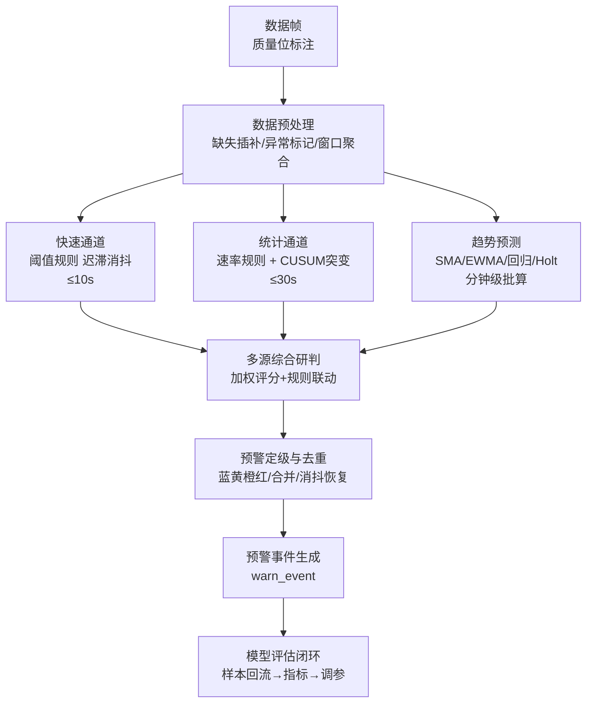

# 5. 算法设计说明书

| 项 | 内容 |
|---|---|
| 项目名称 | 隧道地质灾害AI预警系统（TGAWS） |
| 文档编号 | TSG-AIWS-DOC-05 |
| 文档版本 | V1.1 |
| 编制日期 | 2026-09-25 |
| 编制人 | 项目组（架构师） |
| 评审人 | 甲方项目组（2026-09-25 评审确认） |
| 上游文档 | 《1.需求规格说明书》（FR-301~306、FR-601~605）、《2.系统架构设计说明书》（2.4 计算链路）、《3.数据库设计说明书》（mon_rule/ai_model 表） |
| 文档状态 | 已评审确认（2026-09-25） |

## 修订历史

| 版本 | 日期 | 修订人 | 修订说明 |
|---|---|---|---|
| V1.0 | 2026-09-25 | 项目组 | 初稿：规则引擎、趋势预测、突变检测、综合研判、定级去重、评估迭代；公式 12 项；默认参数基线（待评审定稿） |
| V1.1 | 2026-09-25 | 项目组 | 评审修订：风险分距限值归一化（F12 重写）+附录C 标定表、预测落库 ai_forecast、影子/灰度/生效三级门禁、增量统计量内存（附录D）、CUSUM 冷启动与基线重建、降权计数规则、趋势预警阈值 |

## 5.1 设计目标与范围

1. 落实需求基线：阈值/速率/突变**规则预警** + **时序趋势预测** + **多源综合研判**（本期），视频 AI 识别不在本期（二期）；
2. 约束条件：无 GPU、纯 CPU 推理；判定延迟 ≤30s（快速通道突发类 ≤10s）；5000 点位、30s~5min 采集频率下实时在线计算；
3. 冷启动可用：无历史样本时以规则引擎全量兜底，统计模型达到最小样本量后自动启用；
4. 可评估可迭代：模型带版本、可评估（准确率/漏报率/误报率）、可回滚，为二期 ML 模型演进预留接口（ai_model 表）；
5. 全部参数化：算法参数集中于 mon_rule 与 ai_model 表，支持按"监测对象×工程阶段×断面分区"配置，试运行期可调参。

## 5.2 算法体系总览



算法分层与代码模块对应：数据预处理、单指标判定、趋势预测、综合研判归属 `tgaws-compute`；定级去重与事件生成在 `tgaws-business` 调用 compute 接口完成（接口契约见《4.接口设计说明书》4.3）。

## 5.3 数据预处理算法

| 步骤 | 算法 | 说明 |
|---|---|---|
| 质量位处理 | 按质量位降权：正常 1.0、超范围 0.8、跳变 0.5、缺失不计入统计 | 异常值保留（需求 FR-102），仅影响研判权重 |
| 缺失值处理 | 缺口 ≤3 个周期：线性插值（标记插值）；>3 个周期：不插值，窗口统计跳过 | 插值数据仅用于趋势计算，不写回原始表 |
| 异常值稳健判定 | **MAD 法**（公式 F5）：|x−median| > 3×1.4826×MAD 判为异常点 | 比 3σ 稳健，含突变数据下不误伤真突变 |
| 窗口聚合 | 滑动窗口均值/极值/计数（与 data_sample_minute 聚合口径一致） | 统计通道输入 |
| 标准化 | Z-score（公式 F4，窗口均值/标准差） | 仅用于数据质量诊断；**综合研判改按距限值归一化（5.6.1），不再用 Z-score 定级** |
| 时间跳变 | 断点续传造成时间大间隔（>10min） | 不插值；统计窗口按时间轴重置，不跨断点聚合 |
| 离线恢复 | 测点离线（>180s 无数据）后恢复 | 统计基线重新初始化（同冷启动规则，防旧基线污染） |
| 传感器漂移 | 缓慢系统性偏移 | MAD 检出+人工标记（API-B21）降权；漂移期数据不进模型基线 |
| 降权计数 | 质量位权重 ≤0.5 的样本不计入有效样本 | 有效样本 < N_on 时**该周期不判定**（跳过并计数），不按残缺样本强行判定 |

## 5.4 单指标判定算法

### 5.4.1 阈值规则（含迟滞与消抖）

判定条件（公式 F11）：

- **触发**：连续 `N_on` 次采样满足 `x ≥ A_on`（上限型）或 `x ≤ A_on`（下限型）→ 命中；
- **恢复**：连续 `T_confirm` 分钟满足 `x ≤ A_off`（上限型，迟滞回差 `A_off < A_on`）→ 可消警。

| 设计点 | 取值 | 目的 |
|---|---|---|
| 消抖次数 N_on | 默认 3（可配 1~10） | 滤除单点噪声，防误报 |
| 迟滞回差 H = A_on − A_off | 默认 5% 量程（可配） | 防阈值边界抖动导致的频繁告警/消警振荡 |
| 恢复观察窗 T_confirm | 默认 30min（可配） | 确认风险解除（对应需求 1.6.5） |

### 5.4.2 速率规则

变化速率（公式 F3）：`r_t = (x_t − x_{t−k}) / (k·Δt)`，判定 `|r_t| ≥ R_on` 且方向匹配（上升型/下降型规则分别校验正负号）。同样适用 N_on 消抖与迟滞恢复。适用对象：位移/沉降速率（mm/d）、瓦斯浓度上升速率（%VOL/min）等。

### 5.4.3 突变检测（CUSUM 累积和算法）

采用**在线 CUSUM**（公式 F6），对缓慢漂移型异常（均值漂移）比阈值规则更早检出：

```
S⁺_t = max(0, S⁺_{t−1} + x_t − μ₀ − k)     （正向累积）
S⁻_t = min(0, S⁻_{t−1} + x_t − μ₀ + k)     （负向累积）
命中条件：S⁺_t > h  或  S⁻_t < −h
```

| 参数 | 含义 | 默认值 | 说明 |
|---|---|---|---|
| μ₀ | 基线均值 | 启动时以最近 24h 滑动均值初始化（样本 <24h 时 CUSUM 不启用），每 6h 自适应更新（受屏蔽/重建规则约束） | 自适应慢漂移跟踪 |
| k | 漂移灵敏度 | 0.5σ（窗口标准差） | K=δ/2 最优参考值；k 越小越灵敏 |
| h | 判决阈值 | **8σ（全局安全阀）** | h 越大误报越低、检出越慢；**分测项档位（2026-09-27 参数决策，sys_config 可配）见下表** |
| 窗口 | σ 估计窗 | 24h | 与 μ₀ 同窗 |

**h 分测项档位（初始基线，影子期/灰度期按 8.7.2 门禁逐测项收敛）**：

| 档位 | 测项组 | 代表测项 | 建议 h | 理由 |
|---|---|---|---|---|
| A 类 | 突发致命型 | CH₄、CO、H₂S 浓度；涌水量；水压 | 6~7σ | 误报代价（撤人停工）可承受、漏报代价不可承受；信号超限为断崖式、信噪比高 |
| B 类 | 缓变结构型 | 沉降量、下沉速率、净空收敛、周边位移、锚杆轴力 | 8~10σ | 靠"累计量+速率规则"兜底，CUSUM 仅补充；传感器噪声与温度效应大 |
| C 类 | 高噪声辅助型 | 风速、孔隙水压、地下水位 | 10σ 或暂不启用 | 信噪比低收益小；先"入库不判定"积累样本再定 |

**h↔检出延迟对照（实测，2026-09-27，合成序列 2880 样本暖机后注入）**：1σ 阶跃检出：h=5σ→5 样本、h=8σ→14 样本（30s 采样=7 分钟）、h=10σ→21 样本；0.2σ/样本缓慢漂移：h=8σ→10 样本（5 分钟）。**h=8σ 检出延迟远低于 NFR-A3 平均提前量 ≥15min，安全侧无损失**；误报率从 0.08%/样本（≈5760 次/天/5000 点）降至 ≈1.9 次/天。

**参数单位**：k 为允许漂移量（参考值 K），h 为判决阈值，**单位均为窗口标准差 σ 的倍数**，实现时按实际量纲换算。

**冷启动**：样本 <24h 时 CUSUM 不启用（仅阈值/速率规则），与 5.5.1 对预测的处理一致。

**基线保护**：①窗口内存在预警事件时不更新 μ₀（防异常期污染）；②**消警后丢弃受污染窗口，以消警后新样本重建基线**（或改用截尾均值/中位数作 μ₀ 的稳健估计），防异常残留抬高基线导致同类异常漏报。

命中后 S⁺/S⁻ 归零重启；方差突变用 F 检验辅助（窗口方差比 > 4 且样本 ≥30 判显著，用于瓦斯/涌水流量类波动型突变）。

### 5.4.4 组合规则

多条件经 Aviator 表达式组合（`r1 && (r2 || r3)`），条件引用单指标判定结果与窗口统计量，存 mon_rule.expression_json。示例：同断面"位移速率超限 **且** 锚杆轴力超限"→ 橙色。

## 5.5 趋势预测算法

### 5.5.1 算法选择策略

| 条件 | 选用算法 | 用途 |
|---|---|---|
| 样本 < 24h | 不启用预测（冷启动，仅规则） | 防模型噪声 |
| 样本 ≥24h 且短时波动大（σ/μ > 0.3） | SMA/EWMA（公式 F1/F2） | 平滑+短时外推 |
| 样本 ≥7d 且趋势性显著（回归显著性检验通过） | 线性回归（公式 F7）+ 置信区间 | 中期趋势外推（提前预警核心） |
| 样本 ≥7d 且趋势平缓 | Holt 双参数指数平滑（公式 F8） | 长期缓变监测（沉降类） |

### 5.5.2 预测输出与使用

- 输出：未来 H 分钟（默认 30，可配）预测值 + 95% 置信区间（回归公式 F7 预测区间）；
- 使用：预测值越过**趋势预警阈值**时生成"趋势预警"（趋势预警阈值默认取对应级别 A_on，允许在 mon_rule 独立配置，见附录B）；置信区间宽度作为研判置信度输入综合研判。

### 5.5.3 计算方式与结果落库

每 5min 批算一次全部启用点位（窗口取分钟级数据，5000 点 × O(288) 常数级，单核 <2s），**结果写入 ai_forecast 表（保留 90 天）**：支撑模型评估回测（"每个时点对未来 H 分钟的预测值"必须留存才能计算平均提前量 F10）与 API-E05 查询（**读落库结果，不触发实时计算**；驾驶舱/断面图只读最近一次批算结果）。需实时预测的场景走异步任务接口，不挂同步查询路径。

## 5.6 多源综合研判算法

### 5.6.1 加权评分模型（按距限值归一化）

综合风险分（公式 F9）：

```
S = Σ wᵢ · gᵢ(xᵢ)  ，  Σwᵢ = 1
gᵢ(x) = 该测项距危险限值的归一化占比（公式 F12）
```

**设计理由**：安全预警的语义是"离危险限值的绝对距离"，而非"偏离窗口均值的标准差数"——Z-score 在长期高波动窗口与平稳窗口下会对同一物理浓度给出不同等级，方法论上不可用于定级；按限值归一化后与需求 1.6.3 蓝黄橙红定义语义一致、公式对专家可审计。

**权重与分级阈值联立标定**：权重（下表）与分级映射（5.6.3）必须用典型危险工况联立标定——取每类监测对象的典型工况（如瓦斯 0.5%/1.0%/1.5%），反解出使"典型工况落在预期级别"的组合。标定表见附录C（可复算：工况 → 各 gᵢ → S → 级别）；**单指标定级由规则通道负责，综合研判定位为多指标联合确认与升级，两者取严（5.7.1）**。

| 监测对象 | 指标权重建议基线（评审定稿） |
|---|---|
| 坍塌 | 位移速率 0.35 + 累计位移 0.25 + 锚杆轴力 0.20 + 钢架应力 0.20 |
| 涌水/突水 | 涌水量速率 0.40 + 水压 0.30 + 水位 0.30 |
| 瓦斯 | CH₄ 浓度 0.50 + 浓度上升速率 0.30 + 风速 0.20 |
| 突泥 | 泥水流量速率 0.50 + 孔隙水压 0.50 |
| 沉降 | 下沉速率 0.50 + 累计沉降 0.50 |
| 收敛位移 | 收敛速率 0.60 + 累计收敛 0.40 |

### 5.6.2 规则联动升级

同断面多指标组合命中（5.4.4 组合规则）直接建议升级一级，与加权评分结果取严。

### 5.6.3 分级映射

风险分 S ∈ [0,1]：S ≥0.85→红，≥0.50→橙，≥0.35→黄，≥0.20→蓝，<0.20 不预警。映射阈值可配（ai_model.params_json），并与 5.6.1 权重按附录C 标定表**联立标定**——2026-09-27 联立校验修正：旧映射（0.40/0.55/0.70/0.85）下典型橙级工况实测落黄级（瓦斯双指标 S=0.54、坍塌双超限 S=0.53 均 <0.70），经附录C 全工况重算调整为现映射（红阈值 0.85 为"近红多指标"S≈0.80 留橙级档位；蓝级主要由规则通道承载，综合研判定位联合确认与升级，两者取严）。

## 5.7 预警定级、去重与恢复

### 5.7.1 定级决策

```
最终级别 = max( 单指标规则命中最高级别, 综合研判建议级别, 趋势预警级别 )
```
多规则命中时：先取命中规则中最高 warn_level；同级多规则取 priority 最高者（mon_rule.priority）；规则级别与研判级别不一致时**取严**并记录两个来源（事件 snapshot_json 留痕判定依据）。

### 5.7.2 重复告警抑制

| 场景 | 处理 |
|---|---|
| 同点位已有未消警事件（B0303） | 不生成新事件，新命中数据追加到原事件快照 |
| 新命中级别 > 当前事件级别 | 自动升级（FR-305）：原事件 level 提升、trigger_value 更新、记录 upgrade 留痕 |
| 新命中级别 ≤ 当前级别 | 仅更新快照，不重复通知 |
| 趋势恶化自动升级 | 消抖窗口内连续 3 次采样值单调恶化（|Δ|>噪声带）→ **自动升级立即生效**（FR-305），值班可在 15min 内人工回调（降级）留痕；通知附带一键复核入口 |

### 5.7.3 恢复与消警判定

阈值恢复（F11）+ 观察窗确认 → 事件转"待复核"（warn_status=4），人工复核消警（FR-404）。突变类事件的恢复以 CUSUM 归零且窗口均值回落至基线 ±k 为准。

## 5.8 模型评估与迭代

### 5.8.1 评估指标（硬门槛）

| 指标 | 定义（公式 F10） | 门槛 |
|---|---|---|
| 漏报率 | FN/(TP+FN) | **生效期 ≤5%（安全系统第一指标，硬阈值，对应需求 NFR-A1）** |
| 误报率 | FP/(FP+TN) | 生效期 ≤10%；试运行期放宽至 ≤20% |
| 准确率 | (TP+TN)/N | 参考指标 |
| 平均提前预警时间 | 触发时刻 − 灾变时刻 | **≥15min** |

灾变时刻取 warn_hazard_event.event_time（FR-407 灾害登记真值锚点）；未登记时以人工确认时刻作代理指标（评估报告中注明局限）。

### 5.8.2 影子/灰度/生效三级上线门禁（对应需求 NFR-A4）

| 阶段 | 时长 | 模型行为 | 门禁 |
|---|---|---|---|
| 影子期 | ≥30 天 | 照常计算并落库（ai_forecast），**只标记不通知**（生成事件但 warn_status 独立标记，不发短信/声光） | 与人工判断比对，输出四项指标 |
| 灰度期 | ≥14 天 | 蓝/黄级正常通知；**橙/红级需人工确认后升级** | 漏报率/误报率达门槛 |
| 生效期 | — | 全级别自动通知 | 持续监控；**回滚条件：连续 3 次误报 或 单日误报 > 配置阈值（默认 10）→ 自动回退上一版本并告警** |

### 5.8.3 回测方法

1. 区间选取：近 90 天（与 ai_forecast 保留期一致）或指定历史区间；
2. 样本构造：正样本=warn_hazard_event 登记灾变/险情事件；假阳性=人工标记误报事件；阴性样本=平稳期随机抽样（按测项分层）；
3. 跑批：用当前版本模型对样本区间重放（输入=历史采样，输出=预测与判定）；
4. 指标计算与留痕：四项指标写入 ai_model.metrics_json，评估过程与样本清单留痕（可复现）。

### 5.8.4 迭代路径

试运行期每 2 周评估一次；稳定期每月/参数变更后。一期规则+统计模型 → 积累 ≥6 个月带标签样本 → 二期引入 ML 模型（模型接口已预留，ai_model.model_type=3）。

## 5.9 性能与复杂度分析

| 项 | 分析 |
|---|---|
| 判定吞吐 | 统一容量口径 490 万条/天：均值 57 条/s、峰值 300 条/s；单次判定（阈值 O(1) + CUSUM O(1) + 研判 O(指标数)）<1ms，峰值单核占用 <30% |
| 预测批算 | 每 5min 一次，5000 点 × O(288)（分钟级窗口）≈ 150 万次运算，单核 <2s；结果落 ai_forecast，查询不触发计算 |
| 内存（增量统计量） | **不保留原始序列**：CUSUM 仅存 S⁺/S⁻ 两标量；方差用 Welford（n/mean/M2 三标量）；MAD 分位数用 P² 在线估计（O(1)）；EWMA/回归存系数。单点位 <1KB × 5000 点 **<5MB**（明细见附录D），已并入架构 2.10 JVM 预算 |
| 延迟 | 快速通道：入库（双触发队列驻留 ≤1s）→判定→通知 <3s（满足突发 ≤10s）；统计通道：分钟聚合后 ≤30s 达标 |
| 数值稳定性 | 全部 double 运算；方差用 Welford 在线算法防精度丢失；预测落库值转 decimal(16,4) |

## 5.10 算法风险与应对

| 编号 | 风险 | 应对 |
|---|---|---|
| R-G1 | 无历史数据，统计模型冷启动不可用 | 规则引擎全量兜底；CUSUM/预测达最小样本（24h）自动启用且受影子期门禁约束（5.8.2 只标记不通知）；基线 μ₀ 初始化期用保守值 |
| R-G2 | 阈值参数不准导致误报/漏报 | 参数化+消抖迟滞机制；试运行 ≥30 天调参期；评估闭环（5.8）每 2 周复盘 |
| R-G3 | CUSUM 对突变类数据过敏感 | h/k 参数按测项分组配置；MAD 预处理剔除孤立异常后再入 CUSUM |
| R-G4 | 自适应基线 μ₀ 被持续异常"污染" | 屏蔽规则：窗口内存在预警事件时不更新；**消警后丢弃受污染窗口以新样本重建基线**（或截尾均值/中位数稳健估计），防基线抬高导致漏报 |
| R-G5 | 综合研判权重主观性强 | 权重按监测对象给出建议基线（5.6.1），评审定稿；评估指标反馈权重迭代 |
| R-G6 | 二期切换 ML 模型不兼容 | 模型接口/版本管理已预留（4.3、ai_model 表），评估对比后切换 |

---

## 附录A 算法公式汇总

| 编号 | 公式 | 说明 |
|---|---|---|
| F1 | SMA_t = (1/n)Σ_{i=t−n+1}^{t} x_i | 滑动平均 |
| F2 | e_t = αx_t + (1−α)e_{t−1} | EWMA 指数加权滑动平均（默认 α=0.3） |
| F3 | r_t = (x_t − x_{t−k})/(k·Δt) | 变化速率 |
| F4 | z_t = (x_t − μ_w)/σ_w | Z-score 标准化 |
| F5 | MAD = median(|x_i − median(x)|)；异常判定 |x−median| > 3×1.4826×MAD | 稳健异常检测 |
| F6 | S⁺_t = max(0, S⁺_{t−1}+x_t−μ₀−k)；S⁻_t = min(0, S⁻_{t−1}+x_t−μ₀+k)；命中：S⁺>h 或 S⁻<−h | CUSUM 突变检测；**k=允许漂移量（参考值 K）、h=判决阈值，单位均为窗口标准差 σ 的倍数** |
| F7 | ŷ = β₀+β₁t；预测区间 ŷ±t_{α/2,n−2}·s·√(1+1/n+(t₀−t̄)²/Σ(t_i−t̄)²) | 最小二乘线性回归+置信区间 |
| F8 | l_t = αx_t+(1−α)(l_{t−1}+b_{t−1})；b_t = β(l_t−l_{t−1})+(1−β)b_{t−1}；ŷ_{t+h} = l_t+h·b_t | Holt 双参数指数平滑 |
| F9 | S = Σ wᵢ·gᵢ(xᵢ)，Σwᵢ=1 | 综合风险分（xᵢ 为测项原始值，gᵢ 按 F12 距限值归一化） |
| F10 | 准确率=(TP+TN)/N；漏报率=FN/(TP+FN)；误报率=FP/(FP+TN)；提前量=触发时刻−灾变时刻 | 模型评估指标；灾变时刻取 warn_hazard_event.event_time（FR-407 登记真值，未登记时以人工确认时刻作代理并在评估报告中注明局限） |
| F11 | 触发：连续 N_on 次 x≥A_on；恢复：持续 T_confirm 满足 x≤A_off | 阈值+迟滞消抖 |
| F12 | ratio=(x−A_safe)/(A_lim−A_safe)；x≤A_warn→g=0.5·clamp(ratio,0,1)；A_warn<x≤A_lim→g=0.5+0.5·(x−A_warn)/(A_lim−A_warn)；x>A_lim→g=1.0 | 距限值归一化分段映射（下限型镜像；分段点可配） |

## 附录B 默认参数基线表（建议基线，评审定稿后写入 data/03_default_rule.sql）

| 参数 | 默认值 | 可调范围 | 说明 |
|---|---|---|---|
| N_on 消抖次数 | 3 | 1~10 | 阈值/速率规则通用 |
| H 迟滞回差 | 5% 量程 | 1%~20% | 防告警振荡 |
| T_confirm 恢复观察窗 | 30min | 10~240min | 消警前置条件 |
| CUSUM k | 0.5σ | 0.25~1.0σ | 漂移灵敏度 |
| CUSUM h | 5σ | 3~8σ | 判决阈值 |
| σ 估计窗 | 24h | 6~72h | 与 μ₀ 同窗 |
| μ₀ 自适应周期 | 6h | 1~24h | 含屏蔽规则（R-G4） |
| EWMA α | 0.3 | 0.1~0.5 | 平滑系数 |
| Holt α / β | 0.4 / 0.2 | 0.1~0.6 | 水平/趋势系数 |
| 预测时域 H | 30min | 10~120min | 趋势预警提前量 |
| 风险分级映射 | 0.40/0.55/0.70/0.85 | 可配 | 蓝/黄/橙/红 |
| 最小训练样本 | 24h（预测）/7d（回归） | 可配 | 冷启动门槛 |
| 趋势预警阈值 | 默认取对应级别 A_on | 可独立配置 | 预测值越过该阈值触发趋势预警（5.5.2） |

**监测对象阈值建议基线（占位，必须按地质分区评审定稿）**：

| 监测对象 | 指标 | 建议基线（示例） | 依据 |
|---|---|---|---|
| 瓦斯 CH₄ | 浓度 | 黄 0.5% / 橙 1.0% / 红 1.5% | TB 10120—2019 惯例（报警/断电撤人/停止作业） |
| 瓦斯 CH₄ | 上升速率 | 黄 0.1%/min | 工程惯例 |
| 收敛位移 | 速率 | 黄 3mm/d / 橙 5mm/d | 施工监测惯例（围岩等级相关） |
| 拱顶下沉 | 速率 | 黄 2mm/d / 橙 4mm/d | 同上 |
| 涌水量 | 突变 | CUSUM 检出即黄级起评 | 突变型指标以算法判定为主 |
| 沉降/位移 | 累计量 | 按设计文件控制值 | 因工程而异，无通用基线 |

> 上表数值仅作为初始化脚本占位示例，**正式阈值以技术专家按地质分区/围岩等级评审定稿为准**（需求基线 Q13），系统侧全部参数化、即改即用。

## 附录C 权重与分级阈值联立标定表（可复算）

标定方法：取典型危险工况 → 代入 5.6.1 的 gᵢ 与权重 → 计算 S → 对照 5.6.3 分级映射，验证"典型工况落在预期级别"；不满足则调权重或分级阈值后重标定（全部参数化，无需改代码）。

**示例一：瓦斯（权重 0.50/0.30/0.20；CH₄：A_safe=0.2%、A_warn=0.5%、A_lim=1.5%；速率：A_safe=0.01、A_warn=0.1、A_lim=0.3 %/min；风速按下限型：A_safe=1.0、A_warn=0.5、A_lim=0.25 m/s）**

| 工况 | CH₄ | 速率(%/min) | 风速(m/s) | g₁ | g₂ | g₃ | S | 综合研判定级 | 最终定级（取严） |
|---|---|---|---|---|---|---|---|---|---|
| 正常 | 0.2% | 0.01 | 1.0 | 0.000 | 0.000 | 0.000 | 0.00 | 无 | 无 |
| 黄级工况 | 0.5% | 0.08 | 0.8 | 0.115 | 0.121 | 0.133 | 0.12 | 无（规则通道定黄） | 黄 |
| 橙级工况（附录原例） | 1.0% | 0.15 | 0.6 | 0.750 | 0.625 | 0.267 | 0.62 | 橙（≥0.50） | 橙 |
| **橙级工况（评审联立校验例）** | 1.0% | 0.12 | 1.0 | 0.750 | 0.550 | 0.000 | **0.54** | 橙（≥0.50） | 橙 |
| 红级工况 | 1.5% | 0.30 | 0.4 | 1.000 | 1.000 | 0.700 | 0.94 | 红（≥0.85） | 红 |
| 单指标红限（口径记录） | 1.5% | 0.01 | 1.0 | 1.000 | 0.000 | 0.000 | 0.50 | 橙（规则通道定红，取严=红） | 红 |

**示例二：坍塌（权重 0.35/0.25/0.20/0.20；位移速率：A_safe=1、A_warn=3、A_lim=8 mm/d；累计位移：A_safe=30、A_warn=60、A_lim=120 mm；轴力/应力为限值占比：A_safe=0.5、A_warn=0.8、A_lim=1.0）**

| 工况 | 速率(mm/d) | 累计(mm) | 轴力占比 | 应力占比 | g₁ | g₂ | g₃ | g₄ | S | 最终定级 |
|---|---|---|---|---|---|---|---|---|---|---|
| 黄级工况 | 3 | 60 | 0.8 | 0.7 | 0.143 | 0.167 | 0.300 | 0.200 | 0.19 | 黄（规则通道定黄） |
| 橙级工况（附录原例） | 5 | 100 | 1.0 | 0.9 | 0.700 | 0.833 | 1.000 | 0.750 | 0.80 | 橙 |
| **橙级工况（评审联立校验例）** | 5 | 60 | 1.0 | 0.7 | 0.700 | 0.167 | 1.000 | 0.200 | **0.53** | 橙（≥0.50） |
| 红级工况 | 8 | 120 | 1.0 | 1.0 | 1.000 | 1.000 | 1.000 | 1.000 | 1.00 | 红 |

**结论**：单指标超限由规则通道直接定级（需求 FR-301/302）；综合研判承担"多指标联合确认与升级"（如橙级工况多指标联动 S=0.80 可独立支撑橙色），两者取严（5.7.1）。本表随附录B 阈值基线同步评审定稿。

## 附录D 算法内存明细（已并入架构文档 2.10 JVM 预算）

| 模型/组件 | 单点位常驻 | 说明 |
|---|---|---|
| CUSUM 状态 | 2×double + Welford 3×double | S⁺/S⁻、n/mean/M2，O(1) |
| MAD 分位数 | P² 算法 ≈10×double | 在线分位数估计（5 组 marker），O(1) |
| EWMA/Holt | 2~3×double | 水平/趋势系数 |
| 回归 | 系数缓存 4×double | 批算周期内有效 |
| 质量位窗口 | 短窗位图 ≤64B | 近 N_on 次采样质量 |
| 合计 | **<1KB/点位** → 5000 点 **<5MB** | 与架构文档 2.10 内存预算一致 |
