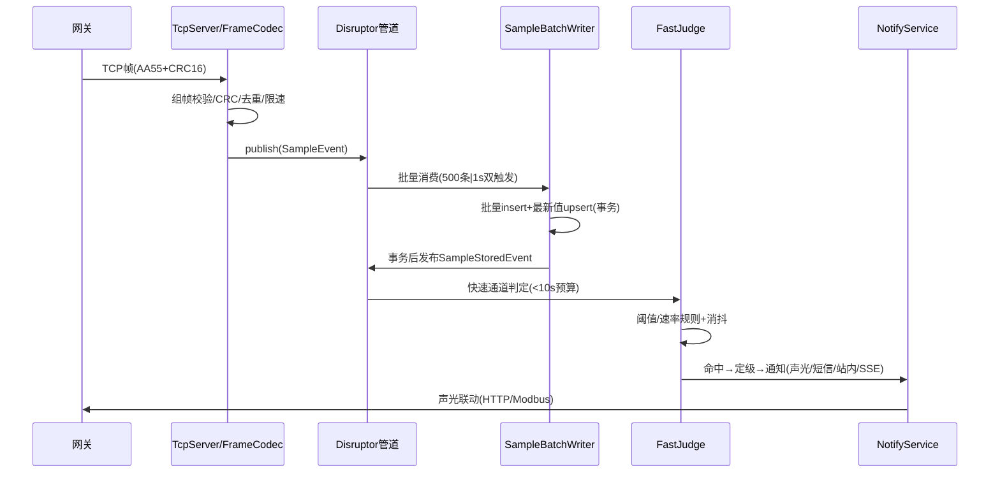
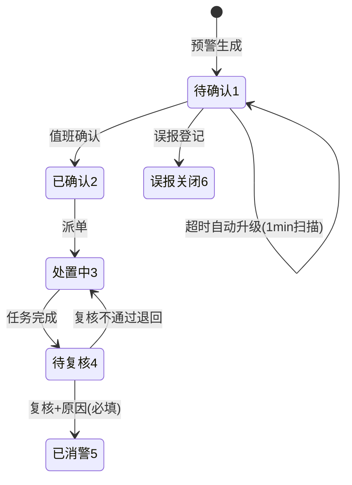
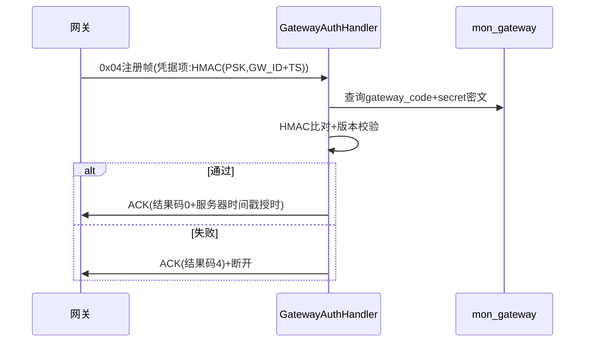

# 6. 详细设计说明书

| 项 | 内容 |
|---|---|
| 项目名称 | 隧道地质灾害AI预警系统（TGAWS） |
| 文档编号 | TSG-AIWS-DOC-06 |
| 文档版本 | V1.1 |
| 编制日期 | 2026-09-25 |
| 编制人 | 项目组（架构师） |
| 评审人 | 甲方项目组（2026-09-25 评审确认） |
| 上游文档 | 1~5 号文档 V1.1（已评审确认） |
| 文档状态 | 已评审确认（2026-09-25） |

## 修订历史

| 版本 | 日期 | 修订人 | 修订说明 |
|---|---|---|---|
| V1.0 | 2026-09-25 | 项目组 | 初稿：工程结构、核心机制、时序、类设计、事务并发、安全实现、配置运维、Mapper 设计 |
| V1.1 | 2026-09-25 | 项目组 | 评审修订：模块口径澄清（1 父 POM+5 子模块，controller 上移 web）、数据权限强类型方案（DataScopeCondition+ArchUnit 守护）、通知 Outbox+补偿任务+积压告警、批量写折半重试、接口分级限流、分钟聚合边界右开、pmax 兜底+归档留痕、W1a/W1b 拆分与 W2 出口标准 |

## 6.1 设计目标与范围

1. 将架构/数据库/接口/算法设计落到**类级与机制级**，使阶段7可按本设计直接编码；
2. 覆盖：工程结构、数据管道、定时任务、缓存、幂等防重放、数据权限、审计、SSE、核心流程时序、关键类清单、事务并发、安全实现、配置与运维、Mapper 与核心 SQL；
3. 承接全部评审修订决策（统一容量口径、双触发批量写、预测落库 ai_forecast、影子/灰度门禁、data_scope 数据权限、datetime(3) 毫秒等）。

## 6.2 工程结构设计

### 6.2.1 Maven 聚合工程（最终版）

```
tunnel-geohazard-ai-warning-system          # 根（tgaws-parent 聚合：1 父 POM + 5 子模块）
├── pom.xml                                  # 父 POM：Spring Boot 4.0.8 / JDK25 / 依赖版本管理
├── tgaws-common                             # 通用层：常量/枚举/异常/统一返回/工具/注解
├── tgaws-access                             # 接入层：Netty TCP + Moquette MQTT + 协议适配
├── tgaws-compute                            # 计算层：规则引擎/突变检测/预测/综合研判/管道
├── tgaws-business                           # 业务层：预警/处置/巡检/台账/用户/报表（无 controller，纯业务）
└── tgaws-web                                # 接口与装配层：Controller/启动类/全局配置/拦截器/定时任务
```

依赖方向：`web → business → compute → common`、`web → access → common`；**business 不依赖 access**（依赖倒置，保持接入层可替换承诺，与架构 2.11 扩展点一致）。现有脚手架 `cn.puge` 单模块将重构为上述结构（阶段7 任务 W1b，代码从 `cn.puge.tunnelgeohazardaiwarningsystem` 迁移至 `com.tgaws`）。

### 6.2.2 包结构（com.tgaws）

```
com.tgaws.common      constant/ enums/ exception/ result/ util/ annotation/
com.tgaws.access      tcp/ mqtt/ protocol/ pipeline/
com.tgaws.compute     rule/ detect/ forecast/ judge/ task/
com.tgaws.business    warn/ dispose/ patrol/ mon/ sysmgr/ ai/ rpt/   # service/manager/mapper/entity/dto/vo（无 controller）
com.tgaws.web         controller/ config/ boot/                       # Controller 按业务域分包 + 装配与启动
```

分层约束（阿里规约）：controller 只做参数校验与协议转换；service 承载业务；manager 承载跨 DAO 组合与外部封装；mapper 只做 CRUD；DTO 入参、VO 出参、PO 与表一一对应；禁止跨模块直调 mapper。

### 6.2.3 配置体系

| 文件/来源 | 内容 |
|---|---|
| application.yml | 非敏感默认配置：端口、线程池、队列容量、mybatis 映射 |
| application-prod.yml | 生产 profile：全部敏感项走环境变量 `${...}`（附录A 环境变量清单） |
| sys_config 表 | 运行期可调参数（预警参数、保留期、限流阈值、scale），优先级高于 yml |
| bootstrap 参数 | JVM：`-Xms4g -Xmx4g -Dfile.encoding=UTF-8`（WinSW 服务配置） |

## 6.3 核心机制详细设计

### 6.3.1 数据管道（Disruptor）

| 设计点 | 实现 |
|---|---|
| RingBuffer | 容量 2^20（约 100 万条），多生产者模式（TCP/MQTT 双通道发布） |
| 事件对象 | `SampleEvent{ pointId, ts, value, quality, source }`，对象池复用 |
| 消费链 | 消费线程 A（批量写库，双触发：满 500 条或满 1s 先到提交）→ 事务提交后发布 `SampleStoredEvent`（afterCommit） |
| 判定消费 | 线程 B 消费 `SampleStoredEvent`：快速通道阈值判定（≤10s 预算）；线程 C 消费分钟聚合信号：统计通道判定（≤30s 预算） |
| 背压降级 | ①≥80% 级：容量预警计数（不丢数据，自监控告警联动）；②**环满（等价 ≥95%）：丢弃新入+计数+暂停接入信号**（示意网关降速）——**丢弃仅允许发生在超设计峰值场景（持续 >300 条/s 超 5min），日数据完整率 ≥99.99%**（对应需求 FR-101 修订口径）；实现要点：publish 先 tryNext、环满才丢（若比例预检前置会形成 80% 自锁均衡，95% 档永不可达——W4-4b 实测踩坑修正） |
| 优雅关停 | 停机信号 → 停止发布 → drain 队列落盘 → 关闭 |

### 6.3.2 判定链路

- 快速通道（`FastJudgeHandler`）：最新值 + 近 N_on 采样 → 阈值/速率规则 → 命中即定级（突发类 ≤10s）；
- 统计通道（`StatsJudgeHandler`）：分钟聚合完成后 → CUSUM/方差突变/组合规则 → 综合研判（距限值归一化 F12）→ 定级（≤30s）；
- 趋势预警：预测批算（5min）中检出越阈 → 生成"趋势预警"（低一级提示），不直接定级；
- 影子/灰度门禁（算法文档 5.8.2）：模型通知行为按阶段参数 `model.gate.stage`（shadow/gray/live）控制，shadow 期事件只标记不通知。

### 6.3.3 定时任务清单（Spring @Scheduled，4 线程 TaskScheduler）

| 任务 | 周期 | 执行窗口 | 失败处理 |
|---|---|---|---|
| 分钟聚合（data_sample→minute） | 每 1min | 整分+5s | 聚合区间 **[last_agg_ts, 整分)**（分钟边界右开，与分钟桶语义严格对齐，避免边界抖动）；重试 2 次后 D0007，下周期续传 |
| 趋势预测批算（写 ai_forecast） | 每 5min | — | D0007 |
| CUSUM 基线 μ₀ 自适应更新 | 每 6h | — | 跳过本周期（保留旧基线） |
| 月分区创建（当年+次年） | 每月 1 日 00:10 | — | D0007 |
| 分区归档清理（原始>1年/聚合>3年） | 每日 03:00 | — | D0007；归档开关 sys_config |
| ai_forecast 清理（>90 天） | 每日 03:30 | — | D0007 |
| 处置任务超时扫描（→超时未完成） | 每 5min | — | D0007 |
| 巡检任务逾期扫描（→逾期） | 每 10min | — | D0007 |
| 预警确认超时升级（蓝30/黄15/橙5/红3min） | 每 1min | — | D0007 |
| 数据中断检测（全网关离线或入库停顿>5min） | 每 1min | — | D0006 告警；**在线→离线迁移由本任务调用 GatewayOnlineRegistry.isOffline 驱动（access 层提供判定能力，W4-4 接线，勿悬空）** |
| 通知投递补偿（Outbox） | 每 30s | — | 扫 warn_notify_log `deliver_state=0/2 且 next_retry_time<=now()` 重投；退避 10s/30s/2min/10min，最多 6 次后置 3（已放弃）+D0003 升级告警 |
| 通知积压告警 | 每 1min | — | 待投递数 >notify.pending_max 或最早待投递超时 >notify.pending_alert_sec → 告警管理员（系统"哑火"哨兵） |
| 通知通道健康检测 | 每日 08:00 | — | D0008 |
| 分析报告生成（日/周/月） | 06:00 | — | rpt_report 记失败 |
| 登录锁定解锁/失败计数清理 | 每 1min | — | 无 |
| 数据库备份 | 每日 02:00 | Windows 任务计划（应用外，备份脚本交付） | sys_backup_log |

### 6.3.4 缓存设计（Caffeine 实例清单）

| 缓存 | key | TTL | 容量 | 失效策略 |
|---|---|---|---|---|
| latestValue | pointId | 5s | 10000 | 过期（看板轮询口径） |
| dictCache | dictCode | 10min | 200 | 字典变更主动失效 |
| configCache | configKey | 10min | 200 | sys_config 变更主动失效 |
| tokenBlacklist | jti | 30min | 10000 | 登出写入 |
| nonceCache | nonce | 5min | 100000 | 防重放 |
| loginFailCache | username+ip | 30min | 10000 | 防爆破计数 |
| idempotencyCache | Idempotency-Key | 24h | 10000 | 幂等结果 |
| ruleCache | (hazardType,itemType,stage) | 10min | 1000 | 规则变更主动失效 |
| pointMetaCache | pointId | 10min | 10000 | 点位变更主动失效 |
| modelParamCache | modelCode+version | 10min | 100 | 模型参数变更失效 |

统一由 `CacheManager`（Spring Cache 抽象 + Caffeine 实现）管理，为二期切换 Redis 保留扩展点。

### 6.3.5 幂等与防重放

- 幂等：创建类接口解析 `Idempotency-Key` → idempotencyCache 命中返回首次响应；24h 过期；
- 防重放：全局过滤器校验 `X-Ts`（5min 窗口）+ `X-Nonce`（nonceCache 判重）；
- Open API：HMAC-SHA256（METHOD+PATH+body）签名校验器 `OpenApiSignVerifier`，失败记 A0004/A0005；
- TCP 补传幂等：48h 内存去重窗口（pointId+ts 的环形哈希集合）。

### 6.3.6 数据权限（data_scope，强类型显式方案）

- 登录时由 `DataScopeInterceptor`（web 层）**仅解析登录态**生成 `DataScope{ type(1全部/2本隧道/3本断面/4仅本人), tunnelIds[], sectionIds[] }` 放入请求上下文，**不注入查询条件**（职责唯一，避免与显式方案双轨）；
- 查询路径：`DataScopeHelper.forTunnel(scope)` 返回**强类型条件对象 `DataScopeCondition`**（内部持有参数化 IN 条件，不做 SQL 字符串拼接），**Mapper 查询方法签名强制携带**——`List<Event> selectPage(@Param("scope") DataScopeCondition scope, @Param("q") EventQuery q)`，不带 scope 的签名不存在，**漏用即编译失败**；
- 写/改/删路径：一律"**先按 scope 条件查主键**（查不到即 C0008）再执行变更"，禁止"查出后再比对 tunnelId"（防先查 A 隧道再改 B 隧道 ID 的越权路径）；
- **架构守护测试（ArchUnit）已落地（T-704，CI 构建失败拦截）**：①patrol/rpt 域 Mapper 的 select* 查询方法签名必须包含 `DataScopeCondition` 参数（白名单：单主键查询——出口走 ScopeGuard；无隧道维度查询；系统任务全量查询），XML 以参数化 foreach 片段消费条件（scope=null 全部/空集合 1=0，列名仅来自 DataScopeHelper 白名单）；②分层：business 不得依赖 web；web 不得直接依赖 mapper（一律经业务服务）；mapper 不得反向依赖 manager；③p3c-pmd（阿里规约）verify 阶段 P1 阻断级失败即构建失败（PMD6 数据流在 JDK25 字节码上的"maximum Iterations exceeded"为已知降级，结构性规则不受影响）；
- sys_role_tunnel 提供多隧道授权，sys_role.data_scope 定义范围类型（默认 3=本断面）。

### 6.3.7 操作审计（@OperLog）

- AOP 切面注解 `@OperLog(module, operation)`：切 controller 写操作；记录 username/module/operation/method/params(脱敏)/response_code/cost_ms/ip → sys_oper_log；
- 脱敏工具 `MaskUtil`：password/token/secret/手机号等字段掩码后落库；
- 异步写（审计线程池），写失败降级 ERROR 日志（不阻断业务）；
- 登录/登出由 AuthService 直写 sys_login_log。

### 6.3.8 SSE 推送（API-C21）

- `SseEmitterRegistry`：userId → List<SseEmitter>（多终端）；连接上限 100，超限拒绝最旧连接；
- 事件源：WarnEventPublisher 发布 Spring 事件 → 监听器按数据权限推送给可见用户；
- 心跳：每 15s 发送 comment 帧；断线重连按 `Last-Event-ID`（=event_id）增量补发；
- 移动 H5 不接 SSE，走 5s 轮询最新值接口。

**移动端离线降级三层（评审 4.5/3.1 定稿，物理约束：H5 浏览器离线时 SSE/轮询均不可达）**：

| 场景 | 通道 | 说明 |
|---|---|---|
| PC 在线 | SSE（API-C21） | SseEmitterRegistry 上限 100 连接、15s 心跳、Last-Event-ID 续传 |
| 移动在线 | 5s 轮询（API-B16 最新值） | 覆盖 FR-201 看板刷新 |
| 移动离线 | **短信（唯一可靠离线通道，走运营商网络）** | 不承诺应用内推送（技术不可能）；橙/红级由短信覆盖（需求 1.6.3 映射表）；**恢复网络后按 since 时间戳补拉 API-C01 预警事件（离线期间事件不丢失，仅迟达）** |

## 6.4 核心业务流程时序设计

### 6.4.1 数据采集→预警判定→通知（端到端）



延迟预算：组帧 <1ms → 队列驻留 ≤1s → 写库 <100ms → 判定 <1ms → 通知 <2s，合计 <3s（满足突发 ≤10s）。

### 6.4.2 预警处置闭环（状态机）



并发控制：全部流转用**条件 UPDATE**（`UPDATE warn_event SET warn_status=?,... WHERE id=? AND warn_status=?`），影响行数=0 即返回 B0302（状态不允许），杜绝双值班并发误操作；消警校验 close_reason 非空（B0304）。

### 6.4.3 网关注册（0x04）



### 6.4.4 巡检任务生成与填报

计划（patrol_plan）→ 定时生成器（**每日 00:30 生成次日任务**，PatrolTaskGenerator）→ patrol_task 派发 → 移动 H5 填报（离线暂存补传）→ 隐患登记联动（result=异常提示登记，不强制）→ 完成校验（全部巡检项已填报）。

**生成语义（FR-501 派发准确率 100%）**：

- 频率 `frequency_type`：1 每班 → 00:00/08:00/16:00 三班；2 每日 → `time_slot`（HH:mm）；3 每周 → 仅周一 `time_slot`（HH:mm）；
- **幂等**：`uk_plan_time(plan_id, plan_time)` + `ON DUPLICATE` 无操作——重复执行/补跑零副作用（created=0），生成数=启用计划×班次数可复核；
- **派发对象**：`patrol_plan.inspector_id`（自动指派，任务级 `inspector_id` 快照）；
- **逾期**：PatrolOverdueScanner 每 5min 扫描 `status=1 且 plan_time 已过 → 4逾期`（3.7.2 状态机）；
- **模板版本化**：修改=同 `template_no` 新版本行（version+1），`patrol_task.template_id` 指向生成时版本，记录行存 `item_name/judge_standard_snapshot` 快照——模板改版后历史任务按旧标准解释；
- **离线补传**：`client_key`（前端暂存 UUID）+ `uk_client_key`/`uk_task_item` 双唯一键幂等；任务改派/取消后补传拒绝（B0501/B0403）；
- **隐患闭环**：登记（source 1巡检/2上报，含经纬度与 task_id/record_id 来源追溯）→ 转处置（指定 handlerId，1/2→2）→ 闭环（closeRemark 必填，1/2→3）；达灾害级经"转灾害登记"生成 warn_hazard_event（patrol_hazard_id 留痕，FR-407 真值样本不遗漏）。

### 6.4.5 报表与驾驶舱（FR-801/802/605 预聚合口径）

**物理前提**：FR-802 要求驾驶舱指标刷新 ≤1min。若实时 GROUP BY：单月数据完整率需扫 4320 万行（30~180s），架构上不可能达标（评审第 7 轮结论）。因此：

- **完整日**：RptStatDailyTask 每日 01:00 将昨日逐隧道聚合入 `rpt_stat_daily`（预警/处置/巡检/隐患/样本实收+按频率固化的应收），`uk_tunnel_date` upsert 重跑安全；启动补数补齐近 7 日缺失日；F02 查询时缺日自动补齐（幂等）；
- **今日（实时段）**：驾驶舱"今日预警/未闭环/闭环率/在线率/数据完整率/高风险点位"仅查当日或近 24h 有界窗口（`warn_event.idx_create_time` 支撑），数据量小；
- **周趋势**：近 6 个完整日预聚合行 + 今日实时点拼接；
- **报告（FR-605）**：ReportService 生成自包含 HTML（统计表 + 7 日趋势纯 SVG 折线 + 结论建议阈值模板），落 `tgaws.rpt.dir`（默认 D:\AI监测预警系统\reports，C 盘纪律），rpt_report 留痕；定时：01:30 日报（昨日）、周一 01:40 周报、每月 1 日 01:50 月报；
- **指标口径**：闭环率=当日派单中已闭环/当日派单（滚动口径）；巡检完成率=已完成/当日任务；数据完整率=实收/应收；分母为 0 计 100%（无欠账）。

## 6.5 关键类设计清单

| 模块 | 类 | 职责 | 关键方法/说明 |
|---|---|---|---|
| access | TcpServer | Netty 服务（:9000） | start()/stop()；boss/worker 线程 |
| access | TcpFrameCodec | 组帧/CRC/粘包半包处理 | 按 4.4.1 组帧规则与附录A 伪代码实现 |
| access | GatewayAuthHandler | 注册凭据校验/心跳/在线维护 | HMAC-SHA256 比对（PSK 密文） |
| access | MqttBrokerStarter | 内嵌 Moquette 启停 | 主题 tgaws/v1/...，账号认证（MQTT 3.1.1） |
| access | ProtocolAdapter | TCP/MQTT→统一 SampleEvent | SPI 接口+两实现 |
| access | SampleValidator | 校验清洗 | 范围/跳变/重复/质量位（FR-102） |
| compute | DisruptorPipeline | 有界队列管道 | 发布/背压降级/优雅关停 |
| compute | SampleBatchWriter | 双触发批量写 | TransactionTemplate；失败整批重试 1 次→**折半递归重试**（≤log₂500≈9 层，定位坏行且仅多 9 个事务）；`INSERT..ON DUPLICATE KEY UPDATE` 幂等覆盖（主键 (point_id,ts) 去重） |
| compute | FastJudgeHandler | 快速通道判定 | 阈值/速率+消抖（N_on/迟滞） |
| compute | StatsJudgeHandler | 统计通道判定 | CUSUM/方差突变/组合规则 |
| compute | RuleEngineImpl | 规则求值 | Aviator 表达式+规则缓存 |
| compute | CusumDetector | CUSUM 突变检测 | 增量标量 S⁺/S⁻；μ₀ 自适应+屏蔽/重建 |
| compute | MaddOutlierFilter | MAD 稳健异常检测 | P² 在线分位数 |
| compute | WelfordStats | 在线均值/方差 | n/mean/M2 |
| compute | ForecastService | 趋势预测 | 模型选择（SMA/EWMA/回归/Holt）+置信区间 |
| compute | ComprehensiveJudge | 综合研判 | 距限值归一化 F12+权重（附录C 标定） |
| compute | ForecastBatchTask | 5min 批算 | 写 ai_forecast |
| compute | AggregationTask | 分钟聚合 | 增量区间 [last_agg_ts, now)，仅非空分钟 |
| business | WarnEventServiceImpl | 预警事件生命周期 | create/confirm/upgrade/downgrade/close（条件 UPDATE） |
| business | DisposeTaskServiceImpl | 处置任务 | create/start/feedback/finish/超时扫描 |
| business | NotifyService | 通知编排（Outbox） | 业务事务内写 warn_notify_log(deliver_state=0)→afterCommit 投递；三级通道路由+B0306 抑制合并；红/橙级同步尝试 1 次+失败转补偿 |
| business | SmsSenderImpl | 短信（占位配置） | ISmsSender；重试2次转站内兜底 |
| business | AlarmClientHttpImpl / ModbusImpl | 声光联动 | Bearer+IP 白名单 / Modbus 长连接 |
| business | SseService | SSE 推送 | 注册中心/心跳/Last-Event-ID 续传 |
| business | HazardEventServiceImpl | 灾害险情登记（FR-407） | register（event_time 三重校验+关联一对多 linkHazard）/list（API-C22） |
| business | PointServiceImpl | 点位台账 | 标定字段（range/scale）/启停 |
| business | ImportService | 文件导入 | EasyExcel 解析/批次状态/错误明细 |
| web | WarnController | 预警中心接口（API-C01~C20） | 事件分页/详情/时间线/统计/确认/升降级/消警/派单/反馈/完成/规则 CRUD/通知查询；userId 一律认证上下文 |
| business | RuleService | 预警规则管理（T-708） | 版本+1 留痕/删除引用守卫 B0204/启停/历史/expressionJson JSON 校验 |
| business | PatrolServiceImpl | 巡检计划/模板/任务/记录/隐患 | 模板版本+1；generateTasksForDate（uk_plan_time 幂等）；fillRecords（clientKey 补传幂等）；assign/closeHazard（条件更新）；convertHazardToDisaster |
| web | PatrolTaskGenerator | 巡检任务生成调度 | 每日 00:30 生成次日任务（cron），失败次日补跑幂等 |
| web | PatrolOverdueScanner | 巡检逾期扫描 | 每 5min：1待巡检 且 plan_time 已过 → 4逾期 |
| business | AuthService | 认证 | 登录/锁定/refresh 轮换/黑名单 |
| business | UserRoleService | 用户角色权限 | RBAC 组装 |
| business | ModelManageService | 模型注册/参数/切换 | 影子-灰度-生效阶段参数 |
| business | RptStatDailyService | 报表日聚合（预聚合口径） | aggregateForDate（upsert 重跑安全）/ensureAggregated（缺日补齐）/todaySamples（实时段完整率） |
| business | DashboardService | 领导驾驶舱（FR-802） | 今日指标实时段小查询 + 预聚合周趋势；比率分母 0 计 100% |
| business | ReportService | 统计报表/报告生成（FR-801/605） | statistics（区间 SUM）/generateReport（HTML+SVG 落 D 盘）/reportPath（B0802 守卫） |
| web | RptSchedulers | 报表调度与启动补数 | ApplicationRunner 补数近 7 日；cron 01:00 聚合/01:30 日报/周一 01:40 周报/每月 1 日 01:50 月报 |
| web | GlobalExceptionHandler | 统一异常处理 | 错误码映射（4.6 表） |
| web | AuthInterceptor | JWT 校验+权限点校验 | Bearer/黑名单/`@RequirePermission`；401 C0006/403 C0008；SSE `?token=` 兜底 |
| web | DataScopeInterceptor | 数据权限解析（仅此职责） | 登录态→DataScope 请求上下文；不注入查询条件 |
| web | ScopeGuard | 数据出口守卫 | requireTunnel/requireSelf/认证上下文 userId |
| web | OperLogAspect + OperLogRecorder | 操作审计（T-703） | @OperLog 拦截→脱敏→异步落库；哈希链；降级仅日志 |
| web | RateLimitInterceptor | 接口分级限流（T-703） | @RateLimit 分级+sys_config 覆盖+429 |
| business | SysConfigService | 系统配置 | 60s 缓存；getInt 缺省/非法回退 |
| web | DataScopeInterceptor | 数据权限解析（仅此职责） | 登录态→DataScope 请求上下文；不注入查询条件 |
| business | NotifyCompensationTask | 投递补偿+积压告警 | 30s 扫描重投/退避/超时哨兵（6.3.3） |
| common | DataScopeCondition / DataScopeHelper | 数据权限条件对象与构建器 | 强类型参数化 IN 条件；forTunnel/checkTunnel |
| web | ArchUnitGuardTest | 架构守护测试（CI，T-704） | 数据权限签名（patrol/rpt select* 必带 DataScopeCondition，白名单制）/分层依赖（business 不依 web、web 不触 mapper、mapper 不反向依 manager） |
| business | PartitionMaintenanceService | 分区维护（T-709，NFR-DATA1） | ensureFuturePartitions（REORGANIZE pmax 幂等）/dropExpiredPartitions（1 年保留+行数留痕）/dailyCheck（pmax 兜底+边界 90 天+遗留数据告警） |
| web | PartitionMaintenanceScheduler | 分区维护调度 | 每月 1 日 00:10 建区/03:30 过期删除；每日 01:20 巡检（D0008 口径） |
| business | GatewayOnlineStatusService | 网关在线状态写入 | web 扫描器经服务写库（分层落地） |
| web | OpenApiSignFilter | Open API 签名过滤（/open/**） | 时间窗/nonce 重放/IP 白名单/限流 429/轮换 24h 并行；验签先于 doFilter |
| business | ThirdAppService | 第三方应用注册服务 | 密文解密（config.enc.key）+60s 缓存+停用/过期统一 null 防枚举 |
| business | OpenPushService | 第三方推送接收（FR-105） | 校验（点位/时间/数值/质量位）→ source=5 入库；判定链路二期 |
| web | RateLimitFilter | 全局限流 | 429 |
| web | CacheConfig / ScheduleConfig / ThreadPoolConfig | 装配 | Caffeine 实例/4线程调度/业务线程池 |
| common | Result / ErrorCode / BizException / SysException | 统一返回与错误码 | 5 位错误码（4.6） |
| common | SnowflakeIdGenerator | 雪花 id | 保留工具类（业务单号等场景备用；采样表主键已改 (point_id,ts)，不再使用） |
| common | MaskUtil | 脱敏 | 审计/日志 |
| common | DataScopeHelper | 数据权限 SQL 构建 | buildTunnelCondition/checkTunnel |

## 6.6 异常与错误处理设计

- 异常体系：`BizException(错误码)` 业务可预期异常 → 返回对应 code；`SysException` 系统异常 → D0001 等，堆栈仅入 ERROR 日志，对外脱敏；
- 全局处理器兜底：`Exception` → D0005；参数校验失败 → A0001/A0002；
- 日志规范：`@Slf4j`；INFO=关键业务节点（预警生成/确认/消警/派单/导入完成）；WARN=可恢复异常（重试成功、通道降级）；ERROR=不可恢复（含入参脱敏）；禁止打印密码/密钥/token；
- logback-spring.xml：按模块分文件（app/access/compute/audit/sql），按天滚动保留 30 天，审计独立文件防篡改（仅追加）。

## 6.7 事务与并发设计

| 场景 | 设计 |
|---|---|
| 批量写库 | 每批一个事务（TransactionTemplate），批失败整批重试 1 次，仍失败**对半拆分递归重试**（最多 log₂500≈9 层，定位坏行且仅多 9 个事务），最终失败计 D0001 |
| 预警事件流转 | 条件 UPDATE 乐观控制（6.4.2），不使用悲观锁 |
| 派单 | 创建任务+事件状态变更同事务 |
| 规则修改 | 版本+1 与历史留痕同事务；发布规则缓存失效事件（事务后） |
| 通知发送 | **Outbox 模式**：通知记录在业务事务内写入 warn_notify_log（deliver_state=0 待投递）→ afterCommit 立即投递；**提交后崩溃由补偿任务兜底**（6.3.3），杜绝"已提交未通知"静默丢失；红/橙级预警同步尝试 1 次，红级 T+10s 未确认投递成功 → 升级为系统故障事件并通知管理员 |
| 并发写最新值 | upsert（ON DUPLICATE KEY UPDATE）天然幂等 |
| 分区 DDL | 与批量写错峰（凌晨窗口），DDL 失败不阻塞数据写入 |

## 6.8 安全实现设计

| 项 | 实现 |
|---|---|
| 密码 | BCrypt（cost=10）存 sys_user；90 天过期（pwd_update_time）；连续 5 次失败锁定 30min（loginFailCache），第 5 次直接返回 C0003；登录不区分"用户不存在"与"密码错误"（防枚举） |
| JWT | jjwt 0.12：HS256，`${JWT_SECRET}`；access 30min（jti 黑名单注销）/refresh 2h 滑动+轮换 |
| 认证拦截（T-701） | AuthInterceptor：Bearer 校验（无效/黑名单 401 C0006）→ UserRoleService 授权装载（权限点/角色/隧道，Caffeine 60s）→ `@RequirePermission` 校验（无权限 403 C0008）；白名单仅 auth/login、auth/refresh；SSE（EventSource 无自定义头）经 `?token=` 查询参数认证 |
| 数据权限（T-701） | DataScopeInterceptor 仅组装登录态→DataScope（sys_role.data_scope 最宽值：1全部/2本隧道/3本断面按本隧道降级/4仅本人，无角色=仅本人防放大）；查询条件由 Manager 层 DataScopeHelper 显式构建（T-704 ArchUnit 守护）；隧道级出口 Controller 先经 ScopeGuard.requireTunnel/requireSelf（C0008）；**userId 一律取认证上下文，不信任请求体** |
| 注入防护 | MyBatis 参数化预编译；orderBy 白名单映射；like 特殊字符转义 |
| 上传 | 白名单 jpg/png/xlsx/csv；大小 5MB/50MB；服务端重命名；路径穿越校验 |
| 限流 | **按接口分级**：看板/最新值 10 req/s/user、查询类 5、写操作 2、登录 5 次/min/IP、Open API 100 次/min/app（分级阈值存 sys_config，避免看板多维度轮询触顶） |
| 敏感配置 | 全部环境变量注入（附录A）；sys_config 密钥类字段密文存储 |
| Open API（T-702） | OpenApiSignFilter：HMAC-SHA256(appSecret, timestamp+nonce+METHOD+PATH+body) Hex 小写常数时间比对，**验签先于 doFilter（body 预读缓存透传）**；5min 时间窗 A0005、nonce 24h 唯一 A0004、未注册/停用/过期统一 A0004（防枚举）、IP 白名单、密钥轮换 24h 新旧并行、100/min/app 限流 429 |
| 操作审计（T-703） | @OperLog 切面：写/改/删接口留痕，入参按"字段名:值"整体掩码（password/secret/token/psk/pwd/credential），异步单线程+有界队列（队满/写库失败仅 ERROR 日志，不阻断业务）；防篡改：audit_hash 哈希链（SHA-256 上一行哈希+本行内容）+ 应用账号 REVOKE UPDATE/DELETE + Mapper 无 update/delete 语句 |
| 接口限流（T-703） | @RateLimit 分级：DASHBOARD 10/s、QUERY 5/s、WRITE 2/s、LOGIN 5/min（sys_config rate.limit.{tier} 可覆盖，配置≤0 回退默认）；维度：已登录按 userId/未登录按 IP；超限 429；SSE/刷新豁免 |
| 备份 | mysqldump 压缩后 `${BACKUP_KEY}` 加密（3 代滚动+周代） |

## 6.9 配置与运维设计

### 6.9.1 运行期配置项清单（sys_config，安装时初始化默认值）

| 配置键 | 默认 | 说明 |
|---|---|---|
| protocol.value_scale | 4 | TCP 值缩放系数（10^-scale） |
| protocol.heartbeat_sec | 60 | 心跳周期 |
| protocol.offline_sec | 180 | 离线判定 |
| protocol.late_data_min | 10 | 迟到数据窗口（只入库不判定） |
| protocol.register_window_sec | 300 | 注册帧时间戳新鲜度窗口（±5min 防重放，现场调试期可临时放宽） |
| pipeline.queue_capacity | 1048576 | RingBuffer 容量 |
| pipeline.batch_size | 500 | 批量写条数（双触发之一） |
| pipeline.batch_interval_ms | 1000 | 批量写时间（双触发之一） |
| warn.confirm_timeout_blue/yellow/orange/red | 30/15/5/3 min | 确认超时升级 |
| warn.observe_window_min | 30 | 消警恢复观察窗 |
| rule.n_on | 3 | 消抖次数 |
| rule.hysteresis_pct | 5 | 迟滞回差（%量程） |
| cusum.k_sigma / cusum.h_sigma | 0.5 / **8** | CUSUM 参数（h=8σ 全局安全阀；分测项档位 A 6~7/B 8~10/C 10 见《5》5.4.3，2026-09-27 参数决策） |
| cusum.window_h / cusum.update_h | 24 / 6 | σ 估计窗/μ₀ 更新周期 |
| forecast.horizon_min / forecast.interval_min | 30 / 5 | 预测时域/批算周期 |
| model.gate.stage | shadow | shadow/gray/live（5.8.2 门禁） |
| retention.raw_year / retention.minute_year / retention.forecast_day | 1 / 3 / 90 | 保留期 |
| sse.heartbeat_sec / sse.max_conn | 15 / 100 | SSE 参数 |
| notify.retry_max | 6 | 投递最大尝试次数 |
| notify.backoff_schedule | 10s,30s,2min,10min | 退避序列 |
| notify.pending_alert_sec | 60 | 最早待投递超时告警阈值 |
| notify.pending_max | 100 | 待投递积压告警阈值 |
| notify.send_timeout_ms | 3000 | 单通道发送超时 |
| login.fail_lock_count / login.lock_min | 5 / 30 | 锁定策略 |
| rate.limit_user_per_sec | 20 | 限流 |

### 6.9.2 自监控与告警（对应 D0006~D0008）

- 数据中断：1min 扫描全网关离线或入库停顿 >5min → D0006 站内+短信告警管理员；
- 任务失败：定时任务重试仍失败 → D0007 告警；
- 通道健康：每日检测声光/短信通道 → D0008；
- 磁盘水位：备份目录/数据目录 >85% → 告警（脚本层面）。

## 6.10 Mapper 与核心 SQL 设计要点

| Mapper | 关键方法 | SQL 要点 |
|---|---|---|
| SampleMapper | batchInsert(List) | `INSERT INTO data_sample(point_id,ts,value,quality,source,receive_time) VALUES (...),(...) ON DUPLICATE KEY UPDATE value=VALUES(value)`（主键 (point_id,ts) 天然去重+幂等覆盖补传重放，无需雪花 id；分区键 ts 全覆盖） |
| SampleMapper | selectByPointRange | `WHERE point_id=? AND ts>=? AND ts<? ORDER BY ts`（分区裁剪+idx_point_ts）；raw 限 7 天、超限走 minute |
| MinuteAggMapper | aggIncrement(from,to) | 聚合区间 **[last_agg_ts, 整分)**（分钟边界右开，与桶语义严格对齐）：`INSERT ... ON DUPLICATE KEY UPDATE ... SELECT point_id, 桶时间, avg/min/max/count, 异常占比 FROM data_sample WHERE ts>=? AND ts<整分 GROUP BY point_id, DATE_FORMAT(ts,'%Y-%m-%d %H:%i:00')`（仅非空分钟，重跑幂等） |
| LatestStoreMapper | upsert | `INSERT ... ON DUPLICATE KEY UPDATE value=?,ts=?,quality=?` |
| EventMapper | tryUpdateStatus | 条件 UPDATE（6.7），影响行数判并发 |
| EventMapper | selectPage | 组合索引 idx_tunnel_status/idx_level_time；深分页改 `id<?` 游标 |
| ForecastMapper | insertBatch/selectLatest | ai_forecast 批写；查询取最近 forecast_at |
| PartitionDdlMapper | addPartition/dropPartition | 建分区用 **`REORGANIZE PARTITION pmax INTO (新月份, pmax)`**（pmax 存在时 ADD PARTITION 会报 ERROR 1503）；DROP 前三重断言（分区存在/上界过期/行数已归档）并写 data_archive_log 留痕 |
| CleanMapper | deleteForecastBefore | `DELETE ... WHERE forecast_at<?` 分批（每批 1 万，防长事务） |
| ImportBatchMapper | updateStatus | 批次状态流转 |
| ReportMapper | 统计聚合 | 按周期聚合 warn_event/dispose/patrol（走索引，禁全表） |

所有 Mapper XML 遵循：参数化、禁止 `SELECT *`（列名显式）、禁止动态拼接排序字段（白名单）。

## 6.11 与前置验证任务的衔接

| 阶段7 验证 | 本设计依赖点 |
|---|---|
| T1 MyBatis 启动验证 | 6.10 Mapper 架构、6.2 工程重构 W1 |
| T2 Netty 压测 | 6.3.1 管道、6.4.1 时序 |
| T3 Moquette 内嵌 | 6.5 MqttBrokerStarter |
| T6 WinSW 守护 | 6.2.3 bootstrap 参数 |
| T9 MySQL 绿色版初始化 | 40 表 DDL 生成与实跑（W2 出口标准：全绿无 ERROR/WARNING + DDL 静态校验 SQL 通过 + pmax 兜底） |
| T10 依赖全量拉取 | 6.2.1 父 POM |

---

## 附录A 环境变量清单（部署交付《环境变量说明》基础）

| 变量 | 必填 | 说明 |
|---|---|---|
| DB_URL / DB_USERNAME / DB_PASSWORD | 必 | 数据库连接（默认库 tgaws） |
| JWT_SECRET | 必 | JWT 签名密钥（≥256 位随机） |
| ADMIN_INIT_PASSWORD | 必 | 初始化管理员密码（安装向导输入） |
| MYSQL_ROOT_PASSWORD | 必 | MySQL root（安装向导输入） |
| SMS_ACCESS_KEY / SMS_SECRET_KEY / SMS_SIGN_NAME / SMS_TEMPLATE_CODE | 条件 | 短信供应商确定后配置 |
| MQTT_USERNAME / MQTT_PASSWORD | 必 | 网关 MQTT 接入账号（初始化生成） |
| LIGHT_ALARM_URL / LIGHT_ALARM_TOKEN | 条件 | 声光 HTTP 适配器 |
| BACKUP_KEY | 必 | 备份加密密钥（初始化生成） |
| SERVER_IP / NGINX_LISTEN_PORT | 部署 | 对外地址与端口 |

## 附录B 编码顺序约束（供阶段7排期）

**W1a 技术验证（单模块内，先行启动）**：T1（MyBatis Boot4 启动+最小 CRUD）/T10（依赖全量拉取）——T1 存在兜底方案（mybatis-spring 原生整合 / Spring JDBC），先验证后重构，失败影响面最小（0.5~1 人日）；
**W1b 工程重构**：多模块拆分（1 父 POM + 5 子模块，controller 上移 web，business 不依赖 access）；
**W2 数据库脚本**：40 表 DDL+字典+数据+分区（含 pmax 兜底），T9 实跑；**出口标准：全绿无 ERROR/WARNING + DDL 静态校验 SQL 通过 + data_archive_log 留痕可用**（W2 必须等待评审前置项 ③④ 完成后启动，否则必然返工）；
W3 common 层（含 DataScopeCondition/ArchUnit 基础）→ W4 接入层（T2/T3）→ W5 计算层（规则/检测/预测）→ W6 业务层（认证→台账→预警+Outbox 通知→处置→巡检→报表）→ W7 安全与审计（拦截器/分级限流/脱敏/ArchUnit 守护测试）→ W8 打包交付（T6~T8）。

每步编译+单元测试绿后方可进入下一步；W1a 可与文档修订并行。
